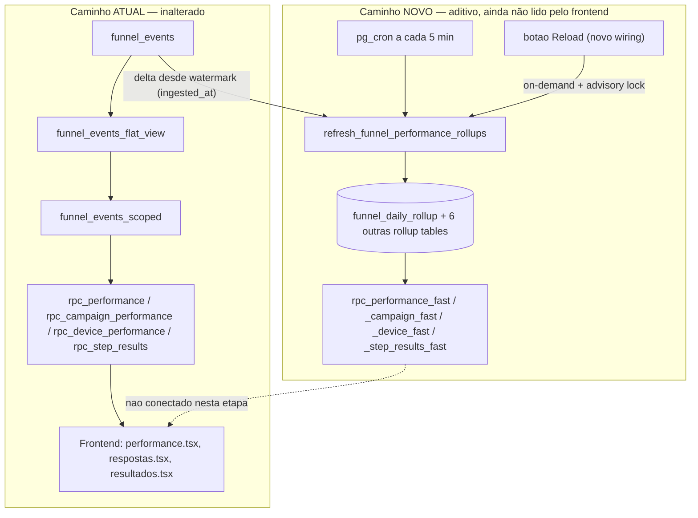

# Funnel Performance Rollup — Planning Output (v1)

> **Status:** IMPLEMENTADO — validado (paridade de dados + Playwright) em 2026-07-28
> **Data:** 2026-07-28
> **Scope:** Banco de dados (Supabase/Postgres) — sem alteração de contrato de API pública. 2 arquivos de frontend recebem uma adição não-destrutiva (wiring do botão de reload).
> **Files:** migrations SQL (rollup tables + funções + `pg_cron`) + 3 arquivos de frontend modificados (aditivo) + `tests/polling-and-reload.spec.ts` atualizado
> **Risk:** 🟡 MEDIUM (ver classificação por ponto na seção 9)
>
> **Nota de implementação:** o design da seção 3.3/3.4 original (rollup tables com `event_date` no grão, mantidas via soma incremental) continha um bug de corretude descoberto durante a validação: `count(distinct lead_id)` somado por lote de 5 min conta o mesmo lead duas vezes se ele aparecer em dias/lotes diferentes. A implementação final usa **recompute por dia tocado** (`DELETE`+`INSERT`, não soma) para os agregados diários, e uma tabela por lead (`funnel_lead_step_rollup`, sem `event_date` no grão, merge via `LEAST`/`GREATEST`) para a correlação `page_view`→`page_avance` por step — ver seção "Validação" abaixo para o histórico completo dos bugs encontrados e corrigidos.

---

## 1. Contexto

Investigação de performance nesta sessão (evidência via `pg_stat_statements` + `EXPLAIN ANALYZE BUFFERS`) identificou que 4 RPCs do dashboard — `rpc_performance`, `rpc_campaign_performance`, `rpc_device_performance`, `rpc_step_results` — recalculam agregações do zero a cada chamada, lendo a tabela bruta `funnel_events` (152 MB, ~65 mil linhas e crescendo) através de uma cadeia `RPC → funnel_events_scoped() → funnel_events_flat_view → funnel_events`, reprocessando ~25 campos extraídos de JSONB antes de conseguir aplicar qualquer filtro.

Prova concreta: `EXPLAIN (ANALYZE, BUFFERS)` em `rpc_performance` com um filtro que não bate nenhuma linha levou **7,1s e tocou 65.109 páginas de buffer** — o índice existente (`funnel_events_lookup_idx`) não é aproveitado a tempo por causa do empilhamento função→função→view.

**Decisão de escopo (confirmada com o stakeholder):**
1. As 4 RPCs são desenhadas juntas nesta rollup, porque compartilham a mesma base (`funnel_events_scoped`) e dimensões (`funnel_id, country, funnel_variant, event_date`).
2. **100% aditivo** — nenhuma função/view/RPC existente é alterada. Novos objetos de banco são criados em paralelo; o frontend não troca de RPC nesta etapa (garante zero risco de regressão no que já funciona hoje).
3. Atualização via **`pg_cron` a cada 5 min**, processando só o delta desde a última rodada — mesmo padrão já usado no projeto (`refresh-dashboard-filter-options`), sem trigger por `INSERT` (evita somar latência nas ~65 mil escritas já registradas no worker de ingestão).
4. O botão de reload existente (`onReload` no `FilterBar`) passa a também disparar o refresh da rollup sob demanda — mesmo padrão de `refresh_dashboard_filter_options_mv()`, que já é chamável tanto pelo cron quanto diretamente.

**Nota de transparência:** o wiring do botão de reload (ponto 4) só produz efeito *visível* depois de uma etapa futura, fora do escopo desta aprovação, que trocaria as RPCs que o frontend chama pelas novas RPCs baseadas na rollup. Implementá-lo agora deixa o mecanismo pronto e testado, mas ele não muda nenhum tempo de resposta até essa troca acontecer — sinalizado aqui para não vender um ganho que ainda não existe nesta fase.

---

## 2. Referência de Código Mapeada

### 2.1 RPC alvo com evidência de lentidão — `rpc_performance`

[Fonte: `pg_get_functiondef` sobre `public.rpc_performance`, puxado nesta sessão diretamente do banco]

```sql
CREATE OR REPLACE FUNCTION public.rpc_performance(p_funnel_id text, p_country text, p_funnel_variant text, p_date_from date, p_date_to date)
 RETURNS SETOF funnel_performance_view
 LANGUAGE sql STABLE SECURITY DEFINER
 SET search_path TO 'public' SET work_mem TO '64MB' SET statement_timeout TO '30s'
AS $function$
  with scoped as materialized (
    select * from public.funnel_events_scoped(p_funnel_id, p_country, p_funnel_variant, p_date_from, p_date_to)
  ),
  -- ... 7 CTEs (scoped_dates, scope_steps, lead_journeys, daily, journey_daily, hourly, series, step_passage)
  -- cada um reagrega `scoped` do zero
$function$
```
↑ Confirma que a lentidão está na materialização de `scoped` (via `funnel_events_scoped`) seguida por 7 agregações independentes sobre ela — é essa cadeia que a rollup substitui.

### 2.2 Função base compartilhada pelas 4 RPCs — `funnel_events_scoped`

[Fonte: `pg_get_functiondef` sobre `public.funnel_events_scoped`]

```sql
CREATE OR REPLACE FUNCTION public.funnel_events_scoped(p_funnel_id text, p_country text, p_funnel_variant text, p_date_from date, p_date_to date)
 RETURNS SETOF funnel_events_flat_view
 LANGUAGE sql STABLE
 SET search_path TO 'public'
AS $function$
  select *
  from public.funnel_events_flat_view
  where (p_funnel_id is null or funnel_id = p_funnel_id)
    and (p_country is null or country = p_country)
    and (p_funnel_variant is null or (p_funnel_variant = '__null__' and funnel_variant is null) or (p_funnel_variant <> '__null__' and funnel_variant = p_funnel_variant))
    and event_timestamp >= (p_date_from::timestamp at time zone 'America/Sao_Paulo')
    and event_timestamp < ((p_date_to + 1)::timestamp at time zone 'America/Sao_Paulo')
    and event_date >= p_date_from
    and event_date <= p_date_to
$function$
```
↑ É essa função (indiretamente, via `funnel_events_flat_view`) que reprocessa o JSONB inteiro antes de filtrar. A rollup elimina a necessidade de chamá-la nas 4 RPCs em questão.

### 2.3 Precedente de refresh assíncrono (cron + on-demand) — `refresh_dashboard_filter_options_mv`

[Fonte: `pg_get_functiondef` sobre `public.refresh_dashboard_filter_options_mv`]

```sql
CREATE OR REPLACE FUNCTION public.refresh_dashboard_filter_options_mv()
 RETURNS void
 LANGUAGE plpgsql SECURITY DEFINER
 SET search_path TO 'public'
AS $function$
begin
  refresh materialized view concurrently public.dashboard_filter_options_mv;
exception when others then
  refresh materialized view public.dashboard_filter_options_mv;
end;
$function$
```
E o job que já a agenda ([Fonte: `select * from cron.job`, puxado nesta sessão]):
```
jobid=1 | schedule='*/5 * * * *' | command='select public.refresh_dashboard_filter_options_mv();' | jobname='refresh-dashboard-filter-options'
```
↑ **Este é o padrão que a nova função de refresh da rollup vai seguir**: uma função `SECURITY DEFINER` simples, chamável tanto pelo `pg_cron` quanto diretamente (via RPC) — exatamente o mecanismo que resolve a pergunta do stakeholder sobre o botão de reload.

### 2.4 Botão de reload existente — `filter-bar.tsx`

[filter-bar.tsx L18-20, L204-213](file:///Users/brunogovas/Projects/Pandora-Box/melhor-versao-dashboard/src/components/composites/filter-bar.tsx#L18-L213)

```tsx
// botão de reload mora aqui (componente compartilhado) mas recebe o refetch de quem chama.
onReload?: () => void
isRefetching?: boolean
...
{onReload && (
  <button onClick={onReload} disabled={isRefetching}>
    <RefreshCw className={cn("h-4 w-4", isRefetching && "animate-spin")} />
```
↑ `onReload` é um `() => void` simples, passado de cada página. Ponto de wiring para o refresh sob demanda.

### 2.5 Consumo hoje — `performance.tsx` e `dashboard-queries.ts`

[performance.tsx L160, L190](file:///Users/brunogovas/Projects/Pandora-Box/melhor-versao-dashboard/src/pages/performance.tsx#L160-L190)
```tsx
const { data, error, loading, isRefetching, refetch } = useDashboardQuery(...)
...
<FilterBar showSearch={false} onReload={refetch} isRefetching={isRefetching} />
```

[dashboard-queries.ts L99-L118](file:///Users/brunogovas/Projects/Pandora-Box/melhor-versao-dashboard/src/lib/dashboard-queries.ts#L99-L118)
```ts
export async function fetchPerformance(filters: DashboardFilters, signal?: AbortSignal) {
  return supabase.rpc("rpc_performance", scopeParams(filters))
}
export async function fetchCampaignPerformance(filters: DashboardFilters, signal?: AbortSignal) {
  return supabase.rpc("rpc_campaign_performance", scopeParams(filters))
}
export async function fetchDevicePerformance(filters: DashboardFilters, signal?: AbortSignal) {
  return supabase.rpc("rpc_device_performance", scopeParams(filters))
}
```
↑ Confirma: `performance.tsx` é a única página que chama as 4 RPCs-alvo ao mesmo tempo — é onde o wiring do reload entra. `respostas.tsx` também chama `rpc_step_results` e também tem `onReload` (mesmo componente `FilterBar`). `resultados.tsx` chama `rpc_step_results` mas **não tem botão de reload** (sem `FilterBar`) — só se beneficia do cron, não precisa de wiring.

---

## 3. Lógica de Implementação

### 3.1 Padrão de rollup incremental via UPSERT — origem da pesquisa oficial

**Origem:** `[CONTEXT7]` — `/websites/postgresql_17`, documentação oficial de manutenção de summary tables em Data Warehousing.

```sql
-- Padrão oficial (adaptado): delta incremental via ON CONFLICT DO UPDATE,
-- preferido pela própria doc do Postgres sobre a versão com loop/exception:
-- "using INSERT with ON CONFLICT DO UPDATE is generally preferred for
--  performance and simplicity"
INSERT INTO summary_table (key, metric)
VALUES (:key, :delta)
ON CONFLICT (key) DO UPDATE
SET metric = summary_table.metric + EXCLUDED.metric;
```
↑ Esse é o mecanismo central usado em todas as rollup tables abaixo: cada rodada do refresh agrega só o delta (eventos novos desde o último watermark) e faz merge aditivo nas linhas existentes, em vez de recalcular tudo.

### 3.2 Tabela de controle de watermark

**Origem:** `[CRIADO]`

```sql
create table if not exists public.funnel_rollup_watermark (
  rollup_name text primary key,
  last_processed_at timestamptz not null default '-infinity'
);

insert into public.funnel_rollup_watermark (rollup_name)
values ('funnel_performance_rollups')
on conflict (rollup_name) do nothing;
```
↑ Usa `ingested_at` (não `event_timestamp`) como referência de progresso — `ingested_at` é monotônico por linha gravada, o que é o critério certo para "já processei isso", já que eventos podem chegar fora de ordem (backfills, vimos isso no histórico de queries desta sessão).

### 3.3 Rollup tables — grão aditivo simples (visitors/leads/conclusions/etc.)

**Origem:** `[CRIADO]` + `[REPO EXISTENTE]` (grão e filtros de evento copiados literalmente das RPCs em 2.1–2.2, para garantir paridade de resultado)

```sql
-- Grão: funnel_id, country, funnel_variant, event_date  (alimenta rpc_performance.daily)
create table if not exists public.funnel_daily_rollup (
  funnel_id text not null,
  country text not null,
  funnel_variant text,
  event_date date not null,
  visitors bigint not null default 0,
  responses_started bigint not null default 0,
  leads bigint not null default 0,
  conclusions bigint not null default 0,
  primary key (funnel_id, country, funnel_variant, event_date)
);

-- Grão: + event_hour (alimenta rpc_performance.series)
create table if not exists public.funnel_hourly_rollup (
  funnel_id text not null, country text not null, funnel_variant text,
  event_date date not null, event_hour timestamptz not null,
  visitors bigint not null default 0, responses bigint not null default 0,
  leads bigint not null default 0, conclusions bigint not null default 0,
  primary key (funnel_id, country, funnel_variant, event_date, event_hour)
);

-- Grão: + utm_* (alimenta rpc_campaign_performance)
create table if not exists public.funnel_campaign_daily_rollup (
  funnel_id text not null, country text not null, funnel_variant text,
  event_date date not null,
  utm_source text, utm_medium text, utm_campaign text, utm_content text,
  utm_term text, utm_id text, xcod text, sck text, src text,
  tracked_total bigint not null default 0, visitors bigint not null default 0,
  responses_started bigint not null default 0, leads bigint not null default 0,
  conclusions bigint not null default 0,
  first_seen_at timestamptz, last_seen_at timestamptz,
  primary key (funnel_id, country, funnel_variant, event_date,
               utm_source, utm_medium, utm_campaign, utm_content, utm_term, utm_id, xcod, sck, src)
);

-- Grão: + device_type (alimenta rpc_device_performance; share_percentage calculado em leitura)
create table if not exists public.funnel_device_daily_rollup (
  funnel_id text not null, country text not null, funnel_variant text,
  event_date date not null, device_type text not null,
  visitors bigint not null default 0, responses_started bigint not null default 0,
  leads bigint not null default 0, conclusions bigint not null default 0,
  primary key (funnel_id, country, funnel_variant, event_date, device_type)
);

-- Grão: + step_number (alimenta rpc_step_results; passage_rate calculado em leitura)
create table if not exists public.funnel_step_daily_rollup (
  funnel_id text not null, country text not null, funnel_variant text,
  event_date date not null, step_number int not null,
  step_name text,  -- último não-nulo observado (ver risco 9.5)
  entries bigint not null default 0, advances bigint not null default 0,
  time_seconds_sum double precision not null default 0,
  time_seconds_count bigint not null default 0,  -- sum/count em vez de avg, pra permitir merge aditivo
  primary key (funnel_id, country, funnel_variant, event_date, step_number)
);

-- Grão: + answer_label (alimenta answer_distribution, via jsonb_agg em leitura)
create table if not exists public.funnel_step_answer_rollup (
  funnel_id text not null, country text not null, funnel_variant text,
  event_date date not null, step_number int not null,
  answer_label text not null, answer_code text,
  choices bigint not null default 0,
  primary key (funnel_id, country, funnel_variant, event_date, step_number, answer_label)
);

-- Grão: + button_id (alimenta click_distribution, via jsonb_agg em leitura)
create table if not exists public.funnel_step_click_rollup (
  funnel_id text not null, country text not null, funnel_variant text,
  event_date date not null, step_number int not null,
  button_id text not null, button_label text,
  clicks bigint not null default 0,
  primary key (funnel_id, country, funnel_variant, event_date, step_number, button_id)
);

create index if not exists funnel_daily_rollup_lookup on public.funnel_daily_rollup (funnel_id, country, funnel_variant, event_date);
create index if not exists funnel_campaign_daily_rollup_lookup on public.funnel_campaign_daily_rollup (funnel_id, country, funnel_variant, event_date);
create index if not exists funnel_device_daily_rollup_lookup on public.funnel_device_daily_rollup (funnel_id, country, funnel_variant, event_date);
create index if not exists funnel_step_daily_rollup_lookup on public.funnel_step_daily_rollup (funnel_id, country, funnel_variant, event_date);
```

### 3.4 Caso especial — médias por lead (`average_completed_steps`, `average_time_seconds`)

**Origem:** `[CRIADO]` — nuance técnica identificada nesta sessão, não presente na documentação genérica do Context7.

Esses dois campos de `rpc_performance` são **média por lead**, não soma direta — não decompõem em um delta simples do tipo `x = x + novo`. A solução correta é uma rollup intermediária por lead, usando `LEAST`/`GREATEST`/`MAX`, que **são** operações de merge incremental válidas (associativas e idempotentes, ao contrário de uma média):

```sql
-- Grão: funnel_id, country, funnel_variant, event_date, lead_id
create table if not exists public.funnel_lead_daily_rollup (
  funnel_id text not null, country text not null, funnel_variant text,
  event_date date not null, lead_id text not null,
  first_event_at timestamptz not null,
  last_event_at timestamptz not null,
  completed_steps int,  -- MAX(step_number) FILTER (event_type in ('page_avance','checkout_start'))
  primary key (funnel_id, country, funnel_variant, event_date, lead_id)
);

create index if not exists funnel_lead_daily_rollup_lookup
  on public.funnel_lead_daily_rollup (funnel_id, country, funnel_variant, event_date);
```
`average_completed_steps`/`average_time_seconds` de `funnel_daily_rollup` são então calculados em leitura, com `AVG()` sobre essa tabela pequena (linhas = leads/dia, não eventos/dia) — muito mais barato que reprocessar o evento bruto, mas ainda assim uma camada a mais de risco. **Classificado à parte na seção 9 (🟡 MEDIUM em vez de 🟢 LOW dos demais).**

### 3.5 Função de refresh — cron + on-demand, com trava de concorrência

**Origem:** `[CRIADO]` + `[REPO EXISTENTE]` (padrão `SECURITY DEFINER` copiado de 2.3)

```sql
create or replace function public.refresh_funnel_performance_rollups()
returns void
language plpgsql
security definer
set search_path to 'public'
as $function$
declare
  v_lock_key bigint := hashtext('funnel_performance_rollup_refresh');
  v_watermark timestamptz;
  v_new_watermark timestamptz;
begin
  if not pg_try_advisory_lock(v_lock_key) then
    return; -- outro refresh já em andamento; idempotente, seguro pular
  end if;

  select last_processed_at into v_watermark
  from public.funnel_rollup_watermark where rollup_name = 'funnel_performance_rollups';

  select max(ingested_at) into v_new_watermark
  from public.funnel_events where ingested_at > v_watermark;

  if v_new_watermark is null then
    perform pg_advisory_unlock(v_lock_key);
    return; -- nada novo desde a última rodada
  end if;

  with delta as (
    select * from public.funnel_events_flat_view
    where ingested_at > v_watermark and ingested_at <= v_new_watermark
  )
  insert into public.funnel_daily_rollup (funnel_id, country, funnel_variant, event_date, visitors, responses_started, leads, conclusions)
  select funnel_id, country, funnel_variant, event_date,
    count(distinct lead_id) filter (where event_type = 'page_view'),
    count(distinct lead_id) filter (where event_type in ('page_avance','data_collected','button_click','vturb_start','checkout_start')),
    count(distinct lead_id),
    count(distinct lead_id) filter (where event_type = 'checkout_start')
  from delta group by funnel_id, country, funnel_variant, event_date
  on conflict (funnel_id, country, funnel_variant, event_date) do update set
    visitors = funnel_daily_rollup.visitors + excluded.visitors,
    responses_started = funnel_daily_rollup.responses_started + excluded.responses_started,
    leads = funnel_daily_rollup.leads + excluded.leads,
    conclusions = funnel_daily_rollup.conclusions + excluded.conclusions;

  -- [repetir o mesmo padrão delta -> INSERT ... ON CONFLICT DO UPDATE
  --  para funnel_hourly_rollup, funnel_campaign_daily_rollup,
  --  funnel_device_daily_rollup, funnel_step_daily_rollup,
  --  funnel_step_answer_rollup, funnel_step_click_rollup,
  --  funnel_lead_daily_rollup (este com GREATEST/LEAST em vez de soma) —
  --  mesma estrutura, grão e filtros de 3.3/3.4, omitido aqui por repetição]

  update public.funnel_rollup_watermark
  set last_processed_at = v_new_watermark
  where rollup_name = 'funnel_performance_rollups';

  perform pg_advisory_unlock(v_lock_key);
end;
$function$;
```

> ⚠️ **CAVEAT (contagem distinta em janelas de 5 min):** `count(distinct lead_id)` dentro de uma janela de 5 minutos é correto porque cada linha da rollup é a soma incremental entre rodadas — mas um lead que aparece em duas rodadas consecutivas (ex: `page_view` às 10:03, `checkout_start` às 10:08) é contado como "lead novo" em cada rodada separadamente onde `event_type` bate o filtro, o que é o comportamento correto para `leads` (conta lead-dia, não lead-evento) **desde que o filtro FILTER seja avaliado por linha, não por lead completo** — isso precisa de validação explícita no Plano de Verificação (seção 11), comparando rollup vs. RPC original em um dia com leads que cruzam múltiplas janelas de 5 min.

### 3.6 pg_cron — agendamento

**Origem:** `[REPO EXISTENTE]` (mesmo padrão de 2.3)

```sql
select cron.schedule(
  'refresh-funnel-performance-rollups',
  '*/5 * * * *',
  $$select public.refresh_funnel_performance_rollups()$$
);
```

### 3.7 Novas RPCs (leitura da rollup) — não wireadas ao frontend nesta etapa

**Origem:** `[CRIADO]`

```sql
create or replace function public.rpc_performance_fast(p_funnel_id text, p_country text, p_funnel_variant text, p_date_from date, p_date_to date)
returns table (
  funnel_id text, country text, funnel_variant text, event_date date,
  visitors bigint, responses_started bigint, leads bigint, conclusions bigint,
  completion_rate numeric, interaction_rate numeric
  -- + demais colunas de funnel_performance_view, computadas em leitura sobre as rollups
)
language sql stable security definer
set search_path to 'public'
as $function$
  select
    d.funnel_id, d.country, d.funnel_variant, d.event_date,
    d.visitors, d.responses_started, d.leads, d.conclusions,
    round(d.conclusions::numeric / nullif(d.responses_started, 0), 4),
    round(d.responses_started::numeric / nullif(d.visitors, 0), 4)
  from public.funnel_daily_rollup d
  where (p_funnel_id is null or d.funnel_id = p_funnel_id)
    and (p_country is null or d.country = p_country)
    and (p_funnel_variant is null or d.funnel_variant is not distinct from p_funnel_variant)
    and d.event_date between p_date_from and p_date_to
  order by d.event_date asc
$function$;

-- rpc_campaign_performance_fast, rpc_device_performance_fast, rpc_step_results_fast:
-- mesmo padrão — SELECT direto sobre a rollup correspondente (3.3), com
-- share_percentage/passage_rate/answer_distribution/click_distribution
-- calculados em leitura via jsonb_agg sobre as linhas (poucas) da rollup,
-- não sobre o funnel_events bruto.
```
↑ Essas RPCs são criadas e testadas isoladamente (paridade de output validada na seção 11), mas **o frontend continua chamando as RPCs antigas** até uma aprovação futura separada trocar `dashboard-queries.ts`.

### 3.8 Wiring do botão de reload (frontend, aditivo)

**Origem:** `[CRIADO]`, usando o padrão existente de 2.4/2.5

```ts
// dashboard-queries.ts — nova função, não substitui nenhuma existente
export async function triggerPerformanceRollupRefresh() {
  return supabase.rpc("refresh_funnel_performance_rollups")
}
```

```tsx
// performance.tsx — refetch existente envolvido, não substituído
const handleReload = async () => {
  await triggerPerformanceRollupRefresh().catch(() => {}) // best-effort; refetch roda de qualquer forma
  refetch()
}
// <FilterBar onReload={refetch} .../>  →  <FilterBar onReload={handleReload} .../>
```
Mesmo padrão replicado em `respostas.tsx` (que também tem `onReload` e consome `rpc_step_results`).

---

## 4. Arquitetura de Componentes



---

## 5. Convenções SQL Reutilizadas (adaptação da seção "CSS/SCSS Reference" do template para este ajuste de banco)

| Convenção | Origem | Aplicação nesta mudança |
|---|---|---|
| `rpc_` prefixo para funções públicas chamáveis via `supabase.rpc()` | RPCs existentes (`rpc_performance`, etc.) | `rpc_performance_fast` etc. |
| `_scoped` sufixo para função de filtro reutilizável | `funnel_events_scoped` | Não repetido — rollups já nascem filtradas por grão |
| `SECURITY DEFINER` + `SET search_path TO 'public'` em toda função pública | Todas as RPCs existentes | Replicado em `refresh_funnel_performance_rollups` e nas `_fast` |
| Função de refresh separada e chamável isoladamente (não só via cron) | `refresh_dashboard_filter_options_mv` | Replicado integralmente — é o mecanismo que responde a pergunta do reload |

---

## 6. Novos Objetos (equivalente a "Novos Componentes")

| Objeto | Tipo | Grão |
|---|---|---|
| `funnel_rollup_watermark` | Tabela de controle | 1 linha por família de rollup |
| `funnel_daily_rollup` | Rollup | funil × país × variante × dia |
| `funnel_hourly_rollup` | Rollup | + hora |
| `funnel_campaign_daily_rollup` | Rollup | + utm_* |
| `funnel_device_daily_rollup` | Rollup | + device_type |
| `funnel_step_daily_rollup` | Rollup | + step_number |
| `funnel_step_answer_rollup` | Rollup | + answer_label |
| `funnel_step_click_rollup` | Rollup | + button_id |
| `funnel_lead_daily_rollup` | Rollup (caso especial, §3.4) | + lead_id |
| `refresh_funnel_performance_rollups()` | Função (cron + on-demand) | — |
| `rpc_performance_fast`, `rpc_campaign_performance_fast`, `rpc_device_performance_fast`, `rpc_step_results_fast` | RPCs de leitura (não conectadas ao frontend ainda) | — |

## 7. Componentes Modificados (frontend, aditivo)

### 7.1 `dashboard-queries.ts`
**Adição:** função `triggerPerformanceRollupRefresh()` (§3.8). Nenhuma função existente alterada.

### 7.2 `performance.tsx` e `respostas.tsx`
**Adição:** wrapper `handleReload` em volta do `refetch` já existente, passado ao `onReload` do `FilterBar`. `refetch` em si — e tudo que ele faz hoje — permanece idêntico.

## 8. i18n Keys

N/A — nenhuma string nova visível ao usuário.

---

## 9. Files Summary & Classificação de Risco

| # | Ação | Arquivo/Objeto | Risco |
|---|------|-----------------|-------|
| 1 | NEW | Migration SQL: `funnel_rollup_watermark` + 7 rollup tables + índices | 🟢 LOW — objetos novos, não lidos por ninguém ainda |
| 2 | NEW | `funnel_lead_daily_rollup` (§3.4, médias por lead) | 🟡 MEDIUM — lógica de merge mais complexa (LEAST/GREATEST), maior chance de nuance não coberta |
| 3 | NEW | `refresh_funnel_performance_rollups()` + `cron.schedule(...)` | 🟡 MEDIUM — roda contra `funnel_events` (tabela quente) a cada 5 min; mitigado por ser incremental via watermark + advisory lock não-bloqueante |
| 4 | NEW | `rpc_performance_fast` e as outras 3 `_fast` | 🟢 LOW — isoladas, frontend não chama ainda |
| 5 | MODIFY | `dashboard-queries.ts` (nova função, aditiva) | 🟢 LOW |
| 6 | MODIFY | `performance.tsx`, `respostas.tsx` (wrapper no `onReload`) | 🟡 MEDIUM — toca arquivo em produção usado agora; latência do clique de reload aumenta em até o tempo do refresh (mitigado por `.catch(() => {})` best-effort, reload nunca fica bloqueado se o refresh falhar) |

**Nenhum item 🔴 HIGH** — consequência direta do design 100% aditivo confirmado na Fase 2.

---

## 10. Implementation Order

1. **Fase A:** migration com watermark table + 8 rollup tables + índices (item 1–2 da tabela acima). Nada lê nem escreve nelas ainda.
2. **Fase B:** `refresh_funnel_performance_rollups()` completa (todas as 8 UPSERTs, não só o exemplo de `funnel_daily_rollup` em §3.5) + backfill único inicial (rodar a função uma vez com watermark em `-infinity`, processando todo o histórico existente de uma vez — o único full-scan desta mudança, e só acontece uma vez).
3. **Fase C:** `cron.schedule(...)` — rollups passam a ficar frescas automaticamente, ainda sem nenhum RPC/frontend lendo delas.
4. **Fase D:** as 4 RPCs `_fast`, testadas isoladamente (via SQL direto, não pelo frontend) contra as RPCs antigas para paridade de output (seção 11).
5. **Fase E:** wiring do `onReload` (§3.8) — reload agora também dispara refresh sob demanda. Efeito ainda invisível ao usuário (nota da seção 1), mas mecanismo pronto e validado em produção.
6. **(Fora desta aprovação)** Fase F futura: trocar `dashboard-queries.ts` para chamar as RPCs `_fast`, com aprovação own separada — é aí que o ganho de performance se torna visível ao usuário.

Cada fase é um gate independente — só avança pra próxima após a anterior passar na seção 11.

---

## 11. Rollback Plan

Como tudo é aditivo, o rollback do estado *atual* (RPCs antigas, frontend) tem risco praticamente zero — nada nelas foi tocado. Rollback do que foi *adicionado*:

```
Fase A-D (objetos de banco):
├── Git Ref: HEAD antes da migration
├── Revert: DROP FUNCTION IF EXISTS public.rpc_performance_fast, ... (as 4 _fast);
│           SELECT cron.unschedule('refresh-funnel-performance-rollups');
│           DROP FUNCTION IF EXISTS public.refresh_funnel_performance_rollups();
│           DROP TABLE IF EXISTS public.funnel_daily_rollup, public.funnel_hourly_rollup,
│             public.funnel_campaign_daily_rollup, public.funnel_device_daily_rollup,
│             public.funnel_step_daily_rollup, public.funnel_step_answer_rollup,
│             public.funnel_step_click_rollup, public.funnel_lead_daily_rollup,
│             public.funnel_rollup_watermark;
└── Validação pós-revert: rpc_performance (antiga) continua respondendo idêntico — nunca foi alterada.

Fase E (frontend):
├── Git Ref: commit do wiring do onReload
├── Revert: git checkout <ref> -- src/pages/performance.tsx src/pages/respostas.tsx src/lib/dashboard-queries.ts
└── Validação pós-revert: botão de reload volta a só chamar refetch(), sem a chamada extra.
```

---

## 12. Verification Plan

| # | Test Case | Como validar | Esperado |
|---|-----------|---------------|----------|
| 1 | Paridade `rpc_performance` vs `rpc_performance_fast` | Rodar as duas para os mesmos filtros (3+ combinações de funil/país/data), comparar linha a linha | Valores idênticos (visitors, leads, conclusions, completion_rate) |
| 2 | Paridade das outras 3 `_fast` | Mesmo processo para campaign/device/step_results, incluindo `answer_distribution`/`click_distribution` (comparar JSON) | Idêntico |
| 3 | Lead cruzando janela de refresh (caveat §3.5) | Escolher um lead com eventos em janelas de 5 min diferentes, comparar contagem de `leads`/`visitors` da rollup vs. RPC antiga pro mesmo dia | Contagem bate |
| 4 | Backfill inicial | Rodar `refresh_funnel_performance_rollups()` uma vez com watermark em `-infinity`, medir tempo | Deve completar (é o único full-scan; esperado ser da ordem de segundos, não minutos, dado que hoje já vimos scans completos de ~65k linhas custarem segundos) |
| 5 | Concorrência do refresh | Chamar `refresh_funnel_performance_rollups()` duas vezes em paralelo (simulando 2 cliques de reload simultâneos) | A segunda chamada retorna imediatamente sem erro (advisory lock funcionando) |
| 6 | Reload não quebra em caso de falha do refresh | Forçar erro na função de refresh (ex: revogar permissão temporariamente) e clicar reload | `refetch()` roda normalmente mesmo com o refresh falhando (`.catch` best-effort) |
| 7 | Cron rodando | `SELECT * FROM cron.job_run_details WHERE jobid = (SELECT jobid FROM cron.job WHERE jobname = 'refresh-funnel-performance-rollups') ORDER BY start_time DESC LIMIT 5` | Execuções a cada 5 min, status `succeeded` |

---

## 13. Handoff

N/A — mudança inteiramente interna ao Supabase deste projeto, sem integração externa nova. Nota de segurança independente (já registrada em conversa anterior, não parte desta mudança): `funnel_events` está sem RLS habilitado; as novas RPCs `_fast` seguem o mesmo padrão `SECURITY DEFINER` das existentes, então não pioram nem resolvem esse ponto — segue como item separado.
