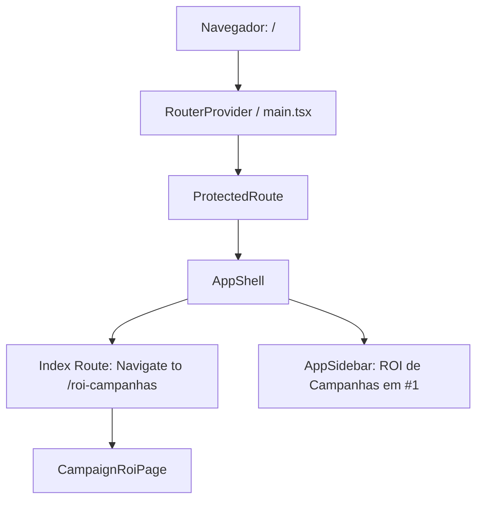

# Alteração da Página Inicial para /roi-campanhas — Planning Output (v1)

> **Status:** PLANEJADO — Aguardando aprovação  
> **Data:** 2026-07-29  
> **Scope:** `/`, `/roi-campanhas`, `/login`, `/reset-password`, Sidebar  
> **Files:** 5 arquivos (1 novo teste, 4 modificados)  
> **Risk:** 🟢 LOW

---

## 1. Contexto

Ao acessar o dashboard na rota raiz (`/`), o sistema atualmente redireciona o usuário para a página de respostas (`/respostas`). Além disso, no menu lateral (`AppSidebar`), o item **ROI de Campanhas** se encontra na 5ª posição (última).

O objetivo desta alteração é tornar `/roi-campanhas` a página inicial padrão do dashboard ao entrar no site e reordenar a lista de navegação lateral para que **ROI de Campanhas** apareça como o primeiro item do menu, mantendo todas as alterações exclusivamente no frontend.

---

## 2. Referência de Código Mapeada

> **REGRA MANDATÓRIA:** Toda referência de código existente que será utilizada, estendida ou servir de base para a implementação DEVE ser mapeada aqui com link + snippet real.

### 2.1 Redirecionamento Inicial de Rota
[src/main.tsx L33-L36](file:///Users/brunogovas/Projects/Pandora-Box/melhor-versao-dashboard/src/main.tsx#L33-L36)

```tsx
      {
        index: true,
        element: <Navigate to="/respostas" replace />
      },
```

### 2.2 Lista de Itens do Menu Lateral
[src/components/composites/app-sidebar.tsx L19-L45](file:///Users/brunogovas/Projects/Pandora-Box/melhor-versao-dashboard/src/components/composites/app-sidebar.tsx#L19-L45)

```tsx
// Menu items
const items = [
  {
    title: "Respostas",
    url: "/respostas",
    icon: MessageSquare,
  },
  {
    title: "Resultados",
    url: "/resultados",
    icon: BarChart2,
  },
  {
    title: "Performance Geral",
    url: "/performance",
    icon: Activity,
  },
  {
    title: "Auditoria de Leads",
    url: "/auditoria",
    icon: ShieldCheck,
  },
  {
    title: "ROI de Campanhas",
    url: "/roi-campanhas",
    icon: DollarSign,
  },
]
```

### 2.3 Fallback de Redirecionamento no Login
[src/pages/login.tsx L19](file:///Users/brunogovas/Projects/Pandora-Box/melhor-versao-dashboard/src/pages/login.tsx#L19)

```tsx
  const from = (location.state as { from?: string } | null)?.from || "/respostas"
```

### 2.4 Redirecionamento no Reset de Senha
[src/pages/reset-password.tsx L28](file:///Users/brunogovas/Projects/Pandora-Box/melhor-versao-dashboard/src/pages/reset-password.tsx#L28)

```tsx
    navigate("/respostas", { replace: true })
```

---

## 3. Lógica de Implementação

> **REGRA MANDATÓRIA:** A lógica de implementação DEVE ser escrita e codificada neste documento ANTES de qualquer execução.

### 3.1 Rota Inicial no Router (`src/main.tsx`)
**Origem:** `[REPO EXISTENTE]` + `[CRIADO]`

```tsx
      {
        index: true,
        element: <Navigate to="/roi-campanhas" replace />
      },
```

### 3.2 Reordenação do Menu (`src/components/composites/app-sidebar.tsx`)
**Origem:** `[REPO EXISTENTE]` + `[CRIADO]`

```tsx
const items = [
  {
    title: "ROI de Campanhas",
    url: "/roi-campanhas",
    icon: DollarSign,
  },
  {
    title: "Respostas",
    url: "/respostas",
    icon: MessageSquare,
  },
  {
    title: "Resultados",
    url: "/resultados",
    icon: BarChart2,
  },
  {
    title: "Performance Geral",
    url: "/performance",
    icon: Activity,
  },
  {
    title: "Auditoria de Leads",
    url: "/auditoria",
    icon: ShieldCheck,
  },
]
```

### 3.3 Fallback de Autenticação (`src/pages/login.tsx` & `src/pages/reset-password.tsx`)
**Origem:** `[REPO EXISTENTE]` + `[CRIADO]`

```tsx
// src/pages/login.tsx:
const from = (location.state as { from?: string } | null)?.from || "/roi-campanhas"

// src/pages/reset-password.tsx:
navigate("/roi-campanhas", { replace: true })
```

---

## 4. Arquitetura de Componentes



---

## 5. CSS/SCSS Reference

Nenhuma alteração de estilos CSS/SCSS necessária. O layout do menu reaproveita a estrutura atomizada de `Sidebar` já existente.

---

## 6. Novos Componentes

Nenhum componente UI novo necessário.

---

## 7. Componentes Modificados

### 7.1 [src/main.tsx](file:///Users/brunogovas/Projects/Pandora-Box/melhor-versao-dashboard/src/main.tsx#L33-L36)
- Alterar redirecionamento da rota `index: true` de `/respostas` para `/roi-campanhas`.

### 7.2 [src/components/composites/app-sidebar.tsx](file:///Users/brunogovas/Projects/Pandora-Box/melhor-versao-dashboard/src/components/composites/app-sidebar.tsx#L19-L45)
- Reordenar a lista `items` colocando `ROI de Campanhas` em primeiro lugar.

### 7.3 [src/pages/login.tsx](file:///Users/brunogovas/Projects/Pandora-Box/melhor-versao-dashboard/src/pages/login.tsx#L19)
- Atualizar a constante `from` para ter como fallback `/roi-campanhas`.

### 7.4 [src/pages/reset-password.tsx](file:///Users/brunogovas/Projects/Pandora-Box/melhor-versao-dashboard/src/pages/reset-password.tsx#L28)
- Atualizar o redirecionamento pós-redefinição de senha para `/roi-campanhas`.

---

## 8. i18n Keys (se aplicável)

N/A

---

## 9. Files Summary

| Action | File | Risk |
|--------|------|------|
| **MODIFY** | `src/main.tsx` | 🟢 LOW |
| **MODIFY** | `src/components/composites/app-sidebar.tsx` | 🟢 LOW |
| **MODIFY** | `src/pages/login.tsx` | 🟢 LOW |
| **MODIFY** | `src/pages/reset-password.tsx` | 🟢 LOW |
| **NEW** | `tests/initial-route-and-sidebar.spec.ts` | 🟢 LOW |

---

## 10. Implementation Order

1. **Phase A:** Fazer commit preventivo do repositório antes de implementar qualquer alteração.
2. **Phase B:** Aplicar alterações nos arquivos `src/main.tsx`, `src/components/composites/app-sidebar.tsx`, `src/pages/login.tsx` e `src/pages/reset-password.tsx`.
3. **Phase C:** Criar o teste automatizado `tests/initial-route-and-sidebar.spec.ts` cobrindo o redirecionamento de `/` -> `/roi-campanhas` e a ordem dos itens do sidebar.
4. **Phase D:** Executar validação com scripts (`npm run lint`, `npm run build`) e Playwright (`npx playwright test`).
5. **Phase E:** Commit das alterações validadas e apresentação do resumo final para validação do stakeholder antes do deploy no remoto.

---

## 11. Rollback Plan

```
Componentes modificados:
├── Git Ref: HEAD antes da implementação
├── Revert: git checkout HEAD -- src/main.tsx src/components/composites/app-sidebar.tsx src/pages/login.tsx src/pages/reset-password.tsx
└── Validação: npm run build && npx playwright test
```

---

## 12. Verification Plan

| # | Test Case | Route | Expected |
|---|-----------|-------|----------|
| 1 | Acesso à rota raiz `/` | `/` | Redireciona automaticamente para `/roi-campanhas` |
| 2 | Ordem do menu no Sidebar | `/roi-campanhas` | Primeiro item visível no menu é "ROI de Campanhas" seguido por "Respostas" |
| 3 | Login com fallback padrão | `/login` | Após login com sucesso sem state de origem, redireciona para `/roi-campanhas` |

---

## 13. Handoff (se aplicável)

Nenhum handoff backend/servidor necessário (alterações estritamente restritas ao frontend).
