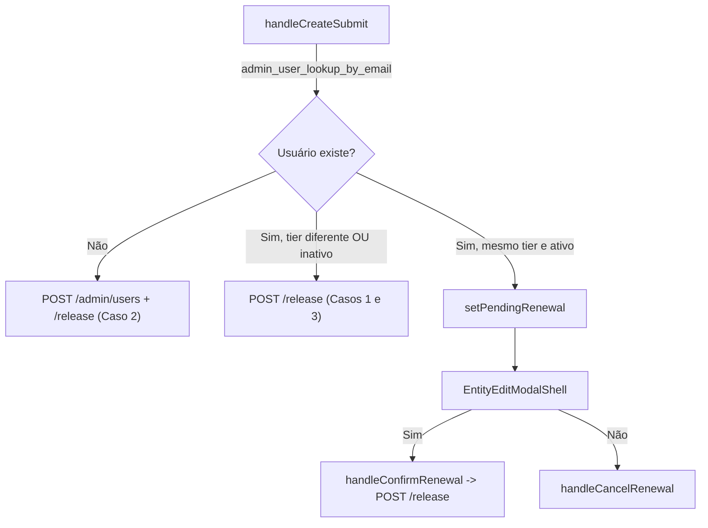

# Liberar Usuário — regras de criação/atualização + Limpeza de Configurações — Planning Output (v1)

> **Status:** PLANEJADO — Aguardando aprovação
> **Data:** 2026-08-22
> **Scope:** `/crm/liberar-usuario`, `/crm/configuracoes`
> **Files:** 0 novos, 2 modificados (`liberar-usuario.tsx`, `configuracoes.tsx`)
> **Risk:** 🟡 MEDIUM (Problema 10) / 🟡 MEDIUM (Problema 11)

---

## 1. Contexto

Este dashboard **não fala diretamente com tabelas Supabase de usuários/config** — toda a lógica de negócio (criar usuário, calcular tier, aplicar validade) mora em um worker externo (fora deste repo), acessado via `adminRpc` (RPC Postgres) e `adminMutation` (fetch REST com `Idempotency-Key`). Isso significa que este plano só pode alterar **orquestração client-side** (quando chamar lookup vs. create vs. release, e o que mostrar ao operador) — não pode criar/alterar tabelas ou regras de validade no backend, pois esse código não existe neste repositório.

### Problema 10 — `liberar-usuario.tsx`

Hoje, `handleCreateSubmit` (L96-126) **sempre** chama `POST /admin/users` (criar) seguido de `POST /admin/users/:id/release` (liberar), sem nunca verificar antes se o e-mail já existe. Isso quebra em produção quando o operador tenta "criar" um aluno que já tem cadastro (o Supabase Auth Admin no worker vai rejeitar e-mail duplicado com um erro genérico) e não cobre os 4 casos pedidos.

O card "Editar usuário" já tem toda a mecânica necessária para os casos 1/3/4 (`admin_user_lookup_by_email`, `POST /admin/users/:id/release` com `tier`) — falta apenas usar essa mesma mecânica **dentro do fluxo de criação**, com uma checagem prévia de existência.

Confirmado com o stakeholder:
- Caso 1 (inativo → trinca): "inativo" só ocorre por reembolso ou expiração do trinca — histórico não importa, pode apenas aplicar o novo plano via `release`.
- Caso 2 (não existe → elite): já é suportado tecnicamente — o formulário de criação já envia `tier: "elite"` direto para `POST /admin/users`; usuários hoje só existem como `"mvp"` ou `"elite"`, não há gate adicional de "elite incompleto".
- Caso 3 (existe com trinca → elite): apenas atualizar via `release`, sem re-criar.
- Caso 4 (usuário já tem exatamente a versão/plano selecionada e está ativo): modal bloqueante Sim/Não perguntando se quer renovar a validade.

### Problema 11 — `configuracoes.tsx`

Remover 3 seções de UI que não devem mais ficar visíveis para o operador: "Prazo de Reavaliação" ("prazo de avaliação"), "Mapa LastLink" e "Funil, produtos e Elite". Não há UI de webhook/ID de webhook nesta tela (confirmado por busca exaustiva em `src/` — o único webhook do sistema, o da LastLink, vive inteiramente no worker externo e não tem tela correspondente neste dashboard); portanto essa parte do pedido já não se aplica a este repo.

---

## 2. Referência de Código Mapeada

### 2.1 Fluxo de criação atual (a ser substituído)

[liberar-usuario.tsx L96-126](file:///Users/brunogovas/Projects/Pandora-Box/melhor-versao-dashboard/src/pages/liberar-usuario.tsx#L96-L126)

```tsx
async function handleCreateSubmit(event: React.FormEvent) {
  event.preventDefault()
  if (createState !== "idle") return

  const email = createEmail.trim().toLowerCase()
  const nomeCompleto = createName.trim()
  const tier = planToTier(createPlan)

  setCreateState("submitting")
  setCreateError(null)
  setCreatedUser(null)

  try {
    const user = await adminMutation<AdminUserMutationResponse>("/admin/users", {
      method: "POST",
      body: { email, nomeCompleto, tier },
    })
    const released = await adminMutation<AdminUserMutationResponse>(`/admin/users/${user.userId}/release`, {
      method: "POST",
      body: { tier },
    })
    setCreatedUser(released)
    setCreateState("done")
    setCreateName("")
    setCreateEmail("")
    setCreatePlan("trinca")
  } catch (error) {
    setCreateError(errorMessage(error))
    setCreateState("idle")
  }
}
```
↑ Base para a nova função `handleCreateSubmit`: mantém o caminho "não existe → create + release" e ganha um branch prévio de lookup.

### 2.2 Lookup por e-mail (já usado no card "Editar usuário")

[liberar-usuario.tsx L128-153](file:///Users/brunogovas/Projects/Pandora-Box/melhor-versao-dashboard/src/pages/liberar-usuario.tsx#L128-L153)

```tsx
async function handleSearch(value: string) {
  const query = value.trim().toLowerCase()
  if (!query) return
  ...
  const rows = await adminRpc<AdminUserLookupRow[]>("admin_user_lookup_by_email", { p_email: query })
  const match = rows[0]
  if (!match) {
    setSearchState("not-found")
    return
  }
  setFoundAluno(match)
  setEditPlan(tierToPlan(match.tier))
  setSearchState("found")
}
```
↑ Mesma RPC (`admin_user_lookup_by_email`, param `p_email`) será reutilizada dentro de `handleCreateSubmit` antes de decidir create vs. release.

### 2.3 Release de plano (já usado no card "Editar usuário")

[liberar-usuario.tsx L155-182](file:///Users/brunogovas/Projects/Pandora-Box/melhor-versao-dashboard/src/pages/liberar-usuario.tsx#L155-L182)

```tsx
async function handleRelease() {
  if (!foundAluno || releaseState !== "idle") return

  const tier = planToTier(editPlan)
  setReleaseState("saving")
  setSearchError(null)

  try {
    const released = await adminMutation<AdminUserMutationResponse>(`/admin/users/${foundAluno.user_id}/release`, {
      method: "POST",
      body: { tier },
    })
    ...
    setReleaseState("saved")
  } catch (error) {
    setSearchError(errorMessage(error))
    setReleaseState("idle")
  }
}
```
↑ Mesmo endpoint (`POST /admin/users/:id/release`) será chamado a partir do fluxo de criação nos casos 1/3/4, sem passar por `POST /admin/users`.

### 2.4 Modal bloqueante Sim/Não (padrão já validado no repo)

[entity-edit-modal-shell.tsx L1-83](file:///Users/brunogovas/Projects/Pandora-Box/melhor-versao-dashboard/src/components/composites/entity-edit-modal-shell.tsx#L1-L83) — wrapper sobre `@base-ui/react/dialog`, já usado como confirmação Sim/Não em `src/pages/conquistas.tsx`:

[conquistas.tsx L406-422](file:///Users/brunogovas/Projects/Pandora-Box/melhor-versao-dashboard/src/pages/conquistas.tsx#L406-L422)

```tsx
{deletingAchievement && (
  <EntityEditModalShell
    title="Excluir conquista"
    description={`Tem certeza que deseja excluir "${deletingAchievement.title}"? Essa ação não pode ser desfeita.`}
    onClose={() => setDeletingAchievement(null)}
    footer={
      <>
        <Button type="button" variant="outline" onClick={() => setDeletingAchievement(null)}>
          Cancelar
        </Button>
        <Button type="button" variant="destructive" onClick={handleConfirmDelete}>
          Excluir definitivamente
        </Button>
      </>
    }
  />
)}
```
↑ Este é exatamente o padrão de modal bloqueante Sim/Não a reutilizar para o Caso 4 (renovar validade).

### 2.5 Seções a remover em `configuracoes.tsx`

[configuracoes.tsx L319-385](file:///Users/brunogovas/Projects/Pandora-Box/melhor-versao-dashboard/src/pages/configuracoes.tsx#L319-L385) — Card "Funil, produtos e Elite" (produtos agrupados + validade + links de renovação).

[configuracoes.tsx L387-445](file:///Users/brunogovas/Projects/Pandora-Box/melhor-versao-dashboard/src/pages/configuracoes.tsx#L387-L445) — Card "Mapa LastLink" (edição de `product_id`/label por produto).

[configuracoes.tsx L493-526](file:///Users/brunogovas/Projects/Pandora-Box/melhor-versao-dashboard/src/pages/configuracoes.tsx#L493-L526) — Card "Prazo de Reavaliação" (`ApplyValueCard` + skeleton).

---

## 3. Lógica de Implementação

### 3.1 Novo `handleCreateSubmit` com branch de lookup

**Origem:** `[REPO EXISTENTE]` (reaproveita `adminRpc`/`adminMutation` já usados em L128-182) + `[CRIADO]` (branch de decisão e novo estado de modal)

```tsx
type PendingRenewal = { userId: string; tier: Tier } | null

const [pendingRenewal, setPendingRenewal] = useState<PendingRenewal>(null)
const [renewState, setRenewState] = useState<SaveState>("idle")

async function handleCreateSubmit(event: React.FormEvent) {
  event.preventDefault()
  if (createState !== "idle") return

  const email = createEmail.trim().toLowerCase()
  const nomeCompleto = createName.trim()
  const tier = planToTier(createPlan)

  setCreateState("submitting")
  setCreateError(null)
  setCreatedUser(null)

  try {
    const rows = await adminRpc<AdminUserLookupRow[]>("admin_user_lookup_by_email", { p_email: email })
    const existing = rows[0]

    // Caso 4: já existe, ativo, e já está exatamente no plano selecionado -> pergunta antes de agir
    if (existing && existing.is_active && existing.tier === tier) {
      setPendingRenewal({ userId: existing.user_id, tier })
      setCreateState("idle")
      return
    }

    let released: AdminUserMutationResponse
    if (existing) {
      // Casos 1 e 3: usuário já existe (inativo, ou ativo em plano diferente) -> só atualiza o plano
      released = await adminMutation<AdminUserMutationResponse>(`/admin/users/${existing.user_id}/release`, {
        method: "POST",
        body: { tier },
      })
    } else {
      // Caso 2: usuário novo -> cria já no tier selecionado (inclusive "elite") e libera
      const user = await adminMutation<AdminUserMutationResponse>("/admin/users", {
        method: "POST",
        body: { email, nomeCompleto, tier },
      })
      released = await adminMutation<AdminUserMutationResponse>(`/admin/users/${user.userId}/release`, {
        method: "POST",
        body: { tier },
      })
    }

    setCreatedUser(released)
    setCreateState("done")
    setCreateName("")
    setCreateEmail("")
    setCreatePlan("trinca")
  } catch (error) {
    setCreateError(errorMessage(error))
    setCreateState("idle")
  }
}

async function handleConfirmRenewal() {
  if (!pendingRenewal || renewState !== "idle") return
  setRenewState("saving")
  setCreateError(null)
  try {
    const released = await adminMutation<AdminUserMutationResponse>(
      `/admin/users/${pendingRenewal.userId}/release`,
      { method: "POST", body: { tier: pendingRenewal.tier } }
    )
    setCreatedUser(released)
    setCreateState("done")
    setCreateName("")
    setCreateEmail("")
    setCreatePlan("trinca")
    setRenewState("idle")
    setPendingRenewal(null)
  } catch (error) {
    setCreateError(errorMessage(error))
    setRenewState("idle")
    setPendingRenewal(null)
  }
}

function handleCancelRenewal() {
  setPendingRenewal(null)
}
```

**Fluxo de decisão (resumo):**
- `!existing` → Caso 2: cria (`POST /admin/users` já aceita `tier: "elite"` direto) + libera.
- `existing && !(is_active && tier igual)` → Casos 1 e 3: apenas `release` com o tier escolhido (reativa se inativo, migra tier se ativo em plano diferente).
- `existing && is_active && tier igual` → Caso 4: abre modal bloqueante; `Sim` chama `release` (que também deve recalcular a validade no worker, mesmo endpoint hoje usado para liberar); `Não` cancela sem chamar a API.

### 3.2 Modal de confirmação de renovação (Caso 4)

**Origem:** `[REPO EXISTENTE]` (padrão `EntityEditModalShell`, idêntico ao usado em `conquistas.tsx` L406-422)

```tsx
{pendingRenewal && (
  <EntityEditModalShell
    title="Usuário já possui este plano"
    description="Este e-mail já está ativo com o mesmo plano selecionado. Deseja renovar a data de vencimento dele agora?"
    onClose={handleCancelRenewal}
    footer={
      <>
        <Button type="button" variant="outline" onClick={handleCancelRenewal}>
          Não
        </Button>
        <Button type="button" onClick={handleConfirmRenewal} disabled={renewState === "saving"}>
          {renewState === "saving" ? (
            <>
              <Loader2 className="animate-spin" />
              Renovando...
            </>
          ) : (
            "Sim, renovar vencimento"
          )}
        </Button>
      </>
    }
  />
)}
```

---

## 4. Arquitetura de Componentes



---

## 5. CSS/SCSS Reference

Não há CSS/SCSS novo — reutiliza classes Tailwind já existentes no `EntityEditModalShell` e nos `Button`/`Card` já importados na página. Nenhuma adaptação de estilo necessária.

---

## 6. Novos Componentes

Nenhum componente novo. O modal do Caso 4 reutiliza `EntityEditModalShell` (já existente) diretamente em `liberar-usuario.tsx`.

---

## 7. Componentes Modificados

### 7.1 `src/pages/liberar-usuario.tsx`

**Novos states:**
```tsx
type PendingRenewal = { userId: string; tier: Tier } | null
const [pendingRenewal, setPendingRenewal] = useState<PendingRenewal>(null)
const [renewState, setRenewState] = useState<SaveState>("idle")
```

**Import adicional:**
```tsx
import { EntityEditModalShell } from "@/components/composites/entity-edit-modal-shell"
```

**Modificação:** substituir `handleCreateSubmit` (L96-126) pela versão da seção 3.1; adicionar `handleConfirmRenewal`/`handleCancelRenewal`; renderizar o bloco da seção 3.2 no final do JSX (dentro do `return`, ao lado do `TwoColumnFormLayout`).

### 7.2 `src/pages/configuracoes.tsx`

**Remoções de JSX:**
- Card "Funil, produtos e Elite" — [L319-385](file:///Users/brunogovas/Projects/Pandora-Box/melhor-versao-dashboard/src/pages/configuracoes.tsx#L319-L385)
- Card "Mapa LastLink" — [L387-445](file:///Users/brunogovas/Projects/Pandora-Box/melhor-versao-dashboard/src/pages/configuracoes.tsx#L387-L445)
- Card "Prazo de Reavaliação" (bloco `isLoading ? ... : ...`) — [L493-526](file:///Users/brunogovas/Projects/Pandora-Box/melhor-versao-dashboard/src/pages/configuracoes.tsx#L493-L526)

**Remoções de lógica/estado associadas (agora mortas sem a UI acima):**
```tsx
// state
const [products, setProducts] = useState<AdminLastlinkProductMapRow[]>([])
const [reavaliacaoDias, setReavaliacaoDias] = useState("")
const [lastAppliedText, setLastAppliedText] = useState<string | undefined>()
const [applyState, setApplyState] = useState<ApplyValueCardApplyState>("idle")
const [savingProductId, setSavingProductId] = useState<string | null>(null)

// funções
handleApplyReavaliacao()
handleProductDraftChange()
handleSaveProduct()
function ProductGroup(...)

// tipos agora não usados
interface AdminLastlinkProductMapRow { ... }
interface AdminReassessmentResponse { ... }
interface AdminLastlinkProductMapResponse { ... }

// carregamento em loadSettings (L132-155)
adminRpc<AdminLastlinkProductMapRow[]>("admin_lastlink_product_map")
setProducts(...)
setReavaliacaoDias(...)
setLastAppliedText(...)
```

**Mantido sem alteração de comportamento:** `handleSave`/`PATCH /admin/settings` continua enviando `trincaValidityDays`/`eliteValidityDays`/`renewalTrincaUrl`/`renewalEliteUrl` com os valores já carregados do backend (apenas não ficam mais editáveis na UI) — evita qualquer reset desses campos no worker. `groupedProducts` (useMemo) é removido junto por ficar órfão.

**Cards que permanecem:** "Informações do App" (L300-317) e "Suporte" (L447-469), inalterados.

---

## 8. i18n Keys

Não aplicável — o projeto não usa i18n (strings hardcoded em pt-BR nos componentes).

---

## 9. Files Summary

| Action | File | Risk |
|--------|------|------|
| **MODIFY** | `src/pages/liberar-usuario.tsx` | 🟡 MEDIUM |
| **MODIFY** | `src/pages/configuracoes.tsx` | 🟡 MEDIUM |

---

## 10. Implementation Order

1. **Phase A (Problema 10):** Reescrever `handleCreateSubmit` com lookup + branch (create/release/renew), adicionar states `pendingRenewal`/`renewState`, adicionar handlers de confirmação/cancelamento.
2. **Phase B (Problema 10):** Adicionar `EntityEditModalShell` de confirmação de renovação no JSX; testar manualmente os 4 casos via `/crm/liberar-usuario`.
3. **Phase C (Problema 11):** Remover os 3 cards de `configuracoes.tsx` e todo state/lógica órfã associada; validar que `handleSave` ainda compila e envia os campos remanescentes sem quebrar o contrato do `PATCH /admin/settings`.
4. **Phase D:** `npm run lint` + `npm run typecheck` (ou `tsc --noEmit`) em ambos os arquivos.

---

## 11. Rollback Plan

```
Point Problema 10 (liberar-usuario.tsx):
├── Git Ref: HEAD antes da implementação (registrar hash antes de começar)
├── Files to Revert: src/pages/liberar-usuario.tsx
├── Revert Command: git checkout <ref> -- src/pages/liberar-usuario.tsx
└── Post-Revert Validation: formulário "Criar usuário" volta a sempre chamar POST /admin/users + /release sem lookup prévio

Point Problema 11 (configuracoes.tsx):
├── Git Ref: HEAD antes da implementação
├── Files to Revert: src/pages/configuracoes.tsx
├── Revert Command: git checkout <ref> -- src/pages/configuracoes.tsx
└── Post-Revert Validation: cards "Funil, produtos e Elite", "Mapa LastLink" e "Prazo de Reavaliação" voltam a aparecer em /crm/configuracoes
```

---

## 12. Verification Plan

| # | Test Case | Route | Expected |
|---|-----------|-------|----------|
| 1 | Criar usuário com e-mail que não existe, plano Trinca | `/crm/liberar-usuario` | `POST /admin/users` (tier `mvp`) + `/release`; mensagem "Usuário criado e liberado" |
| 2 | Criar usuário com e-mail que não existe, plano Elite | `/crm/liberar-usuario` | `POST /admin/users` (tier `elite`) + `/release`; usuário criado direto como elite |
| 3 | "Criar" com e-mail de usuário existente e **inativo**, escolhendo Trinca | `/crm/liberar-usuario` | Nenhum `POST /admin/users`; só `POST /release` com tier `mvp`; usuário reativado no plano trinca |
| 4 | "Criar" com e-mail de usuário existente **ativo em trinca**, escolhendo Elite | `/crm/liberar-usuario` | Nenhum `POST /admin/users`; só `POST /release` com tier `elite`; tier atualizado |
| 5 | "Criar" com e-mail de usuário existente **ativo e já no mesmo plano selecionado** | `/crm/liberar-usuario` | Modal bloqueante aparece; `Não` cancela sem chamada de API; `Sim` chama `POST /release` e fecha o modal |
| 6 | Console/Network sem erros nos 5 casos acima | `/crm/liberar-usuario` | Sem exceptions não tratadas; `Idempotency-Key` presente em toda `adminMutation` |
| 7 | Abrir `/crm/configuracoes` | `/crm/configuracoes` | Apenas "Informações do App" e "Suporte" visíveis; sem "Funil, produtos e Elite", "Mapa LastLink" ou "Prazo de Reavaliação" |
| 8 | Salvar configurações (botão "Salvar configurações") | `/crm/configuracoes` | `PATCH /admin/settings` ainda funciona (envia `supportUrl` + valores de validade/links inalterados vindos do load), sem erro de tipo/runtime |
| 9 | `npm run lint` / `npm run typecheck` | — | Sem erros (sem imports/handlers órfãos remanescentes) |

---

## 13. Handoff

### 13.1 Worker externo (fora deste repo)

- **O que é necessário:** confirmar que `POST /admin/users/:id/release` já recalcula a validade/vencimento do plano (data de expiração) sempre que chamado — inclusive quando o tier enviado é igual ao tier atual (caso da "renovação" do Caso 4). Este plano assume esse comportamento porque é o único endpoint de escrita de tier disponível no contrato atual; se o worker não recalcular validade em re-releases idênticos, será necessário um endpoint dedicado de renovação (fora do escopo deste repo).
- **Documento de handoff:** a ser criado em `docs/sessions/2026-08/` se a suposição acima precisar de ajuste no worker.
