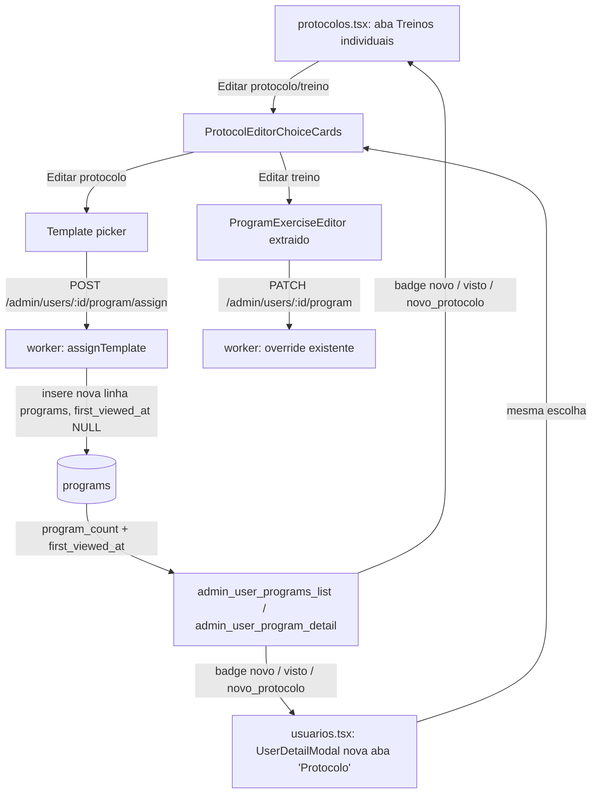

# Filtros de Usuários (MV), Migração de Protocolo e Split Protocolo/Treino — Planning Output (v2)

> **Status:** PLANEJADO — Aguardando aprovação
> **Data:** 2026-08-22
> **Scope:** `melhor-versao-dashboard` (Usuários, Protocolos) + `treino-trinca-app/worker` (backend, admin RPCs/routes/MV) + `treino-trinca-app/app-treino` (student app, handoff only)
> **Nota:** v1 tinha marcado o Problema 02 (split "Editar protocolo" vs "Editar treino" em `protocolos.tsx`) como feito por outra sessão — revertido a pedido do stakeholder; volta a fazer parte deste plano/sessão. Única mudança real de v1→v2 é o Problema 00 passar de RPC com agregação ao vivo para materialized view (ver §3.1).
> **Files:** ~10 arquivos (5 novos, 5 modificados) — dashboard + backend; student-app change é handoff separado
> **Risk:** 🔴 HIGH (o núcleo — migração de protocolo + estado de "visto" — muda dados de produção e contratos de API entre dois repositórios)

---

## 1. Contexto

Três problemas reportados no dashboard admin (`melhor-versao-dashboard`):

**Problema 00 — Filtros incompletos em Usuários.** Em `src/pages/usuarios.tsx`, os selects "Objetivo" e "Sexo" (mas não "Status", que já usa uma lista fixa) derivam suas opções via `Array.from(new Set(leads.map(l => l.objetivo)))` — ou seja, só a partir da página atualmente carregada de `admin_users_list` (paginação por cursor, 100 por vez, hoje 26.585 usuários totais). Confirmado no backend: `users.objetivo` e `users.sexo` são colunas `text` livres, sem `CHECK` constraint (`treino-trinca-app/worker/src/db/migrations/0000_wooden_princess_powerful.sql:97-116`) — não há uma lista fixa de valores possível de hardcodar no frontend como se fez para status.

Em vez de uma RPC que recalcula `DISTINCT` ao vivo sobre `users` a cada chamada (potencialmente pesada conforme a base cresce), seguimos o mesmo padrão já validado no dashboard de tráfego (`melhor-versao-dashboard/supabase/migrations/20260728210555_...sql` + `20260728210849_...sql`, projeto Supabase de funil/analytics): uma **materialized view** com refresh periódico (pg_cron), e uma RPC fina que só lê da MV. Ver §3.1.

**Problema 01 — Sem forma de migrar o protocolo do usuário.** O modal "Editar treino" (aba Protocolos → Treinos individuais, `src/pages/protocolos.tsx`) só edita os exercícios do programa mais recente do aluno via `PATCH /admin/users/:userId/program` (`treino-trinca-app/worker/src/routes/admin/programs.ts:354-528`) — esse handler nunca toca `protocol_templates`, só `workout_days`/`workout_day_exercises` do programa já existente. Não existe hoje nenhum endpoint para trocar o *template* atribuído ao usuário.

Precisamos também de um estado tri-state para o card/botão de "protocolo" no app do aluno: **novo** (primeiro protocolo do usuário, nunca visto), **visto** (já aberto) e **novo protocolo** (o protocolo foi trocado depois que o anterior já tinha sido visto, e o novo ainda não foi aberto). Achado-chave da pesquisa: o padrão de "visto" já existe duas vezes no backend, com timestamp nullable setado uma única vez via `COALESCE`:
- `programs.first_viewed_at` (`0028_programs_first_viewed_at.sql`), setado em `POST /programs/:id/mark-viewed` (`treino-trinca-app/worker/src/routes/programs.ts:135-144, 182-207`) — já consumido pelo `ProtocolReadyCard` no app do aluno.
- `users.evaluation_tab_highlight_seen_at` (`0030_users_evaluation_tab_highlight_seen_at.sql`), mesmo padrão, para o destaque da aba Avaliação.

Importante: `avaliacao.cardVisualizado` no dashboard (`src/pages/usuarios.tsx:204`, `Boolean(row.latest_quiz_response)`) **não é tracking real** — é só "existe uma resposta de quiz". Não é essa a arquitetura a replicar; a arquitetura real e correta é a de `programs.first_viewed_at`.

Como `programs` é a tabela de atribuição (uma linha nova por geração, resolvida hoje via `ORDER BY created_at DESC LIMIT 1`, sem FK explícita "programa atual"), migrar o usuário para um protocolo diferente = **inserir uma nova linha em `programs`**. Isso já dá o tri-state de graça, sem nenhuma coluna nova: se é a primeira linha `programs` do usuário → "novo"; se já existem linhas anteriores e a mais recente tem `first_viewed_at IS NULL` → "novo protocolo"; se `first_viewed_at IS NOT NULL` → "visto".

**Problema 02 — Lista de exercícios sempre visível.** O card/modal de edição do aluno deve primeiro perguntar "Editar protocolo" (trocar template) ou "Editar treino" (editar exercícios do protocolo atual) — hoje "Editar treino" já abre direto a lista de exercícios.

A edição de protocolo precisa funcionar tanto na aba Protocolos → Treinos individuais quanto em uma nova aba dentro do modal de edição de Usuários (`UserDetailModal`, que hoje só tem Dados/Cargas/Respostas do Quiz).

---

## 2. Referência de Código Mapeada

### 2.1 Padrão de "visto" real (nullable timestamp + COALESCE, set-once)

[0028_programs_first_viewed_at.sql](file:///Users/brunogovas/Projects/Pandora-Box/treino-trinca-app/worker/src/db/migrations/0028_programs_first_viewed_at.sql)

```sql
-- Sincroniza cross-device o estado de "protocolo novo" (badge verde em
-- ProtocolReadyCard, home + /workouts). NULL = "nunca visto" ainda; setado
-- uma única vez (coalesce no UPDATE, ver routes/programs.ts POST
-- /:id/mark-viewed) na primeira visualização real do card.
ALTER TABLE "programs" ADD COLUMN "first_viewed_at" timestamp with time zone;
```

[programs.ts L135-144](file:///Users/brunogovas/Projects/Pandora-Box/treino-trinca-app/worker/src/routes/programs.ts#L135-L144)

```ts
export async function markProgramViewed(
  programId: string,
  deps: MarkProgramViewedDeps = {},
): Promise<void> {
  const db = deps.db ?? defaultDb;
  await db
    .update(programs)
    .set({ firstViewedAt: sql`coalesce(${programs.firstViewedAt}, now())` })
    .where(eq(programs.id, programId));
}
```
↑ Este é exatamente o padrão a reaproveitar para o estado tri-state — nenhuma coluna nova de "seen" precisa ser criada, pois a semântica de "novo protocolo" cai naturalmente de "nova linha em `programs` cujo `first_viewed_at` ainda é NULL".

### 2.2 Geração de programa a partir de um template (base para "assign")

[program-generation.ts L166-254](file:///Users/brunogovas/Projects/Pandora-Box/treino-trinca-app/worker/src/services/program-generation.ts#L166-L254)

```ts
export async function generate(
  userId: string,
  quizProfile: QuizProfile,
  deps: ProgramGenerationDeps = {},
): Promise<void> {
  const transaction = deps.transaction ?? defaultTransaction;
  await transaction(async (tx) => {
    const template = await tx.findActiveProtocolTemplate(
      quizProfile.nivel,
      quizProfile.objetivo,
    );
    // ... insere programs, workout_days, workout_day_exercises,
    // program_progress_rollup numa unica transacao
  });
}
```
↑ Hoje resolve o template por `nivel`+`objetivo` (perfil do quiz). Para a migração manual pelo admin, precisamos de uma variante que receba o `templateId` diretamente (o admin já escolhe o protocolo pelo nome, não por nivel/objetivo) — ver §3.2.

### 2.3 RPC `admin_users_list` (fonte da paginação atual)

[0014_admin_users_release.sql L14-79](file:///Users/brunogovas/Projects/Pandora-Box/treino-trinca-app/worker/src/db/migrations/0014_admin_users_release.sql#L14-L79)

```sql
CREATE OR REPLACE FUNCTION public.admin_users_list(
  p_tier text DEFAULT NULL, p_role text DEFAULT NULL, p_is_active boolean DEFAULT NULL,
  p_search_email_prefix text DEFAULT NULL, p_search_name_prefix text DEFAULT NULL,
  p_before_created_at timestamptz DEFAULT NULL, p_before_user_id uuid DEFAULT NULL,
  p_limit integer DEFAULT 100
)
RETURNS TABLE (user_id uuid, email text, nome_completo text, tier text, role text,
  is_active boolean, objective text, age integer, sex text, created_at timestamptz,
  last_seen_at timestamptz, access_status text, cursor_created_at timestamptz, cursor_user_id uuid)
LANGUAGE sql STABLE SECURITY DEFINER SET search_path = public, pg_temp
AS $$
  SELECT u.id, u.email, u.nome_completo, u.tier, u.role, u.is_active,
    u.objetivo AS objective, u.idade AS age, u.sexo AS sex, u.created_at,
    p.last_activity_at AS last_seen_at, coalesce(p.access_status, ...) AS access_status,
    u.created_at, u.id
  FROM public.users u
  LEFT JOIN public.admin_user_search_projection p ON p.user_id = u.id
  WHERE (p_tier IS NULL OR u.tier = p_tier) AND ...
  ORDER BY u.created_at DESC, u.id DESC
  LIMIT least(greatest(coalesce(p_limit, 100), 1), 100);
$$;
```
↑ Padrão a seguir para a nova RPC de opções de filtro: `SECURITY DEFINER`, `STABLE`, `search_path` travado, sem `SELECT *`.

### 2.3b Padrão de materialized view + RPC fina (dashboard de tráfego)

[20260728210555_add_traffic_source_id_to_filter_options_mv.sql L59-89](file:///Users/brunogovas/Projects/Pandora-Box/melhor-versao-dashboard/supabase/migrations/20260728210555_add_traffic_source_id_to_filter_options_mv.sql#L59-L89)

```sql
drop materialized view if exists public.dashboard_filter_options_mv;

create materialized view public.dashboard_filter_options_mv as
  select
    funnel_id, country, funnel_variant, traffic_source_id,
    min(event_date) as min_event_date,
    max(event_date) as max_event_date,
    count(distinct lead_id)::integer as leads
  from funnel_events_flat_view
  group by funnel_id, country, funnel_variant, traffic_source_id
with data;

create unique index dashboard_filter_options_mv_uq
  on public.dashboard_filter_options_mv (funnel_id, country, coalesce(funnel_variant, ''::text), traffic_source_id);
```

[20260728210849_fix_rpc_dashboard_filter_options_use_mv.sql L19-48](file:///Users/brunogovas/Projects/Pandora-Box/melhor-versao-dashboard/supabase/migrations/20260728210849_fix_rpc_dashboard_filter_options_use_mv.sql#L19-L48)

```sql
-- ACHADO: antes desta migração, rpc_dashboard_filter_options() ignorava a
-- MV e recalculava funnel_events do zero a cada chamada. A correção foi
-- fazer o RPC só ler da MV (que já é mantida fresca por
-- refresh_dashboard_filter_options_mv() via pg_cron a cada 5 min):
create or replace function public.rpc_dashboard_filter_options()
returns table(funnel_id text, country text, funnel_variant text, traffic_source_id text, min_event_date date, max_event_date date, leads bigint)
language sql stable security definer
set search_path to 'public'
as $function$
  select mv.funnel_id, mv.country, mv.funnel_variant, mv.traffic_source_id, mv.min_event_date, mv.max_event_date, mv.leads
  from public.dashboard_filter_options_mv mv
  order by 1, 2, 3, 4;
$function$;
```
↑ Padrão exato a replicar para `admin_users_filter_options`: MV com `unique index` (permite `REFRESH MATERIALIZED VIEW CONCURRENTLY`, sem lock de leitura durante o refresh) + RPC que só faz `SELECT` da MV, nunca agrega `users` ao vivo. Nota: essa MV vive no projeto Supabase de funil/analytics (`VITE_SUPABASE_URL`); `users`/`objetivo`/`sexo` vivem no projeto CRM/app (`VITE_SUPABASE_CRM_URL`, mesmo Postgres do worker `treino-trinca-app`) — a nova MV é criada nesse segundo projeto, via migration Drizzle do worker (mesmo padrão de `0015`/`0028`/`0030`), não nas migrations deste repo.

### 2.4 Frontend — filtros derivados da página carregada (bug do Problema 00)

[usuarios.tsx L355-362](file:///Users/brunogovas/Projects/Pandora-Box/melhor-versao-dashboard/src/pages/usuarios.tsx#L355-L362)

```tsx
const objetivoOptions = useMemo(
  () => Array.from(new Set(leads.map((lead) => lead.objetivo).filter(Boolean))).sort(),
  [leads]
)
const sexoOptions = useMemo(
  () => Array.from(new Set(leads.map((lead) => lead.sexo).filter(Boolean))).sort(),
  [leads]
)
```
↑ Será substituído por opções vindas de uma RPC dedicada (§3.1), carregada uma vez, independente da paginação de `leads`.

### 2.5 Modal "Editar treino" — ponto de entrada do Problema 02

[protocolos.tsx L1159-1167](file:///Users/brunogovas/Projects/Pandora-Box/melhor-versao-dashboard/src/pages/protocolos.tsx#L1159-L1167)

```tsx
<Button
  type="button"
  variant="outline"
  disabled={!aluno.has_program}
  onClick={() => void openTreinoIndividualModal(aluno)}
>
  Editar treino
</Button>
```
↑ Vira dois botões (Editar protocolo / Editar treino), ver §6.1.

### 2.6 `UserDetailModal` — tabs existentes (onde a nova aba "Protocolo" entra)

[user-detail-modal.tsx L248-262](file:///Users/brunogovas/Projects/Pandora-Box/melhor-versao-dashboard/src/components/composites/user-detail-modal.tsx#L248-L262)

```tsx
<Tabs defaultValue="dados">
  <TabsList>
    <TabsTrigger value="dados" className="gap-1.5"><ClipboardList className="size-4" />Dados</TabsTrigger>
    <TabsTrigger value="cargas" className="gap-1.5"><Scale className="size-4" />Cargas</TabsTrigger>
    <TabsTrigger value="quiz" className="gap-1.5"><NotebookPen className="size-4" />Respostas do Quiz</TabsTrigger>
  </TabsList>
```
↑ Recebe um novo `TabsTrigger value="protocolo"`.

---

## 3. Lógica de Implementação

### 3.1 Materialized view + RPC fina — opções de filtro reais (Problema 00)

**Origem:** `[CRIADO]` a partir de `[REPO EXISTENTE]` (padrão exato de `dashboard_filter_options_mv`/`rpc_dashboard_filter_options`, §2.3b)

```sql
-- treino-trinca-app/worker/src/db/migrations/00XX_admin_users_filter_options_mv.sql
-- Uma linha por (filter_kind, value) em vez de duas colunas array — permite
-- unique index (filter_kind, value), que por sua vez habilita
-- REFRESH MATERIALIZED VIEW CONCURRENTLY (sem lock de leitura durante o
-- refresh), igual dashboard_filter_options_mv_uq faz para o outro projeto.
CREATE MATERIALIZED VIEW public.admin_users_filter_options_mv AS
  SELECT 'objetivo'::text AS filter_kind, u.objetivo AS value, count(*)::integer AS user_count
  FROM public.users u
  WHERE u.deleted_at IS NULL AND u.objetivo IS NOT NULL AND u.objetivo <> ''
  GROUP BY u.objetivo
  UNION ALL
  SELECT 'sexo'::text AS filter_kind, u.sexo AS value, count(*)::integer AS user_count
  FROM public.users u
  WHERE u.deleted_at IS NULL AND u.sexo IS NOT NULL AND u.sexo <> ''
  GROUP BY u.sexo
WITH DATA;
--> statement-breakpoint
CREATE UNIQUE INDEX admin_users_filter_options_mv_uq
  ON public.admin_users_filter_options_mv (filter_kind, value);
--> statement-breakpoint
-- Refresh function reaproveitando o mesmo nome/padrao de
-- refresh_dashboard_filter_options_mv() (agendado via pg_cron a cada 5 min
-- no outro projeto) — PRE-REQUISITO A VERIFICAR (Phase A.0, ver §10): se a
-- extensao pg_cron ja esta habilitada neste projeto Supabase (CRM/app);
-- se nao estiver, precisa de `create extension if not exists pg_cron;`
-- antes desta migration.
CREATE FUNCTION public.refresh_admin_users_filter_options_mv()
RETURNS void
LANGUAGE sql
AS $$
  REFRESH MATERIALIZED VIEW CONCURRENTLY public.admin_users_filter_options_mv;
$$;
--> statement-breakpoint
SELECT cron.schedule(
  'refresh-admin-users-filter-options-mv',
  '*/5 * * * *',
  $$SELECT public.refresh_admin_users_filter_options_mv();$$
);
--> statement-breakpoint
CREATE FUNCTION public.admin_users_filter_options()
RETURNS TABLE (objetivos text[], sexos text[])
LANGUAGE sql
STABLE
SECURITY DEFINER
SET search_path = public, pg_temp
AS $$
  SELECT
    coalesce((SELECT array_agg(value ORDER BY value) FROM public.admin_users_filter_options_mv WHERE filter_kind = 'objetivo'), '{}'),
    coalesce((SELECT array_agg(value ORDER BY value) FROM public.admin_users_filter_options_mv WHERE filter_kind = 'sexo'), '{}');
$$;
--> statement-breakpoint
COMMENT ON FUNCTION public.admin_users_filter_options() IS
  'Reads distinct objetivo/sexo values from admin_users_filter_options_mv (refreshed every 5min via pg_cron) instead of aggregating users live — same pattern as rpc_dashboard_filter_options()/dashboard_filter_options_mv in the traffic dashboard project. Free-text columns, no enum.';
--> statement-breakpoint
GRANT EXECUTE ON FUNCTION public.admin_users_filter_options() TO admin_dashboard;
```

Frontend (`usuarios.tsx`), substitui §2.4 — sem mudança nenhuma em relação a v1, já que o contrato da RPC (`{ objetivos: string[], sexos: string[] }`) é o mesmo, só a implementação por trás mudou de agregação ao vivo para leitura de MV:

```tsx
const [objetivoOptions, setObjetivoOptions] = useState<string[]>([])
const [sexoOptions, setSexoOptions] = useState<string[]>([])

useEffect(() => {
  let active = true
  adminRpc<{ objetivos: string[]; sexos: string[] }[]>("admin_users_filter_options")
    .then((rows) => {
      if (!active || !rows[0]) return
      setObjetivoOptions(rows[0].objetivos)
      setSexoOptions(rows[0].sexos)
    })
    .catch(() => {})
  return () => { active = false }
}, [])
```
(remove o `useMemo` de L355-362; o resto do JSX dos `<Select>` — L494-519 — não muda, só a fonte de `objetivoOptions`/`sexoOptions`.)

### 3.2 Migração de protocolo — novo serviço `assignTemplate`

**Origem:** `[CRIADO]` a partir de `[REPO EXISTENTE]` (`generate()`, §2.2)

```ts
// treino-trinca-app/worker/src/services/program-generation.ts (nova função, mesmo arquivo)
export async function assignTemplate(
  userId: string,
  templateId: string,
  deps: ProgramGenerationDeps = {},
): Promise<void> {
  const transaction = deps.transaction ?? defaultTransaction;

  await transaction(async (tx) => {
    const template = await tx.findProtocolTemplateById(templateId); // novo método no tx context, mesma forma de findActiveProtocolTemplate mas por id + status='ativo'
    if (!template) {
      throw new Error(`program.assignTemplate: protocol_template "${templateId}" inexistente ou inativo`);
    }

    const templateDays = await tx.findProtocolTemplateDays(template.id);
    if (templateDays.length === 0) {
      throw new Error(`program.assignTemplate: template "${template.id}" sem protocol_template_days`);
    }

    const programRows = await tx.insert(programs).values({
      userId,
      nome: template.nome,
      foco: template.descricao,
      statusGeracao: "pronto",
      // first_viewed_at fica NULL por default — é exatamente o que
      // sinaliza "novo protocolo" pra quem já tinha um programa anterior.
    }).returning<{ id: string }>();
    const program = programRows[0];

    // ... mesmo loop de workout_days/workout_day_exercises/
    // program_progress_rollup de generate() (§2.2), reaproveitado por
    // extração de uma função privada compartilhada `insertProgramDays(tx, program.id, templateDays)`
    // para não duplicar a lógica entre generate() e assignTemplate().
  });
}
```

### 3.3 Endpoint admin de migração + endpoint de leitura do estado tri-state

**Origem:** `[CRIADO]`, seguindo o padrão de auditoria/idempotência já usado no PATCH existente (§ referência abaixo)

```ts
// treino-trinca-app/worker/src/routes/admin/programs.ts — novo handler,
// mesmo bloco de idempotency-key/audit já usado no PATCH /:userId/program
// (ver programs.ts L354-380 para o boilerplate de doFindAdminMutation/
// doCreateAdminMutation/doWriteAdminAudit a reaproveitar tal qual).
app.post("/:userId/program/assign", doOriginGuard, adminWriteRateLimit, async (c) => {
  const userId = c.req.param("userId");
  const { templateId } = parseAssignProgramPayload(await readJsonPayload(c.req.raw));
  // ... mesmo padrao de idempotency/audit do PATCH acima ...
  await doAssignTemplate(userId, templateId); // wraps services/program-generation.ts#assignTemplate
  const response = await buildProgramResponse(db, userId);
  return jsonResponse(response, {}, c.env, c.req.raw);
});
```

Estado tri-state — computado, não armazenado. Adição em `admin_user_programs_list`/`admin_user_program_detail` (DROP+CREATE, mesmo motivo documentado em `0014`/`0015`: mudança de `RETURNS TABLE`):

```sql
-- treino-trinca-app/worker/src/db/migrations/00XX_admin_program_seen_state.sql
-- Adiciona first_viewed_at e program_count ao RETURNS TABLE das duas RPCs
-- de Treinos individuais, para o dashboard computar o badge sem nova coluna:
--   program_count = 1                                -> "novo" (primeiro programa)
--   program_count > 1 AND first_viewed_at IS NULL     -> "novo_protocolo" (trocado, ainda nao visto)
--   first_viewed_at IS NOT NULL                       -> "visto"
DROP FUNCTION public.admin_user_programs_list(text, text, timestamptz, uuid, integer);
CREATE FUNCTION public.admin_user_programs_list(...)
RETURNS TABLE (..., first_viewed_at timestamptz, program_count integer, ...)
LANGUAGE sql STABLE SECURITY DEFINER SET search_path = public, pg_temp
AS $$
  SELECT ..., latest.first_viewed_at,
    (SELECT count(*) FROM public.programs pc WHERE pc.user_id = u.id) AS program_count,
    ...
  FROM public.users u
  LEFT JOIN LATERAL (
    SELECT prog.id, prog.nome, prog.status_geracao, prog.created_at, prog.first_viewed_at
    FROM public.programs prog WHERE prog.user_id = u.id
    ORDER BY prog.created_at DESC, prog.id DESC LIMIT 1
  ) latest ON true
  ...
$$;
```

Frontend, mesma derivação nos dois pontos de consumo (dashboard admin badge e — handoff — `ProtocolReadyCard` no app do aluno):

```ts
// [CRIADO]
type ProtocoloBadgeState = "novo" | "visto" | "novo_protocolo"

function protocoloBadgeState(row: { program_count: number; first_viewed_at: string | null }): ProtocoloBadgeState {
  if (row.first_viewed_at) return "visto"
  return row.program_count <= 1 ? "novo" : "novo_protocolo"
}
```

### 3.4 Escolha "Editar protocolo" vs "Editar treino" (Problema 02)

**Origem:** `[CRIADO]`

```tsx
// src/components/composites/protocol-editor.tsx (novo)
type ProtocolEditorChoice = "protocolo" | "treino" | null

function ProtocolEditorChoiceCards({ onChoose }: { onChoose: (choice: "protocolo" | "treino") => void }) {
  return (
    <div className="grid grid-cols-1 gap-3 sm:grid-cols-2">
      <EntityCard title="Editar protocolo" onClick={() => onChoose("protocolo")}>
        Troca qual protocolo este aluno está seguindo.
      </EntityCard>
      <EntityCard title="Editar treino" onClick={() => onChoose("treino")}>
        Ajusta os exercícios do protocolo atual deste aluno.
      </EntityCard>
    </div>
  )
}
```
A lista de exercícios (bloco JSX existente em `protocolos.tsx` L1602-1836, extraído para `ProgramExerciseEditor`) só renderiza quando `choice === "treino"`; a escolha `"protocolo"` renderiza um `LinkedEntitySearchList` (mesmo composite já usado em L1485-1495) sobre `templates` (nome/categoria/nivel/objetivo) chamando o endpoint de `§3.3` ao confirmar.

---

## 4. Arquitetura de Componentes



---

## 5. CSS/SCSS Reference

Sem CSS/SCSS novo — o projeto usa Tailwind utilitário + composites já estilizados (`EntityCard`, `Badge`, `EntityEditModalShell`). O badge tri-state reaproveita a mesma classe condicional já usada em `user-detail-modal.tsx` L266-271 (`border-green-500/30 bg-green-500/10` vs `border-amber-500/30 bg-amber-500/10`), com uma terceira variante para `novo_protocolo` (ex.: `border-blue-500/30 bg-blue-500/10`, badge "Novo protocolo!" em azul para diferenciar do amarelo de "pendente").

---

## 6. Novos Componentes

### 6.1 `ProtocolEditorChoiceCards` + `ProtocolTemplatePicker`

**Path:** `src/components/composites/protocol-editor.tsx`

#### Props
```tsx
{
  studentUserId: string
  templates: TemplateRow[] // já carregado em protocolos.tsx; em usuarios.tsx precisa ser buscado via admin_protocol_templates_tree ao abrir a aba
  canEdit: boolean
  onAssigned: () => void // reload da lista/detalhe após assign
}
```

#### Lógica Core
Ver §3.4 (`ProtocolEditorChoiceCards`) + chamada `adminMutation(\`/admin/users/${studentUserId}/program/assign\`, { method: "POST", body: { templateId } })` ao confirmar a troca, reaproveitando o `adminMutation` já existente em `src/lib/admin-crm-api.ts`.

### 6.2 `ProgramExerciseEditor` (extração)

**Path:** `src/components/composites/program-exercise-editor.tsx`

Extração 1:1 do bloco hoje inline em `protocolos.tsx` L1602-1836 (edição de dias/exercícios do `programFormState`), transformado em componente recebendo `programFormState`, `updateProgramDay`, `updateProgramExercise`, `addProgramExercise`, `removeProgramExercise`, `exerciseCatalogFull`, `exercisePickerQuery`/`setExercisePickerQuery` como props — sem mudança de lógica, só de local (permite reuso em `usuarios.tsx`).

---

## 7. Componentes Modificados

### 7.1 `src/pages/usuarios.tsx`

**Novos states/hooks:** ver §3.1 (`objetivoOptions`/`sexoOptions` via RPC).

**Modificações no código existente:** remove `useMemo` L355-362; `filteredLeads` (L364-377) não muda, só a origem das opções que popula os `<Select>`.

**Props adicionais para sub-componentes:** `UserDetailModal` passa a receber `onProtocolChanged` (recarrega `selectedUserDetail` após assign) e o modal ganha a nova tab (§7.2).

### 7.2 `src/components/composites/user-detail-modal.tsx`

Novo `TabsTrigger`/`TabsContent` "Protocolo" ao lado de Dados/Cargas/Quiz (§2.6), montando `ProtocolEditorChoiceCards` (§6.1) — carrega `admin_user_program_detail`/`admin_protocol_templates_tree` sob demanda ao abrir a aba, no mesmo padrão de `openTreinoIndividualModal` (`protocolos.tsx` L622-679).

### 7.3 `src/pages/protocolos.tsx`

Botão único "Editar treino" (§2.5) vira dois botões (Editar protocolo / Editar treino) abrindo o mesmo `ProtocolEditorChoiceCards`; o bloco `modalMode === "program"` (L1578-1841) passa a usar `ProgramExerciseEditor` (§6.2) em vez do JSX inline, só quando a escolha for "treino".

---

## 8. i18n Keys

Não aplicável — o projeto não usa i18n (strings em pt-BR direto no JSX, como todo o resto do arquivo).

---

## 9. Files Summary

| Action | File | Risk |
|--------|------|------|
| **NEW** | `treino-trinca-app/worker/src/db/migrations/00XX_admin_users_filter_options_mv.sql` (MV + refresh function + pg_cron schedule + RPC fina) | 🟢 LOW (verificar pg_cron habilitado antes, ver §10 Phase A.0) |
| **NEW** | `treino-trinca-app/worker/src/db/migrations/00XX_admin_program_seen_state.sql` | 🟡 MEDIUM (DROP+CREATE de RPC em uso) |
| **NEW** | `treino-trinca-app/worker/src/services/program-generation.ts` (`assignTemplate`, extração de helper compartilhado) | 🔴 HIGH (escreve `programs`/`workout_days` de produção) |
| **MODIFY** | `treino-trinca-app/worker/src/routes/admin/programs.ts` (`POST /:userId/program/assign`) | 🔴 HIGH |
| **NEW** | `melhor-versao-dashboard/src/components/composites/protocol-editor.tsx` | 🟡 MEDIUM |
| **NEW** | `melhor-versao-dashboard/src/components/composites/program-exercise-editor.tsx` (extração) | 🟢 LOW |
| **MODIFY** | `melhor-versao-dashboard/src/pages/usuarios.tsx` | 🟡 MEDIUM |
| **MODIFY** | `melhor-versao-dashboard/src/components/composites/user-detail-modal.tsx` | 🟡 MEDIUM |
| **MODIFY** | `melhor-versao-dashboard/src/pages/protocolos.tsx` | 🟡 MEDIUM |
| **HANDOFF** | `treino-trinca-app/app-treino/src/hooks/use-protocol-status.ts` + `ProtocolReadyCard` (consumir `program_count`/badge "novo_protocolo") | 🟡 MEDIUM — repo/app separado, fora do escopo direto deste dashboard |

---

## 10. Implementation Order

1. **Phase A.0 (pré-requisito, 5 min):** confirmar se a extensão `pg_cron` já está habilitada no projeto Supabase CRM/app (`VITE_SUPABASE_CRM_URL`) — ela já está em uso no projeto de tráfego, mas são projetos Supabase diferentes; se não estiver, adicionar `create extension if not exists pg_cron;` na migration de §3.1 antes do `cron.schedule`.
2. **Phase A (backend, baixo risco):** MV + refresh function + `cron.schedule` + RPC fina `admin_users_filter_options` (§3.1) → desbloqueia Problema 00 sozinho, sem dependência do resto.
3. **Phase B (backend, migração de protocolo):** `assignTemplate` service (§3.2) + `POST /:userId/program/assign` (§3.3) + migração `admin_program_seen_state` (§3.3) — testar isoladamente via chamada direta ao worker antes de ligar ao frontend.
4. **Phase C (dashboard, Problema 00):** trocar `usuarios.tsx` para consumir a nova RPC (§3.1).
5. **Phase D (dashboard, extração):** extrair `ProgramExerciseEditor` (§6.2) de `protocolos.tsx` sem mudar comportamento — validar que nada quebrou antes de seguir.
6. **Phase E (dashboard, Problema 01+02):** `ProtocolEditorChoiceCards` + template picker (§6.1) plugados em `protocolos.tsx` e na nova aba de `user-detail-modal.tsx`.
7. **Phase F (handoff):** documentar contrato de `program_count`/`first_viewed_at` para o time do app do aluno atualizar `use-protocol-status.ts`.

---

## 11. Rollback Plan

```
Fase A/C (Problema 00):
├── Git Ref: HEAD antes da implementação (dashboard) + commit da migration (worker)
├── Revert: git checkout <ref> -- src/pages/usuarios.tsx  |  SELECT cron.unschedule('refresh-admin-users-filter-options-mv'); DROP FUNCTION admin_users_filter_options(); DROP FUNCTION refresh_admin_users_filter_options_mv(); DROP MATERIALIZED VIEW admin_users_filter_options_mv;
└── Validação: filtros voltam ao comportamento anterior (baseado na página carregada); confirmar que o cron job foi removido (`SELECT * FROM cron.job WHERE jobname = 'refresh-admin-users-filter-options-mv'` vazio)

Fase B/E (Problema 01, HIGH risk):
├── Git Ref: commit isolado por fase (B e E em commits separados, nunca amend)
├── Revert dashboard: git checkout <ref> -- src/pages/protocolos.tsx src/components/composites/user-detail-modal.tsx src/components/composites/protocol-editor.tsx
├── Revert backend: git checkout <ref> -- worker/src/routes/admin/programs.ts worker/src/services/program-generation.ts; nova migration de schema (program_count/first_viewed_at exposto) é aditiva e pode ficar (não precisa reverter, só o endpoint de assign deixa de existir)
└── Validação pós-revert: `POST /admin/users/:id/program/assign` retorna 404 de rota; `programs` não recebeu linhas órfãs (checar via admin_user_program_detail que o programa mais recente do usuário testado continua sendo o esperado)
```

Para 🔴 HIGH (`assignTemplate`/endpoint de assign): antes de aprovar a implementação, apresentar um teste manual em ambiente de staging com um usuário de teste, comparando `programs` antes/depois, e só então liberar para produção.

---

## 12. Verification Plan

| # | Test Case | Route | Expected |
|---|-----------|-------|----------|
| 1 | Abrir Usuários sem filtro, checar contagem de opções em Objetivo/Sexo | `/usuarios` | Todas as combinações distintas existentes na base aparecem, não só as da 1ª página de 100 |
| 2 | Selecionar um objetivo raro (presente só em usuário fora da 1ª página) | `/usuarios` | Opção aparece no select e o filtro retorna o usuário certo |
| 2b | Criar usuário com `objetivo` inédito, aguardar até 5 min (ciclo do cron) | backend | Novo valor aparece em `admin_users_filter_options_mv` e na RPC sem precisar de deploy/refresh manual |
| 3 | Trocar protocolo de um aluno com programa existente e já visto (`first_viewed_at` setado) | `/protocolos` aba Treinos individuais → Editar protocolo | Nova linha em `programs`, badge do aluno vira "Novo protocolo" (não "Novo" nem "Visto") |
| 4 | Trocar protocolo de aluno que nunca teve programa | idem | Badge vira "Novo" (primeiro programa, `program_count = 1`) |
| 5 | Abrir o protocolo recém-atribuído no app do aluno e chamar mark-viewed | app do aluno | `first_viewed_at` passa a NOT NULL, badge no dashboard vira "Visto" |
| 6 | Clicar "Editar treino" em um aluno | `/protocolos` | Lista de exercícios só aparece após escolher explicitamente "Editar treino"; escolher "Editar protocolo" nunca mostra a lista de exercícios |
| 7 | Abrir aba "Protocolo" dentro do modal de um usuário em `/usuarios` | `/usuarios` → Ver lead | Mesmas duas opções (editar protocolo/treino) funcionam idêntico ao fluxo de `/protocolos` |
| 8 | Idempotência do assign (duplo clique/retry) | `POST /admin/users/:id/program/assign` | Idempotency-Key evita criar duas linhas `programs` para o mesmo clique |

---

## 13. Handoff

### 13.1 App do aluno (`treino-trinca-app/app-treino`)

- **O que é necessário:** atualizar `src/hooks/use-protocol-status.ts` e `ProtocolReadyCard` para diferenciar "novo protocolo" (mudou depois de visto) de "novo" (primeiro protocolo) — hoje só tratam o binário visto/não visto via `first_viewed_at`. Consumir `program_count` (ou equivalente exposto por `GET /programs/current`) para a derivação de §3.3.
- **Documento de handoff:** a ser criado em `docs/sessions/2026-08/handoff-protocol-seen-state-app.md` junto com o time responsável por `app-treino`, após aprovação deste plano.
