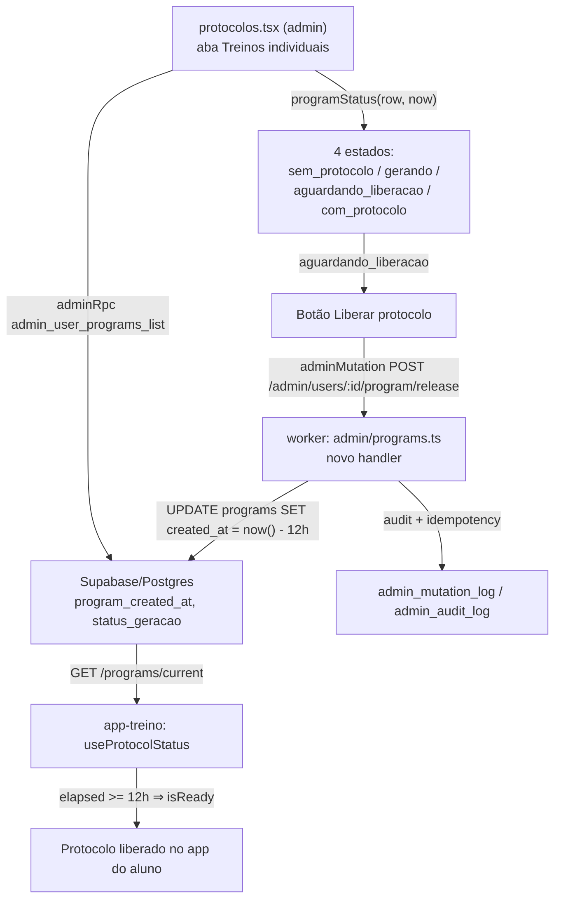

# Liberação Antecipada de Protocolo (Admin) — Planning Output (v1)

> **Status:** PLANEJADO — Aguardando aprovação
> **Data:** 2026-08-18
> **Scope:** `melhor-versao-dashboard/src/pages/protocolos.tsx` (admin, aba "Treinos individuais") + `treino-trinca-app/worker/src/routes/admin/programs.ts` (backend do app do aluno)
> **Files:** 2 arquivos modificados (0 novos)
> **Risk:** 🔴 HIGH (ponto backend) / 🟡 MEDIUM (ponto frontend)

---

## 1. Contexto

Hoje o admin (`protocolos.tsx`, aba "Treinos individuais") mostra 3 estados por aluno: **Com protocolo**, **Protocolo pendente**, **Sem protocolo** (`programStatus()`, linhas 355-359). Esse cálculo tem um bug: compara `program_status_geracao` com as strings `"pending"`/`"pendente"`, mas o backend real (`programs.status_geracao`, constraint em `worker/src/db/schema.ts` L226-238) só emite `"preparando"` ou `"pronto"`. Resultado: o estado "Pendente" nunca dispara — todo aluno com `has_program = true` cai em "Com protocolo", mesmo enquanto o protocolo ainda está sendo gerado.

Além disso, existe uma segunda barreira, totalmente separada da geração, e **invisível hoje no admin**: o app do aluno (`treino-trinca-app/app-treino`) esconde o protocolo por **12 horas reais** a partir de `programs.created_at` mesmo depois de `status_geracao = 'pronto'` (`use-protocol-status.ts` L6-9, L42-46) — um "valor percebido" de countdown de 24h que na verdade libera às 12h. Isso é 100% client-side: não existe coluna, cron, trigger ou edge function que materialize essa carência no backend.

**Objetivo deste ajuste:**
1. Corrigir `programStatus()` para refletir o estado real de geração (`preparando`/`pronto`).
2. Adicionar um 4º estado no admin — **"Aguardando liberação"** — para quando `status_geracao = 'pronto'` mas ainda faltam horas da carência de 12h (quiz concluído, protocolo gerado, só não liberado pro aluno ainda).
3. Adicionar um botão **"Liberar protocolo"** nesse estado, que força a liberação imediata.

**Decisão de arquitetura confirmada com o stakeholder:** a liberação forçada será implementada rebatendo `programs.created_at` para `now() - interval '12 hours'` no programa mais recente do usuário (em vez de usar a coluna `programs.released_early_by`, que já existe no schema — L228 — e já é exposta em `admin_user_detail`, mas está sem nenhum endpoint/consumidor ligado a ela hoje). Essa opção mais limpa foi apresentada e recusada explicitamente — mantém-se `created_at` como fonte da liberação, ciente do risco descrito na seção 11.

---

## 2. Referência de Código Mapeada

### 2.1 Cálculo de status atual (bug) e tiles

[protocolos.tsx L355-359](file:///Users/brunogovas/Projects/Pandora-Box/melhor-versao-dashboard/src/pages/protocolos.tsx#L355-L359)

```tsx
function programStatus(row: UserProgramRow) {
  if (!row.has_program) return "sem_protocolo"
  if (row.program_status_geracao === "pending" || row.program_status_geracao === "pendente") return "pendente"
  return "com_protocolo"
}
```

[protocolos.tsx L216-220](file:///Users/brunogovas/Projects/Pandora-Box/melhor-versao-dashboard/src/pages/protocolos.tsx#L216-L220)

```tsx
const ALUNO_STATUS_TONE = {
  com_protocolo: { icon: CheckCircle2, className: "text-green-500", label: "Com protocolo" },
  pendente: { icon: Clock, className: "text-amber-500", label: "Protocolo pendente" },
  sem_protocolo: { icon: Lock, className: "text-blue-500", label: "Sem protocolo" },
} as const
```

[protocolos.tsx L494-502](file:///Users/brunogovas/Projects/Pandora-Box/melhor-versao-dashboard/src/pages/protocolos.tsx#L494-L502)

```tsx
const alunosStats = useMemo(
  () => ({
    noApp: students.length,
    comProtocolo: students.filter((student) => student.has_program).length,
    pendente: students.filter((student) => programStatus(student) === "pendente").length,
    semProtocolo: students.filter((student) => !student.has_program).length,
  }),
  [students]
)
```
↑ `comProtocolo` hoje conta só `has_program`, não `programStatus(...) === "com_protocolo"` — inconsistente com o badge do card logo abaixo. Como o novo 4º estado precisa entrar nessa contagem para o tile "Com protocolo" não incluir alunos ainda travados na carência, esse `useMemo` será reescrito por completo (seção 7.1) usando `programStatus(...)` para todos os 4 buckets.

### 2.2 Card do aluno + botão de ação existente (padrão a seguir)

[protocolos.tsx L1032-1067](file:///Users/brunogovas/Projects/Pandora-Box/melhor-versao-dashboard/src/pages/protocolos.tsx#L1032-L1067)

```tsx
{pagedAlunos.map((aluno) => {
  const status = programStatus(aluno)
  const statusTone = ALUNO_STATUS_TONE[status]
  const StatusIcon = statusTone.icon
  return (
    <Card key={aluno.user_id}>
      <CardContent className="flex flex-col gap-3 p-4 md:flex-row md:items-center md:justify-between">
        <div className="min-w-0 space-y-1">
          <div className="flex flex-wrap items-center gap-2">
            <h3 className="font-semibold">{aluno.nome_completo || aluno.email}</h3>
            {aluno.tier && <PlanBadge plan={aluno.tier} />}
            <Badge variant="outline" className="gap-1">
              <StatusIcon className={`size-3.5 ${statusTone.className}`} />
              {statusTone.label}
            </Badge>
          </div>
          <p className="text-sm text-muted-foreground">{aluno.email}</p>
          <p className="text-sm text-muted-foreground">
            {aluno.program_nome || "Sem programa atual"}
          </p>
        </div>
        <Button
          type="button"
          variant="outline"
          disabled={!aluno.has_program}
          onClick={() => void openTreinoIndividualModal(aluno)}
        >
          Editar treino
        </Button>
      </CardContent>
    </Card>
  )
})}
```
↑ O botão "Liberar protocolo" entra ao lado de "Editar treino", condicionado ao novo status `aguardando_liberacao`.

### 2.3 Padrão de mutação admin (frontend → worker) — `adminMutation`

[admin-api.ts L73-93](file:///Users/brunogovas/Projects/Pandora-Box/melhor-versao-dashboard/src/lib/admin-api.ts#L73-L93)

```tsx
export async function adminMutation<T>(
  path: string,
  options: { method?: "POST" | "PATCH"; body?: unknown; idempotencyKey?: string } = {}
): Promise<T> {
  const token = await getCrmAccessToken()
  const response = await fetch(`${apiUrl}${normalizePath(path)}`, {
    method: options.method ?? "POST",
    headers: {
      Authorization: `Bearer ${token}`,
      "Content-Type": "application/json",
      "Idempotency-Key": options.idempotencyKey ?? createIdempotencyKey(),
    },
    body: options.body === undefined ? undefined : JSON.stringify(options.body),
  })
  if (!response.ok) throw await parseWorkerError(response)
  return (await response.json()) as T
}
```

Uso real já existente na página irmã `liberar-usuario.tsx` (mesmo padrão que o novo botão vai seguir):

[liberar-usuario.tsx L108-118](file:///Users/brunogovas/Projects/Pandora-Box/melhor-versao-dashboard/src/pages/liberar-usuario.tsx#L108-L118)

```tsx
const user = await adminMutation<AdminUserMutationResponse>("/admin/users", {
  method: "POST",
  body: { email, nomeCompleto, tier },
})
const released = await adminMutation<AdminUserMutationResponse>(`/admin/users/${user.userId}/release`, {
  method: "POST",
  body: { tier },
})
```

### 2.4 Padrão de endpoint mutável no worker (idempotência + auditoria) — a estender

[worker/src/routes/admin/programs.ts L354-386](file:///Users/brunogovas/Projects/Pandora-Box/treino-trinca-app/worker/src/routes/admin/programs.ts#L354-L386)

```ts
app.patch("/:userId/program", doOriginGuard, adminWriteRateLimit, async (c) => {
  const userId = c.req.param("userId");
  const actorUserId = c.get("userId");
  const correlationId = c.get("correlationId");
  let idempotencyKey: string | null = null;

  try {
    idempotencyKey = parseAdminIdempotencyKey(c.req.header("idempotency-key"));
    const existing = await doFindAdminMutation({ actorUserId, idempotencyKey }, deps);
    if (existing?.status === "completed") {
      return jsonResponse(existing.responseBody, {}, c.env, c.req.raw);
    }
    if (existing) {
      throw new HttpError(409, "conflict", "Admin mutation is already in progress");
    }

    await doCreateAdminMutation(
      { actorUserId, idempotencyKey, action: "admin.users.program.override", correlationId },
      deps,
    );

    const payload = parseOverrideProgramPayload(await readJsonPayload(c.req.raw));
    const user = (await db.query.users.findFirst({ where: eq(users.id, userId) })) as UserRow | undefined;
    if (!user) throw new HttpError(404, "not_found", "User not found");

    const program = await findLatestProgram(db, userId);
    if (!program) throw new HttpError(404, "not_found", "User has no program to override");
    // ... mutação ...
```
↑ Bloco `try { idempotencyKey → find → create → handler → writeAdminAudit(success) → completeAdminMutation(completed) } catch { writeAdminAudit(failure) → completeAdminMutation(failed) → throw }` (fechamento completo em L500-528) será replicado 1:1 para o novo endpoint `POST /:userId/program/release`.

`findLatestProgram` (helper já existente, reaproveitado sem alteração):

[worker/src/routes/admin/programs.ts L271-279](file:///Users/brunogovas/Projects/Pandora-Box/treino-trinca-app/worker/src/routes/admin/programs.ts#L271-L279)

```ts
async function findLatestProgram(
  db: Pick<typeof defaultDb, "query">,
  userId: string,
): Promise<ProgramRow | undefined> {
  return (await db.query.programs.findFirst({
    where: eq(programs.userId, userId),
    orderBy: [desc(programs.createdAt)],
  })) as ProgramRow | undefined;
}
```

### 2.5 Schema da tabela `programs` (coluna a rebater)

[worker/src/db/schema.ts L217-241](file:///Users/brunogovas/Projects/Pandora-Box/treino-trinca-app/worker/src/db/schema.ts#L217-L241)

```ts
export const programs = pgTable(
  "programs",
  {
    id: uuid("id").primaryKey().defaultRandom(),
    userId: uuid("user_id").notNull().references(() => users.id, { onDelete: "cascade" }),
    nome: text("nome").notNull(),
    foco: text("foco"),
    statusGeracao: text("status_geracao").notNull().default("preparando"),
    createdAt: timestamp("created_at", { withTimezone: true }).notNull().defaultNow(),
    releasedEarlyBy: uuid("released_early_by").references(() => users.id),
  },
  (table) => [
    index("idx_programs_user_created").on(table.userId, table.createdAt.desc()),
    check("programs_status_geracao_check", sql`${table.statusGeracao} in ('preparando', 'pronto')`),
  ],
);
```

### 2.6 Lógica de carência client-side a espelhar no admin (mesma janela de 12h)

[app-treino/src/hooks/use-protocol-status.ts L6-9,42-46](file:///Users/brunogovas/Projects/Pandora-Box/treino-trinca-app/app-treino/src/hooks/use-protocol-status.ts#L6-L9)

```ts
const TWENTY_FOUR_HOURS_MS = 24 * 60 * 60 * 1000
// Real unlock threshold: workout becomes available at 12h, while the
// countdown card keeps displaying the 24h figure (perceived value).
const ACTIVATION_DELAY_MS = 12 * 60 * 60 * 1000
...
const elapsedMs = createdAtMs !== null ? now - createdAtMs : 0
const hasReachedActivationDelay = createdAtMs !== null && elapsedMs >= ACTIVATION_DELAY_MS
```
↑ O admin precisa usar exatamente essa mesma janela (12h reais a partir de `program_created_at`) para decidir se mostra "Aguardando liberação" — senão o admin e o app do aluno discordam sobre quando o protocolo está liberado.

### 2.7 RPC `admin_user_programs_list` (já expõe o campo necessário, sem alteração)

[0015_admin_protocol_contracts.sql L119-165](file:///Users/brunogovas/Projects/Pandora-Box/treino-trinca-app/worker/src/db/migrations/0015_admin_protocol_contracts.sql#L119-L165)

```sql
RETURNS TABLE (
  user_id uuid, email text, nome_completo text, tier text, access_status text,
  has_program boolean, program_id uuid, program_nome text,
  program_status_geracao text, program_created_at timestamptz,
  cursor_created_at timestamptz, cursor_user_id uuid
)
...
    latest.status_geracao AS program_status_geracao,
    latest.created_at AS program_created_at,
```
↑ `program_created_at` já vem no payload consumido por `adminRpc<UserProgramRow[]>("admin_user_programs_list", …)` — nenhuma migration de leitura é necessária, só o novo endpoint de escrita (2.4).

---

## 3. Lógica de Implementação

### 3.1 Novo cálculo de status (4 estados) — `programStatus`

**Origem:** `[REPO EXISTENTE]` (estende `programStatus` de protocolos.tsx L355-359) + `[CRIADO]` (janela de 12h, replicando 2.6)

```tsx
const ACTIVATION_DELAY_MS = 12 * 60 * 60 * 1000 // mesma janela de use-protocol-status.ts (app-treino)

function programStatus(row: UserProgramRow, nowMs: number): AlunoStatus {
  if (!row.has_program) return "sem_protocolo"
  if (row.program_status_geracao === "preparando") return "gerando"
  if (row.program_created_at) {
    const elapsedMs = nowMs - new Date(row.program_created_at).getTime()
    if (elapsedMs < ACTIVATION_DELAY_MS) return "aguardando_liberacao"
  }
  return "com_protocolo"
}
```

`nowMs` é passado explicitamente (não `Date.now()` direto na função) para manter `programStatus` puro e testável, e para poder recalcular os 4 buckets de `alunosStats` e a lista com o mesmo instante em cada render (evita status divergente entre o tile e o card na mesma renderização).

### 3.2 Horas restantes para exibição no card

**Origem:** `[CRIADO]`

```tsx
function hoursRemaining(row: UserProgramRow, nowMs: number): number {
  if (!row.program_created_at) return 0
  const elapsedMs = nowMs - new Date(row.program_created_at).getTime()
  return Math.max(0, Math.ceil((ACTIVATION_DELAY_MS - elapsedMs) / (60 * 60 * 1000)))
}
```
Arredonda para cima (`ceil`) para nunca mostrar "faltam 0h" enquanto ainda falta minutos — mesma lógica de exibição usada em UI de countdown (não precisa de segundos aqui, é uma lista admin, não uma tela de espera do aluno).

### 3.3 Endpoint `POST /:userId/program/release` (worker)

**Origem:** `[REPO EXISTENTE]` (estrutura idêntica ao PATCH de 2.4) + `[CRIADO]` (regra de negócio da liberação)

```ts
// worker/src/routes/admin/programs.ts — novo handler, mesmo arquivo do PATCH /:userId/program
app.post("/:userId/program/release", doOriginGuard, adminWriteRateLimit, async (c) => {
  const userId = c.req.param("userId");
  const actorUserId = c.get("userId");
  const correlationId = c.get("correlationId");
  let idempotencyKey: string | null = null;

  try {
    idempotencyKey = parseAdminIdempotencyKey(c.req.header("idempotency-key"));
    const existing = await doFindAdminMutation({ actorUserId, idempotencyKey }, deps);
    if (existing?.status === "completed") {
      return jsonResponse(existing.responseBody, {}, c.env, c.req.raw);
    }
    if (existing) {
      throw new HttpError(409, "conflict", "Admin mutation is already in progress");
    }

    await doCreateAdminMutation(
      { actorUserId, idempotencyKey, action: "admin.users.program.release_early", correlationId },
      deps,
    );

    const user = (await db.query.users.findFirst({ where: eq(users.id, userId) })) as UserRow | undefined;
    if (!user) throw new HttpError(404, "not_found", "User not found");

    const program = await findLatestProgram(db, userId);
    if (!program) throw new HttpError(404, "not_found", "User has no program to release");
    if (program.statusGeracao !== "pronto") {
      throw new HttpError(409, "program_not_ready", "Program is still being generated");
    }

    const beforeCreatedAt = program.createdAt;

    // Rebate created_at para o limiar exato dos 12h de carência
    // (use-protocol-status.ts ACTIVATION_DELAY_MS) — libera imediatamente
    // sem alterar a ordenação (findLatestProgram usa orderBy created_at
    // desc; o valor ainda fica no passado, nunca no futuro).
    const [updated] = await db
      .update(programs)
      .set({ createdAt: sql`now() - interval '12 hours'` })
      .where(eq(programs.id, program.id))
      .returning({ id: programs.id, createdAt: programs.createdAt });

    if (!updated) throw new HttpError(500, "internal_error", "Failed to release program");

    const response = {
      userId,
      programId: updated.id,
      releasedAt: updated.createdAt.toISOString(),
    };

    await doWriteAdminAudit(
      {
        actorUserId,
        targetType: "admin_user_program",
        targetId: userId,
        action: "admin.users.program.release_early",
        status: "success",
        metadata: { programId: program.id },
        before: { createdAt: beforeCreatedAt.toISOString() },
        after: { createdAt: updated.createdAt.toISOString() },
        idempotencyKey,
        correlationId,
        ipHash: hashAdminRequestValue(requestIp(c)),
        userAgentHash: hashAdminRequestValue(c.req.header("user-agent")),
      },
      deps,
    );
    await doCompleteAdminMutation(
      { actorUserId, idempotencyKey, status: "completed", responseBody: response },
      deps,
    );
    await doInvalidateAdminCache({ type: "user.mutated", userId }, deps);

    return jsonResponse(response, {}, c.env, c.req.raw);
  } catch (error) {
    await doWriteAdminAudit(
      {
        actorUserId,
        targetType: "admin_user_program",
        targetId: userId,
        action: "admin.users.program.release_early",
        status: "failure",
        metadata: { code: error instanceof HttpError ? error.code : "internal_error" },
        idempotencyKey,
        correlationId,
        ipHash: hashAdminRequestValue(requestIp(c)),
        userAgentHash: hashAdminRequestValue(c.req.header("user-agent")),
      },
      deps,
    );
    if (idempotencyKey) {
      await doCompleteAdminMutation({ actorUserId, idempotencyKey, status: "failed" }, deps);
    }
    throw error;
  }
});
```

Import adicional necessário no topo do arquivo: `import { sql } from "drizzle-orm";` (já usado nesse padrão em `schema.ts` L18, mas ainda não importado em `programs.ts` — checar `head -20` do arquivo antes de aplicar).

**Guard de negócio:** bloqueado (`409 program_not_ready`) se `status_geracao !== 'pronto'` — reflete a decisão do stakeholder de que o botão só existe/funciona quando o quiz já foi concluído e o protocolo já foi *gerado*, nunca para pular a geração em si (Fase 2, pergunta 1: "Só após quiz concluído").

### 3.4 Handler do botão no admin (frontend)

**Origem:** `[REPO EXISTENTE]` (padrão de `handleCreateSubmit` em liberar-usuario.tsx) + `[CRIADO]`

```tsx
const [releasingUserId, setReleasingUserId] = useState<string | null>(null)

async function handleLiberarProtocolo(aluno: UserProgramRow) {
  if (releasingUserId) return
  setReleasingUserId(aluno.user_id)
  try {
    await adminMutation(`/admin/users/${aluno.user_id}/program/release`, { method: "POST" })
    await loadStudents()
  } catch (error) {
    setModalError(errorMessage(error)) // reaproveita o padrão de erro já usado na página
  } finally {
    setReleasingUserId(null)
  }
}
```

---

## 4. Arquitetura de Componentes



---

## 5. CSS/SCSS Reference

Não aplicável — projeto usa Tailwind utility classes + design system de componentes (`@/components/atoms`), sem SCSS. O botão novo reaproveita `Button` (`variant="outline"`, mesmo padrão do "Editar treino" já no card) e o novo tone de badge reaproveita as classes Tailwind já usadas em `ALUNO_STATUS_TONE` (`text-amber-500` etc.), sem CSS novo.

---

## 6. Novos Componentes

Nenhum componente novo — tudo é extensão de `protocolos.tsx` (estado, função, JSX inline no card já existente) e um novo handler no worker. Não há justificativa para extrair um componente dedicado dado o tamanho da mudança.

---

## 7. Componentes Modificados

### 7.1 `melhor-versao-dashboard/src/pages/protocolos.tsx`

**Novo tipo e constante:**
```tsx
type AlunoStatus = "sem_protocolo" | "gerando" | "aguardando_liberacao" | "com_protocolo"

const ACTIVATION_DELAY_MS = 12 * 60 * 60 * 1000
```

**Substituir `ALUNO_STATUS_TONE` (L216-220):**
```tsx
const ALUNO_STATUS_TONE = {
  com_protocolo: { icon: CheckCircle2, className: "text-green-500", label: "Com protocolo" },
  aguardando_liberacao: { icon: Clock, className: "text-amber-500", label: "Aguardando liberação" },
  gerando: { icon: Loader2, className: "text-amber-500 animate-spin", label: "Gerando protocolo" },
  sem_protocolo: { icon: Lock, className: "text-blue-500", label: "Sem protocolo" },
} as const satisfies Record<AlunoStatus, { icon: typeof CheckCircle2; className: string; label: string }>
```

**Substituir `programStatus` (L355-359)** pela versão da seção 3.1 (assinatura ganha `nowMs`) + adicionar `hoursRemaining` (seção 3.2) logo abaixo.

**Substituir `alunosStats` (L494-502)** — precisa de `nowMs` estável por render:
```tsx
const nowMs = useMemo(() => Date.now(), [students]) // recalcula só quando a lista muda (nova busca/reload), evita re-render a cada segundo

const alunosStats = useMemo(
  () => ({
    noApp: students.length,
    comProtocolo: students.filter((s) => programStatus(s, nowMs) === "com_protocolo").length,
    aguardandoLiberacao: students.filter((s) => programStatus(s, nowMs) === "aguardando_liberacao").length,
    gerando: students.filter((s) => programStatus(s, nowMs) === "gerando").length,
    semProtocolo: students.filter((s) => !s.has_program).length,
  }),
  [students, nowMs]
)
```

**Novo state (perto de `releaseState`/outros states de UI da página):**
```tsx
const [releasingUserId, setReleasingUserId] = useState<string | null>(null)
```
+ handler `handleLiberarProtocolo` (seção 3.4).

**Modificação no StatTile grid (L982-987)** — troca o tile "Pendentes" (que hoje não reflete nada corretamente) por "Aguardando liberação", e adiciona/mantém 4 tiles cobrindo os 4 estados reais:
```tsx
<div className="grid grid-cols-1 gap-3 md:grid-cols-4">
  <StatTile icon={Users} label="No app" value={alunosStats.noApp} tone="blue" />
  <StatTile icon={CheckCircle2} label="Com protocolo" value={alunosStats.comProtocolo} tone="green" />
  <StatTile icon={Clock} label="Aguardando liberação" value={alunosStats.aguardandoLiberacao} tone="amber" />
  <StatTile icon={Lock} label="Sem protocolo" value={alunosStats.semProtocolo} tone="purple" />
</div>
```
(`gerando` fica disponível em `alunosStats` mas sem tile dedicado — 4 tiles é o limite do grid atual; pode ser adicionado depois se o stakeholder quiser um 5º tile.)

**Modificação no card do aluno (L1032-1067)** — `programStatus` passa a receber `nowMs`, e o botão novo entra ao lado de "Editar treino":
```tsx
{pagedAlunos.map((aluno) => {
  const status = programStatus(aluno, nowMs)
  const statusTone = ALUNO_STATUS_TONE[status]
  const StatusIcon = statusTone.icon
  return (
    <Card key={aluno.user_id}>
      <CardContent className="flex flex-col gap-3 p-4 md:flex-row md:items-center md:justify-between">
        <div className="min-w-0 space-y-1">
          <div className="flex flex-wrap items-center gap-2">
            <h3 className="font-semibold">{aluno.nome_completo || aluno.email}</h3>
            {aluno.tier && <PlanBadge plan={aluno.tier} />}
            <Badge variant="outline" className="gap-1">
              <StatusIcon className={`size-3.5 ${statusTone.className}`} />
              {statusTone.label}
            </Badge>
          </div>
          <p className="text-sm text-muted-foreground">{aluno.email}</p>
          <p className="text-sm text-muted-foreground">
            {aluno.program_nome || "Sem programa atual"}
            {status === "aguardando_liberacao" &&
              ` · libera em até ${hoursRemaining(aluno, nowMs)}h`}
          </p>
        </div>
        <div className="flex gap-2">
          {status === "aguardando_liberacao" && (
            <Button
              type="button"
              variant="default"
              disabled={releasingUserId === aluno.user_id}
              onClick={() => void handleLiberarProtocolo(aluno)}
            >
              {releasingUserId === aluno.user_id ? "Liberando..." : "Liberar protocolo"}
            </Button>
          )}
          <Button
            type="button"
            variant="outline"
            disabled={!aluno.has_program}
            onClick={() => void openTreinoIndividualModal(aluno)}
          >
            Editar treino
          </Button>
        </div>
      </CardContent>
    </Card>
  )
})}
```

### 7.2 `treino-trinca-app/worker/src/routes/admin/programs.ts`

Adicionar o handler da seção 3.3 dentro de `buildAdminProgramsRoute()`, logo após o `app.patch("/:userId/program", ...)` existente (antes do `return app;` final, L530). Adicionar `import { sql } from "drizzle-orm";` ao import já existente na linha 1 (`import { desc, eq, inArray } from "drizzle-orm";` → `import { desc, eq, inArray, sql } from "drizzle-orm";`).

---

## 8. i18n Keys

Não aplicável — projeto não usa i18n (labels em pt-BR hardcoded diretamente no JSX, como já é o padrão em todo `protocolos.tsx`).

---

## 9. Files Summary

| Action | File | Risk |
|--------|------|------|
| **MODIFY** | `melhor-versao-dashboard/src/pages/protocolos.tsx` | 🟡 MEDIUM |
| **MODIFY** | `treino-trinca-app/worker/src/routes/admin/programs.ts` | 🔴 HIGH |

**Classificação por ponto:**

```
Ponto #1: Corrigir bug de status "pending"/"pendente" + novo cálculo de 4 estados
├── Risk Level: 🟡 MEDIUM
├── Blast Radius: protocolos.tsx (aba Treinos individuais) — tiles + cards + badges
├── Regression Surface: contagem dos StatTiles muda de comportamento (comProtocolo passa a excluir quem está na carência); qualquer teste/print existente que dependa do texto "Protocolo pendente" nunca aparecendo deixa de valer
└── Confidence: HIGH (lógica isolada, sem side-effects em outras páginas)

Ponto #2: Botão "Liberar protocolo" (endpoint worker + handler admin)
├── Risk Level: 🔴 HIGH
├── Blast Radius: worker/src/routes/admin/programs.ts (novo endpoint), tabela programs.created_at (campo usado por findLatestProgram/ORDER BY em múltiplos endpoints), app-treino (useProtocolStatus passa a computar isReady=true mais cedo assim que created_at é rebatido)
├── Regression Surface: created_at deixa de refletir com precisão "quando o protocolo foi de fato gerado" para programas liberados manualmente — nenhuma tela hoje exibe essa data ao aluno (confirmado via grep em app-treino), mas qualquer feature futura que assuma created_at = data real de geração (analytics, relatórios, SLA de geração) fica incorreta para esses registros
└── Confidence: MEDIUM (endpoint segue padrão testado do PATCH irmão; o risco real é semântico/de longo prazo em created_at, não de execução)
```

---

## 10. Implementation Order

1. **Phase A (worker, treino-trinca-app):** adicionar `POST /:userId/program/release` em `admin/programs.ts` (seção 3.3) + import `sql`. Testar isoladamente via `curl`/Postman contra ambiente local antes de integrar o frontend (gate MEDIUM+ exige Console Error Check e Build Validation).
2. **Phase B (dashboard, melhor-versao-dashboard):** corrigir `programStatus`/`ALUNO_STATUS_TONE`/`alunosStats` (Ponto #1) isoladamente, validar visualmente os 4 estados antes de adicionar o botão.
3. **Phase C (dashboard):** adicionar `handleLiberarProtocolo` + botão no card, apontando para o endpoint da Phase A. Requer que Phase A já esteja deployado/acessível via `VITE_API_URL` do ambiente de teste.
4. **Phase D:** demo end-to-end para o stakeholder (🔴 HIGH exige before/after) — mostrar aluno em "Aguardando liberação", clicar "Liberar protocolo", confirmar que o card muda para "Com protocolo" e que (se possível testar) o app do aluno também libera.

---

## 11. Rollback Plan

```
Ponto #1 (bugfix de status):
├── Git Ref: HEAD antes da implementação (melhor-versao-dashboard)
├── Files to Revert: src/pages/protocolos.tsx
├── Revert Command: git checkout <ref> -- src/pages/protocolos.tsx
└── Post-Revert Validation: aba "Treinos individuais" volta a mostrar só 3 estados (com_protocolo/pendente-nunca-dispara/sem_protocolo)

Ponto #2 (botão + endpoint worker) — 🔴 HIGH, plano obrigatório pré-implementação:
├── Git Ref (worker): HEAD antes da implementação (treino-trinca-app)
├── Git Ref (dashboard): HEAD antes da implementação (melhor-versao-dashboard)
├── Files to Revert:
│   ├── treino-trinca-app/worker/src/routes/admin/programs.ts
│   └── melhor-versao-dashboard/src/pages/protocolos.tsx
├── Revert Command:
│   git checkout <ref> -- worker/src/routes/admin/programs.ts   (no repo treino-trinca-app)
│   git checkout <ref> -- src/pages/protocolos.tsx              (no repo melhor-versao-dashboard)
├── Dados já rebatidos: reverter o código NÃO desfaz `created_at` já sobrescrito em programas liberados manualmente antes do revert — não há histórico de `created_at` anterior guardado (só o `before`/`after` no admin_audit_log, útil para reconstrução manual caso necessário, mas não há restore automático)
└── Post-Revert Validation: `POST /admin/users/:userId/program/release` retorna 404 (rota removida); admin volta a mostrar 3 estados
```

---

## 12. Verification Plan

| # | Test Case | Route | Expected |
|---|-----------|-------|----------|
| 1 | Aluno com `status_geracao = 'preparando'` | `/protocolos` aba Treinos individuais | Badge "Gerando protocolo" (não mais "Com protocolo" incorretamente) |
| 2 | Aluno com `status_geracao = 'pronto'` e `created_at` há 2h | `/protocolos` aba Treinos individuais | Badge "Aguardando liberação · libera em até 10h" + botão "Liberar protocolo" visível |
| 3 | Aluno com `status_geracao = 'pronto'` e `created_at` há 13h | `/protocolos` aba Treinos individuais | Badge "Com protocolo", sem botão "Liberar protocolo" |
| 4 | Clicar "Liberar protocolo" no aluno do caso 2 | `/protocolos` | Botão mostra "Liberando...", requisição `POST /admin/users/:id/program/release` retorna 200, lista recarrega e badge vira "Com protocolo" |
| 5 | Clicar "Liberar protocolo" 2x rápido (duplo clique) | `/protocolos` | Segundo clique é ignorado (`releasingUserId` bloqueia); nenhuma segunda requisição disparada |
| 6 | Chamar `POST /admin/users/:userId/program/release` para usuário com `status_geracao = 'preparando'` | worker (direto) | `409 program_not_ready`, `programs.created_at` inalterado |
| 7 | Chamar o endpoint 2x com o mesmo `Idempotency-Key` | worker (direto) | Segunda chamada retorna o mesmo `responseBody` da primeira (não rebate `created_at` de novo) |
| 8 | App do aluno (app-treino), após liberação manual | tela "Meu Protocolo" | `useProtocolStatus` retorna `isReady: true` sem esperar as 12h reais restantes |
| 9 | Sem quiz concluído / sem programa (`has_program = false`) | `/protocolos` aba Treinos individuais | Badge "Sem protocolo", sem botão "Liberar protocolo" (nunca aparece fora do estado `aguardando_liberacao`, por decisão do stakeholder) |

**Compatibility Check (§5.4 do skill):**
- [ ] `admin_mutation_log`/`admin_audit_log` recebem entrada para `admin.users.program.release_early` (novo `action`), sem quebrar consultas existentes que filtram por `action` conhecidas
- [ ] Nenhum console error novo em `/protocolos` nem em `GET /programs/current` (app-treino) após o rebate de `created_at`
- [ ] `findLatestProgram`/`ORDER BY created_at DESC` continuam retornando o programa certo mesmo após o rebate (o valor rebatido ainda é o mais recente, salvo o aluno já ter um programa mais novo gerado depois — caso de borda não coberto por este ajuste, ver nota abaixo)
- [ ] Responsividade do card (`md:flex-row`) não quebra com o botão extra — checar em viewport mobile

**Nota de edge case fora do escopo:** se um admin libera um programa e, minutos depois, o worker gera um programa novo pro mesmo usuário (ex.: aluno refaz o quiz), a ordenação por `created_at DESC` continua correta (o novo programa tem timestamp real, sempre mais recente que o rebatido). Não requer tratamento adicional.

---

## 13. Handoff

Não aplicável — nenhuma integração externa (N8N, webhook) envolvida. O único "handoff" é operacional: o endpoint novo vive no repo `treino-trinca-app` (worker), então o deploy desse repo precisa acontecer **antes ou junto** do deploy do botão em `melhor-versao-dashboard`, senão o botão aparece na UI mas a chamada falha com 404. Recomendo deployar Phase A (worker) primeiro, validar com `curl`, só então mergear Phase B/C (dashboard).
