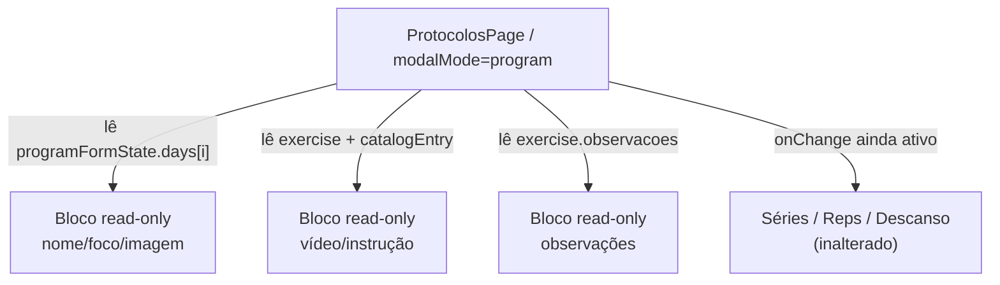

# Bloquear edição de nome/descrição/vídeo no treino individual do aluno — Planning Output (v1)

> **Status:** PLANEJADO — Aguardando aprovação
> **Data:** 2026-08-22
> **Scope:** `/crm/protocolos` (aba "Treinos individuais" → modal "Editar treino individual")
> **Files:** 1 arquivo modificado (0 novos)
> **Risk:** 🟢 LOW

---

## 1. Contexto

Em `src/pages/protocolos.tsx` existem hoje **dois** editores de treino distintos:

1. **Protocolo geral** (`modalMode === "edit"/"create"`, template) — já está correto: o
   nome/descrição do treino (`day.nome` / `day.descricao`) são editáveis aqui (é o comportamento
   esperado), mas nome/descrição/vídeo do **exercício** já são somente leitura, vindos do
   catálogo (ver bloco "Dados cadastrados deste exercício" em L1638-1655).
2. **Treino individual de um aluno** (`modalMode === "program"`, L1730-2003) — hoje permite editar,
   por engano, campos que deveriam ser fixos por vir do protocolo/catálogo:
   - `day.nome` ("Nome do treino") e `day.foco` ("Foco", equivalente à descrição do treino) — L1771-1786
   - `day.imagemUrl` ("Imagem do treino") — L1787-1804
   - `exercise.videoUrlOverride` ("Vídeo do exercício") — L1928-1955
   - `exercise.instrucaoTextoOverride` ("Como executar") — L1958-1971
   - `exercise.observacoes` ("Observações e cuidados") — L1972-1983

Pedido do stakeholder: no modal de **treino individual do aluno**, nome/descrição do treino e
nome/descrição/vídeo do exercício **não podem ser editados** — só a aba "Exercícios" (catálogo)
edita nome/descrição/vídeo do exercício. Confirmado via elicitação que **imagem do treino** e
**observações do exercício** também devem virar somente leitura nesse modal (mesmo não sendo
citados literalmente, ficaram no mesmo grupo de "não editável aqui").

Continuam editáveis no treino individual (não fazem parte do pedido): séries, reps/duração,
descanso, reordenar exercícios (drag), trocar qual exercício ocupa aquela posição (picker de
busca), e adicionar/remover exercício da lista.

## 2. Referência de Código Mapeada

### 2.1 Padrão "somente leitura vindo do catálogo" já usado no editor de Protocolo geral

[src/pages/protocolos.tsx L1638-1655](file:///Users/brunogovas/Projects/Pandora-Box/melhor-versao-dashboard/src/pages/protocolos.tsx#L1638-L1655)

```tsx
{(catalogEntry?.video_url || catalogEntry?.instrucao_texto) && (
  <div className="space-y-2 rounded-md border border-border bg-muted/20 p-3">
    <p className="text-xs font-medium uppercase text-muted-foreground">
      Dados cadastrados deste exercício (somente leitura — vem do catálogo
      de exercícios, não é editável por protocolo)
    </p>
    {catalogEntry.video_url && (
      <p className="truncate text-sm text-foreground">
        Vídeo: {catalogEntry.video_url}
      </p>
    )}
    {catalogEntry.instrucao_texto && (
      <p className="text-sm text-foreground">
        Como executar: {catalogEntry.instrucao_texto}
      </p>
    )}
  </div>
)}
```
↑ Este é exatamente o padrão visual/estrutural (`div` com borda + label uppercase "somente
leitura" + parágrafos) que será replicado no modal de treino individual, tanto para os dados do
treino (nome/foco/imagem) quanto para vídeo/instrução/observações do exercício.

### 2.2 Função a remover (dead code após a mudança)

[src/pages/protocolos.tsx L877-886](file:///Users/brunogovas/Projects/Pandora-Box/melhor-versao-dashboard/src/pages/protocolos.tsx#L877-L886)

```tsx
function updateProgramDay(index: number, patch: Partial<ProgramForm["days"][number]>) {
  setProgramFormState((current) =>
    current
      ? {
          ...current,
          days: current.days.map((day, dayIndex) => (dayIndex === index ? { ...day, ...patch } : day)),
        }
      : current
  )
}
```
↑ Único consumidor é o trio de `Input` (nome/foco/imagemUrl) que será removido. Sem outros
call-sites (`grep -n "updateProgramDay"` confirma 4 ocorrências: a definição + as 3 chamadas que
serão removidas). Função fica órfã e deve ser deletada para não sobrar dead code / warning de
lint `no-unused-vars`.

### 2.3 `updateProgramExercise` — mantém, só perde 3 dos 6 call-sites

[src/pages/protocolos.tsx L888-906](file:///Users/brunogovas/Projects/Pandora-Box/melhor-versao-dashboard/src/pages/protocolos.tsx#L888-L906)

Continua em uso por `series`, `repsOuDuracao` e `descansoSegundos` (L1896, L1907, L1922) — não é
removida, só perde as chamadas de `videoUrlOverride`, `instrucaoTextoOverride` e `observacoes`.

## 3. Lógica de Implementação

### 3.1 Bloco read-only de dados do treino (substitui os 3 Inputs de nome/foco/imagem)

**Origem:** `[REPO EXISTENTE]` (padrão adaptado de 2.1) + `[CRIADO]`

```tsx
{/* Antes: 3x <label><Input onChange={updateProgramDay...}/></label> para nome/foco/imagemUrl */}
<div className="space-y-2 rounded-md border border-border bg-muted/20 p-3">
  <p className="text-xs font-medium uppercase text-muted-foreground">
    Nome, foco e imagem do treino (somente leitura — edite pelo protocolo geral)
  </p>
  <p className="text-sm font-medium text-foreground">{day.nome || "Sem nome"}</p>
  {day.foco && <p className="text-sm text-muted-foreground">{day.foco}</p>}
  {day.imagemUrl.trim() && (
    // eslint-disable-next-line @next/next/no-img-element
    
  )}
</div>
```

### 3.2 Bloco read-only de vídeo/instrução do exercício (substitui os 2 campos editáveis)

**Origem:** `[REPO EXISTENTE]` (padrão de 2.1) + `[CRIADO]`

```tsx
{/* effectiveVideoUrl / effectiveInstrucao continuam calculados como hoje (override salvo
    anteriormente, se existir, tem prioridade sobre o valor do catálogo) — só deixam de ser
    editáveis aqui. Edição real passa a acontecer só na aba Exercícios. */}
{(effectiveVideoUrl || effectiveInstrucao) && (
  <div className="space-y-2 rounded-md border border-border bg-muted/20 p-3">
    <p className="text-xs font-medium uppercase text-muted-foreground">
      Vídeo e instruções do exercício (somente leitura — edite pela aba Exercícios)
    </p>
    {effectiveVideoUrl && (
      <p className="truncate text-sm text-foreground">Vídeo: {effectiveVideoUrl}</p>
    )}
    {embedUrl ? (
      <div className="aspect-video overflow-hidden rounded-lg border border-border bg-muted">
        <iframe src={embedUrl} className="h-full w-full" allowFullScreen title="Preview do vídeo" />
      </div>
    ) : null}
    {effectiveInstrucao && (
      <p className="text-sm text-foreground">Como executar: {effectiveInstrucao}</p>
    )}
  </div>
)}
```

### 3.3 Bloco read-only de observações (substitui a Textarea editável)

**Origem:** `[CRIADO]`

```tsx
{exercise.observacoes && (
  <div className="space-y-1 rounded-md border border-border bg-muted/20 p-3">
    <p className="text-xs font-medium uppercase text-muted-foreground">
      Observações e cuidados (somente leitura)
    </p>
    <p className="text-sm text-foreground">{exercise.observacoes}</p>
  </div>
)}
```

### 3.4 Remoção da função órfã

**Origem:** `[CRIADO]` (remoção)

```tsx
// Deletar por completo o bloco (L877-886):
// function updateProgramDay(index: number, patch: Partial<ProgramForm["days"][number]>) { ... }
```

## 4. Arquitetura de Componentes

Nenhuma mudança de arquitetura — é uma alteração puramente de apresentação dentro do mesmo
componente de página (`ProtocolosPage`), sem novos componentes, sem novas props, sem alteração de
fluxo de dados entre componentes.



## 5. CSS/SCSS Reference

Nenhum CSS novo — reaproveita as classes Tailwind já usadas no bloco read-only existente (L1638):
`space-y-2 rounded-md border border-border bg-muted/20 p-3`, `text-xs font-medium uppercase
text-muted-foreground`, `text-sm text-foreground`.

## 6. Novos Componentes

N/A — nenhum componente novo é criado.

## 7. Componentes Modificados

### 7.1 `src/pages/protocolos.tsx`

**Remoções:**
- Função `updateProgramDay` (L877-886).
- 3x `<label><Input .../></label>` para nome/foco/imagemUrl (L1771-1804).
- `<Input>` editável de `videoUrlOverride` + texto de ajuda condicional (L1937-1945, mantendo o
  `embedUrl` preview).
- `<Textarea>` editável de `instrucaoTextoOverride` (L1958-1971).
- `<Textarea>` editável de `observacoes` (L1972-1983).

**Adições (substituindo os blocos acima, mesmo lugar):**
- Bloco read-only 3.1 (dados do treino).
- Bloco read-only 3.2 (vídeo/instrução do exercício).
- Bloco read-only 3.3 (observações).

**Inalterado (fora do escopo):**
- `programPayload()` / `handleSaveProgram()` continuam enviando `day.nome`, `day.foco`,
  `day.imagemUrl`, `exercise.videoUrlOverride`, `exercise.instrucaoTextoOverride`,
  `exercise.observacoes` inalterados (o valor carregado do backend), já que não há mais UI para
  mudá-los — nenhum contrato de API muda.
- Editor de Protocolo geral (`modalMode === "edit"/"create"`) — já está correto, não é tocado.
- `updateProgramExercise` — mantido, só perde 3 dos 6 call-sites.

## 8. i18n Keys

N/A — projeto não usa i18n nesses textos (strings diretas em PT-BR).

## 9. Files Summary

| Action | File | Risk |
|--------|------|------|
| **MODIFY** | `src/pages/protocolos.tsx` | 🟢 LOW |

## 10. Implementation Order

1. **Phase A:** Substituir o bloco de "Nome do treino / Foco / Imagem do treino" por bloco
   read-only (3.1) e remover `updateProgramDay` (3.4).
2. **Phase B:** Substituir os campos editáveis de vídeo/instrução do exercício por bloco
   read-only (3.2).
3. **Phase C:** Substituir a Textarea de observações por bloco read-only (3.3).
4. **Phase D:** `npm run lint` + `npm run typecheck` (ou os scripts equivalentes do projeto) para
   garantir que a remoção de `updateProgramDay` e dos handlers não deixou import/var órfã.

## 11. Rollback Plan

```
Componentes modificados:
├── Git Ref: HEAD antes da implementação (branch atual: main)
├── Revert: git checkout <ref> -- src/pages/protocolos.tsx
└── Validação: reabrir modal "Editar treino individual" e confirmar que os campos
  voltam a ser editáveis (comportamento anterior restaurado)
```

## 12. Verification Plan

| # | Test Case | Route | Expected |
|---|-----------|-------|----------|
| 1 | Abrir "Treinos individuais" → aluno com programa → "Editar treino individual" | `/crm/protocolos` (aba Treinos individuais) | Nome, foco e imagem do treino aparecem como texto/imagem estático, sem input |
| 2 | Expandir um exercício dentro desse modal | idem | Vídeo, "como executar" e observações aparecem como texto estático (ou nada, se vazios), sem input/textarea editável |
| 3 | Ainda no mesmo exercício | idem | Séries, reps/duração e descanso continuam editáveis normalmente |
| 4 | Trocar o exercício via busca / arrastar para reordenar | idem | Continua funcionando (picker e drag-and-drop intactos) |
| 5 | Salvar o treino individual sem alterar nome/foco/vídeo/observações | idem | PATCH `/admin/users/:userId/program` é enviado com os mesmos valores de antes (sem regressão no payload) |
| 6 | Abrir "Protocolos" → editar um protocolo geral (não vinculado a aluno) | `/crm/protocolos` (aba Protocolos) | Nome/descrição do **treino** continuam editáveis (comportamento correto, não deve mudar); nome/descrição/vídeo do **exercício** continuam somente leitura (já estava correto) |
| 7 | Aba "Exercícios" | `/crm/exercicios` | Nome, instruções e vídeo do exercício continuam editáveis ali normalmente (único lugar permitido) |

## 13. Handoff

N/A — mudança 100% frontend, sem integração externa nova.
