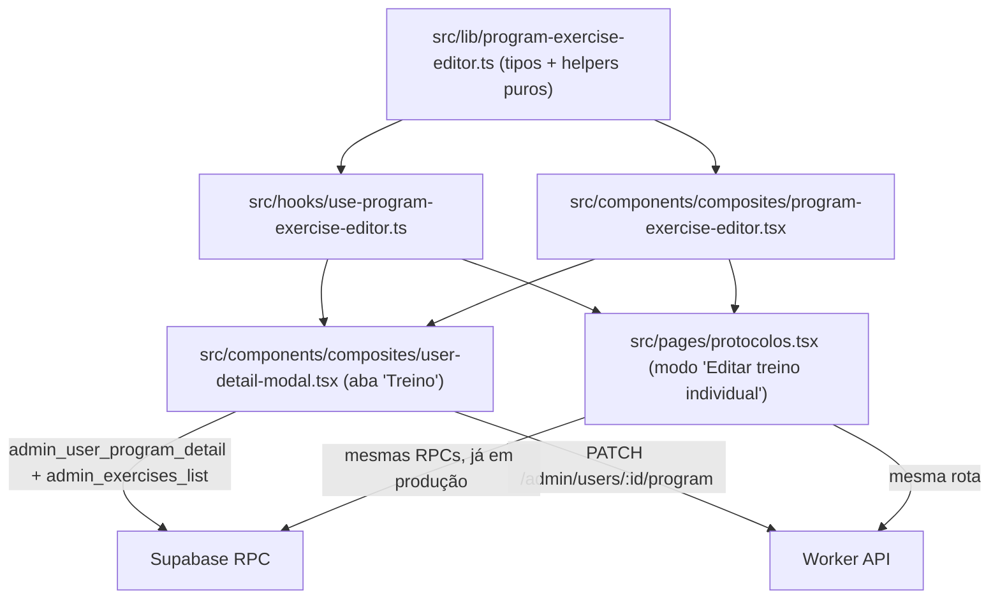

# Nova aba "Treino" em Usuários (editar treino individual, se houver protocolo ativo) — Planning Output (v1)

> **Status:** PLANEJADO — Aguardando aprovação
> **Data:** 2026-08-22
> **Scope:** `src/pages/usuarios.tsx` → `UserDetailModal` (`src/components/composites/user-detail-modal.tsx`); extração de lógica hoje presa em `src/pages/protocolos.tsx`
> **Files:** 4 arquivos (3 novos, 1 modificado — ver §9)
> **Risk:** 🟡 MEDIUM
> **Decisão v2:** a pedido do stakeholder, `protocolos.tsx` **não é tocado**. Os módulos
> compartilhados (§3.1-3.3) são criados do zero copiando a lógica de lá, mas
> `protocolos.tsx` continua com sua implementação própria/inline, intacta. Isso
> elimina o risco 🔴 HIGH original (que vinha de refatorar um fluxo já em produção),
> ao custo de duas cópias da mesma lógica de edição de treino a partir de agora.

---

## 1. Contexto

Hoje, editar o treino individual de um aluno (reordenar/adicionar/remover exercícios, trocar exercício, ajustar séries/reps/descanso) só existe dentro da página **Protocolos → Treinos individuais** (`src/pages/protocolos.tsx`), via `openTreinoIndividualModal` + `modalMode === "program"`. Essa lógica **não é um componente reutilizável** — está toda inline no `ProtocolosPage` (state, handlers e JSX de ~1.900 linhas).

O pedido é: adicionar uma aba **"Treino"** dentro do modal de detalhe da página **Usuários** (`UserDetailModal`, que hoje tem as abas Dados/Cargas/Respostas do Quiz/Protocolo), com o mesmo comportamento de edição de treino já existente em Protocolos — mas **só visível quando o usuário tem um protocolo ativo**.

Decisão já validada com o stakeholder: em vez de duplicar a lógica de edição de treino dentro de `user-detail-modal.tsx`, ela será **extraída de `protocolos.tsx` para módulos compartilhados**, reutilizados nas duas páginas. Isso evita ter duas implementações divergentes da mesma regra de negócio (ex.: o merge por `ordem` entre `exercicios_snapshot` e `exercicios`, que já foi fonte de um bug documentado no próprio código — ver §2.3).

**Gate de "protocolo ativo":** já existe e não precisa de mudança de backend — `src/pages/usuarios.tsx`'s `buildUserDetail()` já computa `protocolo.liberado = Boolean(row.current_program)` a partir do RPC `admin_user_detail` (que já expõe `current_program.program_id`/`days`). A aba "Treino" usa exatamente essa flag (`user.protocolo.liberado`) para decidir se aparece, igual a como a aba "Protocolo" hoje só aparece com `canEdit`.

Nenhuma migration/RPC nova é necessária: a leitura completa (dias + exercícios + overrides) usa a mesma RPC que Protocolos já usa, `admin_user_program_detail(p_user_id)`, e a gravação usa a mesma rota, `PATCH /admin/users/{userId}/program`.

---

## 2. Referência de Código Mapeada

### 2.1 Estado e handlers de edição de treino hoje presos em `protocolos.tsx` (a extrair)

[protocolos.tsx L877-L977](file:///Users/brunogovas/Projects/Pandora-Box/melhor-versao-dashboard/src/pages/protocolos.tsx#L877-L977)

```tsx
function updateProgramExercise(dayIndex: number, exerciseIndex: number, patch: Partial<ProgramForm["days"][number]["exercicios"][number]>) {
  setProgramFormState((current) =>
    current
      ? {
          ...current,
          days: current.days.map((day, currentDayIndex) =>
            currentDayIndex === dayIndex
              ? {
                  ...day,
                  exercicios: day.exercicios.map((exercise, currentExerciseIndex) =>
                    currentExerciseIndex === exerciseIndex ? { ...exercise, ...patch } : exercise
                  ),
                }
              : day
          ),
        }
      : current
  )
}

function addProgramExercise(dayIndex: number) { /* ...fallback do catálogo, renumbered([...]) */ }
function removeProgramExercise(dayIndex: number, exerciseIndex: number) { /* ...renumbered(filter(...)) */ }
function reorderProgramExercises(dayIndex: number, fromIndex: number, toIndex: number) { /* ...renumbered(arrayMove(...)) */ }
function selectProgramExercise(dayIndex: number, exerciseIndex: number, option: { exercise_id: string; nome: string }) {
  // Troca de exercício sempre limpa os overrides do exercício anterior
  updateProgramExercise(dayIndex, exerciseIndex, {
    exerciseId: option.exercise_id, nome: option.nome, videoUrlOverride: "", instrucaoTextoOverride: "",
  })
  setExercisePickerQuery("")
}
```
↑ Toda essa manipulação de state é pura (não depende de `adminRpc`/`adminMutation`) — vira um hook compartilhado.

### 2.2 `renumbered` / `programPayload` (pure helpers, a extrair)

[protocolos.tsx L337-L380](file:///Users/brunogovas/Projects/Pandora-Box/melhor-versao-dashboard/src/pages/protocolos.tsx#L337-L380)

```tsx
function programPayload(form: ProgramForm) {
  return {
    days: form.days.map((day) => ({
      workoutDayId: day.workoutDayId,
      nome: day.nome || null,
      foco: day.foco || null,
      imagemUrl: day.imagemUrl.trim() || null,
      exercicios: day.exercicios.map((exercise) => ({
        ordem: exercise.ordem,
        exerciseId: exercise.exerciseId,
        series: exercise.series,
        repsOuDuracao: exercise.repsOuDuracao,
        descansoSegundos: exercise.descansoSegundos,
        videoUrlOverride: exercise.videoUrlOverride.trim() || null,
        instrucaoTextoOverride: exercise.instrucaoTextoOverride.trim() || null,
        observacoes: exercise.observacoes.trim() || null,
      })),
    })),
  }
}

// Add/remove sempre renumeram ordem 1..N sequencial pela posição no
// array — nunca reaproveitam o ordem antigo dos itens restantes.
function renumbered<T extends { ordem: number }>(items: T[]): T[] {
  return items.map((item, index) => (item.ordem === index + 1 ? item : { ...item, ordem: index + 1 }))
}
```

### 2.3 Merge por `ordem` entre `exercicios_snapshot` e `exercicios` (regra crítica, a extrair como `buildProgramFormDays`)

[protocolos.tsx L634-L692](file:///Users/brunogovas/Projects/Pandora-Box/melhor-versao-dashboard/src/pages/protocolos.tsx#L634-L692)

```tsx
async function openTreinoIndividualModal(student: UserProgramRow) {
  // ...
  const detail = rows[0]
  if (!detail?.program_id) {
    setModalError("Usuario sem programa atual para editar.")
    return
  }
  setProgramFormState({
    userId: student.user_id,
    email: student.email,
    days: detail.days.map((day) => {
      // exercicios_snapshot (cache denormalizado) tem nome/series/reps/
      // descanso mas NUNCA teve exercise_id — só o array `exercicios`
      // (join real com workout_day_exercises) tem o id de verdade e os
      // overrides de video/instrucao/observacoes. Sem esse merge por
      // ordem, exerciseId fica undefined...
      const joinedByOrdem = new Map(
        (day.exercicios ?? []).map((joined, index) => [joined.ordem ?? index + 1, joined])
      )
      return {
        workoutDayId: day.workout_day_id,
        nome: day.nome,
        foco: day.foco ?? "",
        imagemUrl: day.imagem_url ?? "",
        exercicios: (day.exercicios_snapshot ?? day.exercicios ?? []).map((exercise, index) => {
          const ordem = exercise.ordem ?? index + 1
          const joined = joinedByOrdem.get(ordem)
          return {
            key: crypto.randomUUID(),
            ordem,
            exerciseId: joined?.exercise_id ?? exercise.exercise_id ?? "",
            nome: exercise.nome,
            series: exercise.series ?? null,
            repsOuDuracao: exercise.reps_ou_duracao ?? exercise.reps ?? "",
            descansoSegundos: exercise.descanso_segundos ?? 0,
            videoUrlOverride: joined?.video_url_override ?? exercise.video_url_override ?? "",
            instrucaoTextoOverride: joined?.instrucao_texto_override ?? exercise.instrucao_texto_override ?? "",
            observacoes: joined?.observacoes ?? exercise.observacoes ?? "",
          }
        }),
      }
    }),
  })
}
```
↑ **Esse é o trecho mais arriscado de extrair** — é exatamente o tipo de regra que já gerou um bug fix anterior ("bloqueia edição de nome/descrição/vídeo no treino individual"). Vira `buildProgramFormDays(detail: ProgramDetailRow): ProgramForm["days"]`, testada e usada nas duas páginas.

### 2.4 JSX de edição (dias/exercícios/drag/expand) — a extrair como componente

[protocolos.tsx L1741-L1943](file:///Users/brunogovas/Projects/Pandora-Box/melhor-versao-dashboard/src/pages/protocolos.tsx#L1741-L1943)

```tsx
{programFormState.days.map((day, dayIndex) => (
  <div key={day.workoutDayId} className="space-y-3">
    {/* header do dia (nome/foco, somente leitura) */}
    <Card className="ml-4 rounded-lg border-border">
      <CardContent className="space-y-4 p-4">
        {/* nome/foco/imagem somente leitura */}
        <div className="space-y-2 border-t border-border pt-3">
          <div className="flex items-center justify-between">
            <p className="text-sm font-medium">Exercícios ...</p>
            <Button type="button" variant="outline" size="sm" onClick={() => addProgramExercise(dayIndex)}>
              <Plus /> Adicionar
            </Button>
          </div>
          {day.exercicios.length === 0 ? (
            <EmptyState message="Nenhum exercício adicionado a este treino ainda." />
          ) : (
            <DragDropProvider onDragEnd={(event) => {
              const { source } = event.operation
              if (!isSortable(source)) return
              reorderProgramExercises(dayIndex, source.initialIndex, source.index)
            }}>
              <div className="space-y-2">
                {day.exercicios.map((exercise, exerciseIndex) => (
                  <div key={exercise.key} className="space-y-2">
                    <ReorderableListItem
                      id={exercise.key} index={exerciseIndex} order={exercise.ordem} title={exercise.nome}
                      metadata={[`${exercise.series ?? 0} séries`, exercise.repsOuDuracao, `${exercise.descansoSegundos}s descanso`]}
                      draggable
                      onRemove={() => setConfirmRemoval({ kind: "program-exercise", dayIndex, exerciseIndex, label: exercise.nome, description: "..." })}
                      onExpand={() => { setExpandedProgramExerciseKey(...); setExercisePickerQuery("") }}
                    />
                    {exerciseExpanded && (
                      <Card className="ml-4 rounded-lg border-border">
                        <CardContent className="space-y-4 p-4">
                          <LinkedEntitySearchList query={exercisePickerQuery} onQueryChange={setExercisePickerQuery}
                            groups={exerciseCatalogToSearchGroups(exerciseCatalogFull, exercisePickerQuery)}
                            onSelect={(item) => selectProgramExercise(dayIndex, exerciseIndex, { exercise_id: item.id, nome: item.label })} />
                          <StepperInput value={exercise.series ?? 0} min={0} onChange={(v) => updateProgramExercise(dayIndex, exerciseIndex, { series: v || null })} />
                          <Input value={exercise.repsOuDuracao} onChange={(e) => updateProgramExercise(dayIndex, exerciseIndex, { repsOuDuracao: e.target.value })} />
                          <StepperInput value={exercise.descansoSegundos} min={0} onChange={(v) => updateProgramExercise(dayIndex, exerciseIndex, { descansoSegundos: v })} />
                          {/* vídeo/instruções/observações — somente leitura */}
                        </CardContent>
                      </Card>
                    )}
                  </div>
                ))}
              </div>
            </DragDropProvider>
          )}
        </div>
      </CardContent>
    </Card>
  </div>
))}
```
↑ Vira `<ProgramExerciseEditor />`, parametrizado por props em vez de state/setState locais da página.

### 2.5 RPC de leitura completa (já usada por Protocolos, sem mudança de backend)

[0022_workout_admin_overrides.sql (worker repo)](file:///Users/brunogovas/Projects/Pandora-Box/treino-trinca-app/worker/src/db/migrations/0022_workout_admin_overrides.sql#L16)

`admin_user_program_detail(p_user_id uuid)` retorna `user_id, program_id, program_nome, program_foco, status_geracao, program_created_at, days jsonb[]` — cada `day` com `workout_day_id, ordem, nome, foco, status, imagem_url, exercicios_snapshot, exercicios` (o `exercicios` real inclui `exercise_id, video_url_override, instrucao_texto_override, observacoes`). Já é usada hoje por `protocolos.tsx` (leitura completa) **e** por `user-detail-modal.tsx` (leitura parcial, só `program_nome` — ver §2.6).

### 2.6 `UserDetailModal` hoje: aba "Protocolo" já usa o mesmo padrão de load-sob-demanda

[user-detail-modal.tsx L233-L281](file:///Users/brunogovas/Projects/Pandora-Box/melhor-versao-dashboard/src/components/composites/user-detail-modal.tsx#L233-L281)

```tsx
const [protocolTemplates, setProtocolTemplates] = React.useState<ProtocolEditorTemplateOption[] | null>(null)
const [currentProtocolNome, setCurrentProtocolNome] = React.useState<string | null>(null)

async function loadProtocolTab() {
  if (protocolTemplates !== null || !canEdit) return
  try {
    const [templateRows, detailRows] = await Promise.all([
      adminRpc(...)("admin_protocol_templates_tree", { p_status: "ativo", p_nivel: null, p_objetivo: null }),
      adminRpc<{ program_nome: string | null }[]>("admin_user_program_detail", { p_user_id: user.id }),
    ])
    setProtocolTemplates(templateRows.map(...))
    setCurrentProtocolNome(detailRows[0]?.program_nome ?? null)
  } catch (loadError) {
    setProtocolLoadError(errorMessage(loadError))
  }
}
```
↑ Padrão de "carrega uma vez, guarda em state, `!== null` evita recarregar" — a nova `loadTreinoTab()` segue exatamente essa forma, só tipando a resposta completa (`ProgramDetailRow[]`) em vez de só `program_nome`.

### 2.7 `Tabs`/gate de visibilidade da aba "Protocolo" (padrão a copiar para "Treino")

[user-detail-modal.tsx L301-L326](file:///Users/brunogovas/Projects/Pandora-Box/melhor-versao-dashboard/src/components/composites/user-detail-modal.tsx#L301-L326)

```tsx
<Tabs defaultValue="dados" onValueChange={(value) => { if (value === "protocolo") void loadProtocolTab() }}>
  <TabsList>
    <TabsTrigger value="dados" className="gap-1.5"><ClipboardList className="size-4" />Dados</TabsTrigger>
    <TabsTrigger value="cargas" className="gap-1.5"><Scale className="size-4" />Cargas</TabsTrigger>
    <TabsTrigger value="quiz" className="gap-1.5"><NotebookPen className="size-4" />Respostas do Quiz</TabsTrigger>
    {canEdit && (
      <TabsTrigger value="protocolo" className="gap-1.5"><FileStack className="size-4" />Protocolo</TabsTrigger>
    )}
  </TabsList>
  ...
```

### 2.8 Gate "protocolo ativo" já calculado em `usuarios.tsx` (sem mudança)

[usuarios.tsx L179-L184](file:///Users/brunogovas/Projects/Pandora-Box/melhor-versao-dashboard/src/pages/usuarios.tsx#L179-L184)

```tsx
protocolo: row.current_program
  ? { liberado: true, mensagem: "Disponível para treinar agora", detalhe: [programName, programFocus].filter(Boolean).join(" · ") }
  : { liberado: false, mensagem: "Nenhum protocolo atual encontrado." },
```
↑ `user.protocolo.liberado` já é exatamente "tem protocolo ativo" — usado como condição para mostrar a aba "Treino".

---

## 3. Lógica de Implementação

### 3.1 Módulo compartilhado de tipos e helpers puros

**Origem:** `[REPO EXISTENTE]` (movido de `protocolos.tsx`, sem mudança de comportamento)

`src/lib/program-exercise-editor.ts` (novo arquivo):
```ts
export interface ProgramExercise {
  exercise_id: string
  nome: string
  ordem: number
  series?: number | null
  reps?: string
  reps_ou_duracao?: string
  descanso_segundos?: number
  peso_kg?: number | string | null
  video_url_override?: string | null
  instrucao_texto_override?: string | null
  observacoes?: string | null
}

export interface ProgramDayRow {
  workout_day_id: string
  ordem: number
  nome: string
  foco: string | null
  status: string
  imagem_url?: string | null
  exercicios_snapshot: ProgramExercise[] | null
  exercicios: ProgramExercise[]
}

export interface ProgramDetailRow {
  user_id: string
  program_id: string | null
  program_nome: string | null
  program_foco: string | null
  status_geracao: string | null
  program_created_at: string | null
  days: ProgramDayRow[]
}

export interface AdminExerciseCatalogRow {
  exercise_id: string
  nome: string
  grupo_muscular: string
  video_url: string | null
  instrucao_texto: string | null
}

export interface ProgramFormExercise {
  key: string
  ordem: number
  exerciseId: string
  nome: string
  series: number | null
  repsOuDuracao: string
  descansoSegundos: number
  videoUrlOverride: string
  instrucaoTextoOverride: string
  observacoes: string
}

export interface ProgramFormDay {
  workoutDayId: string
  nome: string
  foco: string
  imagemUrl: string
  exercicios: ProgramFormExercise[]
}

// Add/remove sempre renumeram ordem 1..N sequencial pela posição no
// array — nunca reaproveitam o ordem antigo dos itens restantes.
export function renumbered<T extends { ordem: number }>(items: T[]): T[] {
  return items.map((item, index) => (item.ordem === index + 1 ? item : { ...item, ordem: index + 1 }))
}

export function buildProgramFormDays(detail: ProgramDetailRow): ProgramFormDay[] {
  return detail.days.map((day) => {
    // exercicios_snapshot (cache denormalizado) nunca tem exercise_id —
    // só `exercicios` (join real) tem o id de verdade e os overrides.
    const joinedByOrdem = new Map(
      (day.exercicios ?? []).map((joined, index) => [joined.ordem ?? index + 1, joined])
    )
    return {
      workoutDayId: day.workout_day_id,
      nome: day.nome,
      foco: day.foco ?? "",
      imagemUrl: day.imagem_url ?? "",
      exercicios: (day.exercicios_snapshot ?? day.exercicios ?? []).map((exercise, index) => {
        const ordem = exercise.ordem ?? index + 1
        const joined = joinedByOrdem.get(ordem)
        return {
          key: crypto.randomUUID(),
          ordem,
          exerciseId: joined?.exercise_id ?? exercise.exercise_id ?? "",
          nome: exercise.nome,
          series: exercise.series ?? null,
          repsOuDuracao: exercise.reps_ou_duracao ?? exercise.reps ?? "",
          descansoSegundos: exercise.descanso_segundos ?? 0,
          videoUrlOverride: joined?.video_url_override ?? exercise.video_url_override ?? "",
          instrucaoTextoOverride: joined?.instrucao_texto_override ?? exercise.instrucao_texto_override ?? "",
          observacoes: joined?.observacoes ?? exercise.observacoes ?? "",
        }
      }),
    }
  })
}

export function programPayload(days: ProgramFormDay[]) {
  return {
    days: days.map((day) => ({
      workoutDayId: day.workoutDayId,
      nome: day.nome || null,
      foco: day.foco || null,
      imagemUrl: day.imagemUrl.trim() || null,
      exercicios: day.exercicios.map((exercise) => ({
        ordem: exercise.ordem,
        exerciseId: exercise.exerciseId,
        series: exercise.series,
        repsOuDuracao: exercise.repsOuDuracao,
        descansoSegundos: exercise.descansoSegundos,
        videoUrlOverride: exercise.videoUrlOverride.trim() || null,
        instrucaoTextoOverride: exercise.instrucaoTextoOverride.trim() || null,
        observacoes: exercise.observacoes.trim() || null,
      })),
    })),
  }
}

export function exerciseCatalogToSearchGroups(catalog: AdminExerciseCatalogRow[], query: string) {
  const grouped = new Map<string, { id: string; label: string }[]>()
  const normalizedQuery = query.trim().toLowerCase()
  for (const option of catalog) {
    if (normalizedQuery && !option.nome.toLowerCase().includes(normalizedQuery)) continue
    const items = grouped.get(option.grupo_muscular) ?? []
    items.push({ id: option.exercise_id, label: option.nome })
    grouped.set(option.grupo_muscular, items)
  }
  return [...grouped.entries()].sort(([a], [b]) => a.localeCompare(b)).map(([label, items]) => ({ label, items }))
}

export function youtubeEmbedUrl(url: string): string | null {
  const trimmed = url.trim()
  if (!trimmed) return null
  const match = trimmed.match(/(?:youtube\.com\/(?:watch\?v=|shorts\/|embed\/)|youtu\.be\/)([a-zA-Z0-9_-]{6,})/)
  return match ? `https://www.youtube.com/embed/${match[1]}` : null
}
```

### 3.2 Hook compartilhado de state (add/update/remove/reorder/select)

**Origem:** `[REPO EXISTENTE]` (mesma lógica de `protocolos.tsx` L877-L977, parametrizada)

`src/hooks/use-program-exercise-editor.ts` (novo arquivo):
```ts
import { useState } from "react"
import { arrayMove } from "@dnd-kit/helpers"
import { renumbered, type ProgramFormDay } from "@/lib/program-exercise-editor"

export function useProgramExerciseEditor(initialDays: ProgramFormDay[]) {
  const [days, setDays] = useState<ProgramFormDay[]>(initialDays)

  function resetDays(nextDays: ProgramFormDay[]) {
    setDays(nextDays)
  }

  function updateExercise(dayIndex: number, exerciseIndex: number, patch: Partial<ProgramFormDay["exercicios"][number]>) {
    setDays((current) =>
      current.map((day, currentDayIndex) =>
        currentDayIndex === dayIndex
          ? {
              ...day,
              exercicios: day.exercicios.map((exercise, currentExerciseIndex) =>
                currentExerciseIndex === exerciseIndex ? { ...exercise, ...patch } : exercise
              ),
            }
          : day
      )
    )
  }

  function addExercise(dayIndex: number, fallback: { exercise_id: string; nome: string }) {
    setDays((current) =>
      current.map((day, currentDayIndex) =>
        currentDayIndex === dayIndex
          ? {
              ...day,
              exercicios: renumbered([
                ...day.exercicios,
                {
                  key: crypto.randomUUID(),
                  ordem: day.exercicios.length + 1,
                  exerciseId: fallback.exercise_id,
                  nome: fallback.nome,
                  series: 3,
                  repsOuDuracao: "12",
                  descansoSegundos: 60,
                  videoUrlOverride: "",
                  instrucaoTextoOverride: "",
                  observacoes: "",
                },
              ]),
            }
          : day
      )
    )
  }

  function removeExercise(dayIndex: number, exerciseIndex: number) {
    setDays((current) =>
      current.map((day, currentDayIndex) =>
        currentDayIndex === dayIndex
          ? { ...day, exercicios: renumbered(day.exercicios.filter((_, index) => index !== exerciseIndex)) }
          : day
      )
    )
  }

  function reorderExercises(dayIndex: number, fromIndex: number, toIndex: number) {
    if (fromIndex === toIndex) return
    setDays((current) =>
      current.map((day, currentDayIndex) =>
        currentDayIndex === dayIndex
          ? { ...day, exercicios: renumbered(arrayMove(day.exercicios, fromIndex, toIndex)) }
          : day
      )
    )
  }

  function selectExercise(dayIndex: number, exerciseIndex: number, option: { exercise_id: string; nome: string }) {
    // Troca de exercício sempre limpa os overrides do exercício anterior.
    updateExercise(dayIndex, exerciseIndex, {
      exerciseId: option.exercise_id,
      nome: option.nome,
      videoUrlOverride: "",
      instrucaoTextoOverride: "",
    })
  }

  return { days, resetDays, updateExercise, addExercise, removeExercise, reorderExercises, selectExercise }
}
```

### 3.3 Componente de apresentação (JSX extraído, parametrizado por props)

**Origem:** `[REPO EXISTENTE]` (JSX de `protocolos.tsx` L1741-L1943, adaptado para props em vez de state local da página)

`src/components/composites/program-exercise-editor.tsx` (novo arquivo) — assinatura de props:
```tsx
export interface ProgramExerciseEditorProps {
  days: ProgramFormDay[]
  exerciseCatalog: AdminExerciseCatalogRow[]
  expandedExerciseKey: string | null
  onExpandExercise: (key: string | null) => void
  exercisePickerQuery: string
  onExercisePickerQueryChange: (value: string) => void
  onAddExercise: (dayIndex: number) => void
  onUpdateExercise: (dayIndex: number, exerciseIndex: number, patch: Partial<ProgramFormDay["exercicios"][number]>) => void
  onRemoveExerciseRequest: (dayIndex: number, exerciseIndex: number, exerciseNome: string) => void
  onReorderExercises: (dayIndex: number, fromIndex: number, toIndex: number) => void
  onSelectExercise: (dayIndex: number, exerciseIndex: number, option: { exercise_id: string; nome: string }) => void
}
```
Corpo: transcrição direta do bloco em §2.4, trocando `programFormState.days` por `days` (prop), `setConfirmRemoval({...})` por `onRemoveExerciseRequest(dayIndex, exerciseIndex, exercise.nome)`, `setExpandedProgramExerciseKey`/`setExercisePickerQuery` pelas props `onExpandExercise`/`onExercisePickerQueryChange`, `addProgramExercise`/`updateProgramExercise`/`reorderProgramExercises`/`selectProgramExercise` pelas props equivalentes, e `exerciseCatalogFull` pela prop `exerciseCatalog`. Mantém `DragDropProvider`/`isSortable`/`ReorderableListItem`/`LinkedEntitySearchList`/`StepperInput` exatamente como hoje.

### 3.4 `protocolos.tsx` — NÃO É TOCADO (decisão v2)

**Origem:** N/A

Por decisão do stakeholder, `protocolos.tsx` mantém sua implementação própria/inline (tipos, `renumbered`/`programPayload`/etc. locais, handlers locais, JSX local) exatamente como está hoje. Os módulos criados em §3.1-3.3 são cópias adaptadas dessa lógica, usadas **apenas** por `user-detail-modal.tsx`. Isso elimina o risco de regressão no fluxo já em produção de Protocolos, ao custo de manter duas implementações da mesma regra de negócio a partir de agora (documentado como débito técnico consciente — ver nota em §11).

### 3.5 `UserDetailModal`: nova aba "Treino"

**Origem:** `[CRIADO]` (usa os módulos de 3.1-3.3) + `[REPO EXISTENTE]` (padrão de `loadProtocolTab`, §2.6)

```tsx
const [treinoDetail, setTreinoDetail] = React.useState<ProgramDetailRow | null>(null)
const [treinoCatalog, setTreinoCatalog] = React.useState<AdminExerciseCatalogRow[] | null>(null)
const [treinoLoadError, setTreinoLoadError] = React.useState<string | null>(null)
const [treinoSaveState, setTreinoSaveState] = React.useState<"idle" | "saving" | "saved">("idle")
const [treinoSaveError, setTreinoSaveError] = React.useState<string | null>(null)
const [expandedTreinoExerciseKey, setExpandedTreinoExerciseKey] = React.useState<string | null>(null)
const [treinoExercisePickerQuery, setTreinoExercisePickerQuery] = React.useState("")
const [treinoConfirmRemoval, setTreinoConfirmRemoval] = React.useState<
  { dayIndex: number; exerciseIndex: number; label: string } | null
>(null)

const programEditor = useProgramExerciseEditor(treinoDetail ? buildProgramFormDays(treinoDetail) : [])

async function loadTreinoTab() {
  if (treinoDetail !== null || !canEdit || !user.protocolo.liberado) return
  setTreinoLoadError(null)
  try {
    const [detailRows, catalogRows] = await Promise.all([
      adminRpc<ProgramDetailRow[]>("admin_user_program_detail", { p_user_id: user.id }),
      adminRpc<AdminExerciseCatalogRow[]>("admin_exercises_list", { p_is_active: true, p_limit: 500 }),
    ])
    const detail = detailRows[0]
    if (!detail?.program_id) {
      setTreinoLoadError("Usuário sem programa atual para editar.")
      return
    }
    setTreinoDetail(detail)
    programEditor.resetDays(buildProgramFormDays(detail))
    setTreinoCatalog(catalogRows)
  } catch (loadError) {
    setTreinoLoadError(errorMessage(loadError))
  }
}

async function handleSaveTreino() {
  if (!treinoDetail || treinoSaveState !== "idle") return
  setTreinoSaveState("saving")
  setTreinoSaveError(null)
  try {
    await adminMutation(`/admin/users/${user.id}/program`, {
      method: "PATCH",
      body: programPayload(programEditor.days),
    })
    setTreinoSaveState("saved")
    window.setTimeout(() => setTreinoSaveState("idle"), 1600)
  } catch (saveError) {
    setTreinoSaveError(errorMessage(saveError))
    setTreinoSaveState("idle")
  }
}
```

Tab trigger e conteúdo:
```tsx
{canEdit && user.protocolo.liberado && (
  <TabsTrigger value="treino" className="gap-1.5">
    <Dumbbell className="size-4" />
    Treino
  </TabsTrigger>
)}
```
```tsx
{canEdit && user.protocolo.liberado && (
  <TabsContent value="treino" className="space-y-4">
    {treinoLoadError ? (
      <p className="rounded-md border border-destructive/40 bg-destructive/10 px-3 py-2 text-sm text-destructive">{treinoLoadError}</p>
    ) : treinoDetail === null ? (
      <div className="space-y-2"><Skeleton className="h-10 w-full" /><Skeleton className="h-24 w-full" /></div>
    ) : (
      <>
        <ProgramExerciseEditor
          days={programEditor.days}
          exerciseCatalog={treinoCatalog ?? []}
          expandedExerciseKey={expandedTreinoExerciseKey}
          onExpandExercise={(key) => { setExpandedTreinoExerciseKey(key); setTreinoExercisePickerQuery("") }}
          exercisePickerQuery={treinoExercisePickerQuery}
          onExercisePickerQueryChange={setTreinoExercisePickerQuery}
          onAddExercise={(dayIndex) => {
            const fallback = treinoCatalog?.[0]
            if (fallback) programEditor.addExercise(dayIndex, fallback)
          }}
          onUpdateExercise={programEditor.updateExercise}
          onRemoveExerciseRequest={(dayIndex, exerciseIndex, label) => setTreinoConfirmRemoval({ dayIndex, exerciseIndex, label })}
          onReorderExercises={programEditor.reorderExercises}
          onSelectExercise={programEditor.selectExercise}
        />
        {treinoSaveError && (
          <p className="rounded-md border border-destructive/40 bg-destructive/10 px-3 py-2 text-sm text-destructive">{treinoSaveError}</p>
        )}
        <Button type="button" disabled={treinoSaveState !== "idle"} onClick={() => void handleSaveTreino()} className="w-full">
          {treinoSaveState === "saving" ? "Salvando..." : treinoSaveState === "saved" ? "Salvo!" : "Salvar treino"}
        </Button>
      </>
    )}
  </TabsContent>
)}
{treinoConfirmRemoval && (
  <EntityEditModalShell
    title="Remover exercício"
    description={`Tem certeza que deseja remover "${treinoConfirmRemoval.label}" deste treino?`}
    onClose={() => setTreinoConfirmRemoval(null)}
    footer={
      <>
        <Button type="button" variant="outline" onClick={() => setTreinoConfirmRemoval(null)}>Cancelar</Button>
        <Button type="button" variant="destructive" onClick={() => {
          programEditor.removeExercise(treinoConfirmRemoval.dayIndex, treinoConfirmRemoval.exerciseIndex)
          setTreinoConfirmRemoval(null)
        }}>Remover</Button>
      </>
    }
  />
)}
```

---

## 4. Arquitetura de Componentes



---

## 5. CSS/SCSS Reference

Não aplicável — reaproveita 100% dos componentes visuais já existentes (`Card`, `ReorderableListItem`, `LinkedEntitySearchList`, `StepperInput`, `EntityEditModalShell`), sem CSS novo.

---

## 6. Novos Componentes

### 6.1 `src/components/composites/program-exercise-editor.tsx`

**Path:** `src/components/composites/program-exercise-editor.tsx`

#### Props
Ver §3.3 (`ProgramExerciseEditorProps`).

#### Lógica Core
JSX transcrito em §2.4/§3.3 — sem lógica de rede, apenas apresentação + callbacks.

### 6.2 `src/hooks/use-program-exercise-editor.ts`

**Path:** `src/hooks/use-program-exercise-editor.ts`

Ver §3.2 — hook de state puro (sem chamadas de rede).

### 6.3 `src/lib/program-exercise-editor.ts`

**Path:** `src/lib/program-exercise-editor.ts`

Ver §3.1 — tipos e funções puras (`renumbered`, `buildProgramFormDays`, `programPayload`, `exerciseCatalogToSearchGroups`, `youtubeEmbedUrl`).

---

## 7. Componentes Modificados

### 7.1 `src/pages/protocolos.tsx`

**Novos states/hooks:**
```tsx
const programEditor = useProgramExerciseEditor([])
// programFormState passa a guardar só { userId, email } | null
```

**Modificações no código existente:**
- Remove definições locais duplicadas (tipos + `renumbered`/`programPayload`/`exerciseCatalogToSearchGroups`/`youtubeEmbedUrl`), importando de `@/lib/program-exercise-editor`.
- Remove `updateProgramExercise`/`addProgramExercise`/`removeProgramExercise`/`reorderProgramExercises`/`selectProgramExercise` locais — usa `programEditor.*`.
- `openTreinoIndividualModal`: usa `buildProgramFormDays(detail)` + `programEditor.resetDays(...)`.
- JSX L1741-L1943 → `<ProgramExerciseEditor ... />`.
- `handleSaveProgram`: usa `programPayload(programEditor.days)`.

**Props adicionais para sub-componentes:** N/A (mesmo componente raiz da página).

### 7.2 `src/components/composites/user-detail-modal.tsx`

**Novos states/hooks:** ver §3.5 completo.

**Modificações no código existente:**
- Import de `Dumbbell` já existe (usado na seção "Treinos" da aba Dados) — reaproveitado no `TabsTrigger`.
- `onValueChange` do `Tabs` (L303-305) ganha `if (value === "treino") void loadTreinoTab()`.
- Novo `TabsTrigger`/`TabsContent value="treino"` (ver §3.5), condicionados a `canEdit && user.protocolo.liberado`.
- Novo bloco de confirmação de remoção (`treinoConfirmRemoval`) fora da `Tabs`, mesmo padrão do `confirmRemoval` de `protocolos.tsx`.

**Props adicionais para sub-componentes:**
```tsx
<ProgramExerciseEditor
  days={programEditor.days}
  exerciseCatalog={treinoCatalog ?? []}
  expandedExerciseKey={expandedTreinoExerciseKey}
  onExpandExercise={...}
  exercisePickerQuery={treinoExercisePickerQuery}
  onExercisePickerQueryChange={setTreinoExercisePickerQuery}
  onAddExercise={...}
  onUpdateExercise={programEditor.updateExercise}
  onRemoveExerciseRequest={...}
  onReorderExercises={programEditor.reorderExercises}
  onSelectExercise={programEditor.selectExercise}
/>
```

### 7.3 `src/pages/usuarios.tsx`

Nenhuma mudança necessária — `UserDetail.protocolo.liberado` já é passado hoje para `UserDetailModal` e já reflete "tem protocolo ativo" (ver §2.8).

---

## 8. i18n Keys (se aplicável)

Não aplicável — labels novos ("Treino", "Salvar treino", mensagens de erro) são strings diretas em português já no padrão do resto do arquivo, sem sistema de i18n no projeto.

---

## 9. Files Summary

| Action | File | Risk |
|--------|------|------|
| **NEW** | `/Users/brunogovas/Projects/Pandora-Box/melhor-versao-dashboard/src/lib/program-exercise-editor.ts` | 🟢 LOW |
| **NEW** | `/Users/brunogovas/Projects/Pandora-Box/melhor-versao-dashboard/src/hooks/use-program-exercise-editor.ts` | 🟡 MEDIUM |
| **NEW** | `/Users/brunogovas/Projects/Pandora-Box/melhor-versao-dashboard/src/components/composites/program-exercise-editor.tsx` | 🟡 MEDIUM |
| **MODIFY** | `/Users/brunogovas/Projects/Pandora-Box/melhor-versao-dashboard/src/components/composites/user-detail-modal.tsx` | 🟡 MEDIUM (aditivo — nova aba) |

`protocolos.tsx` **não é modificado** (decisão v2, ver topo do documento).

Nenhuma mudança de backend/RPC/migration.

---

## 10. Implementation Order

1. **Phase A:** Criar `src/lib/program-exercise-editor.ts` (tipos + helpers puros).
2. **Phase B:** Criar `src/hooks/use-program-exercise-editor.ts`.
3. **Phase C:** Criar `src/components/composites/program-exercise-editor.tsx`.
4. **Phase D:** Adicionar a aba "Treino" em `user-detail-modal.tsx`, gated por `canEdit && user.protocolo.liberado`, consumindo os três módulos acima. `protocolos.tsx` não é tocado.
5. **Phase E:** Validação manual completa (ver §12) + `tsc -b` + `oxlint src`.

---

## 11. Rollback Plan

```
Componentes adicionados:
├── Git Ref: HEAD antes da implementação (commit atual: 90e1bf8)
├── Files a reverter: src/lib/program-exercise-editor.ts (novo),
│                      src/hooks/use-program-exercise-editor.ts (novo),
│                      src/components/composites/program-exercise-editor.tsx (novo),
│                      src/components/composites/user-detail-modal.tsx (modificado)
├── Revert: git checkout 90e1bf8 -- src/components/composites/user-detail-modal.tsx
│           git rm src/lib/program-exercise-editor.ts src/hooks/use-program-exercise-editor.ts
│              src/components/composites/program-exercise-editor.tsx
└── Validação: modal de Usuários volta a ter só Dados/Cargas/Respostas do Quiz/Protocolo.
```

**Blast Radius:** Restrito a arquivos novos + `user-detail-modal.tsx` (aditivo). `protocolos.tsx` não é tocado — zero risco de regressão no fluxo já em produção de Protocolos. Nenhuma RPC/migration nova.

**Regression Surface:**
- Aba "Protocolo" existente em Usuários (troca de template) — não deve ser afetada, pois é um fluxo separado (`ProtocolTemplatePicker`), só compartilha a mesma RPC de leitura.
- Nenhuma tela de aluno (app mobile/PWA) é tocada — só o dashboard admin.
- **Débito técnico consciente:** a partir desta mudança, a lógica de merge `exercicios_snapshot`/`exercicios` (§2.3) e os handlers de add/update/remove/reorder/select existem em duas cópias (`protocolos.tsx` inline e `src/lib/program-exercise-editor.ts` + `src/hooks/use-program-exercise-editor.ts`). Um bug fix futuro numa cópia (ex.: futuras correções em `openTreinoIndividualModal`) precisa ser replicado manualmente na outra, se aplicável.

---

## 12. Verification Plan

| # | Test Case | Route | Expected |
|---|-----------|-------|----------|
| 1 | Abrir Protocolos → Treinos individuais → Editar treino de um aluno com protocolo | `/crm/protocolos` | Lista de dias/exercícios carrega igual a antes da refatoração |
| 2 | Reordenar exercícios via drag-and-drop | `/crm/protocolos` | Ordem persiste após salvar e recarregar |
| 3 | Adicionar, trocar e remover exercício, depois salvar | `/crm/protocolos` | Payload salvo reflete as mudanças; overrides de vídeo/instrução são limpos ao trocar exercício |
| 4 | Abrir Usuários → detalhe de um usuário **com** protocolo ativo | `/crm/usuarios` | Aba "Treino" aparece, ao lado de "Protocolo" |
| 5 | Abrir Usuários → detalhe de um usuário **sem** protocolo ativo (`protocolo.liberado === false`) | `/crm/usuarios` | Aba "Treino" **não** aparece |
| 6 | Na aba "Treino" de Usuários: reordenar, adicionar, remover, trocar exercício e salvar | `/crm/usuarios` | Mesmo comportamento de Protocolos; `PATCH /admin/users/:id/program` disparado corretamente |
| 7 | Fechar e reabrir o modal de detalhe do mesmo usuário, reabrir aba "Treino" | `/crm/usuarios` | Reflete o treino salvo (recarrega do backend, não cache stale) |
| 8 | Console do navegador durante os testes acima | `/crm/protocolos`, `/crm/usuarios` | Nenhum erro novo |
| 9 | `npx tsc -b` e `npm run lint` | — | Ambos passam sem erros novos |

---

## 13. Handoff (se aplicável)

Não aplicável — nenhuma integração externa nova; RPCs e rota de mutação já existentes e em produção.
