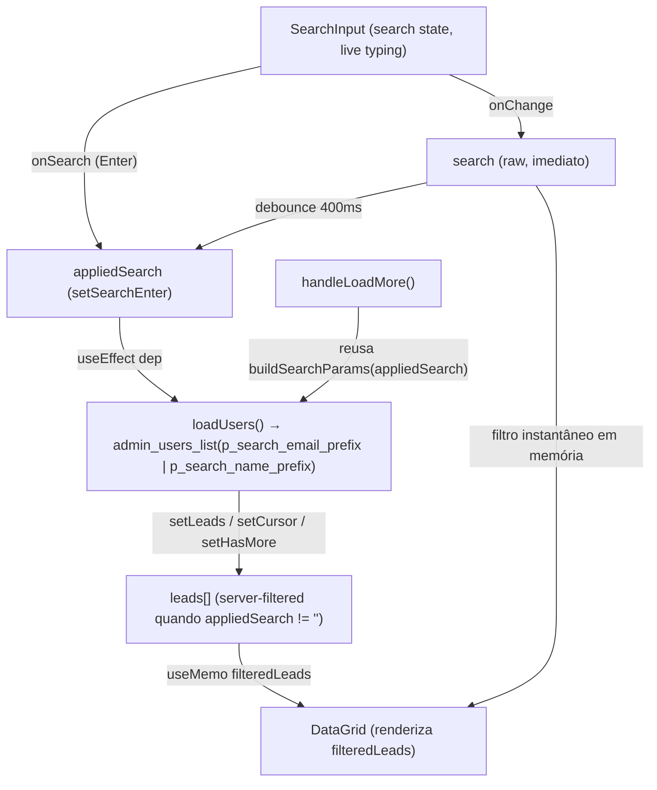

# Busca por e-mail em "Usuários" não encontra usuários fora da página carregada — Planning Output (v1)

> **Status:** PLANEJADO — Aguardando aprovação
> **Data:** 2026-08-22
> **Scope:** `src/pages/usuarios.tsx` (rota "Usuários")
> **Files:** 1 arquivo (0 novos, 1 modificado)
> **Risk:** 🟡 MEDIUM

---

## 1. Contexto

Na página **Usuários** (`src/pages/usuarios.tsx`), a busca por nome/e-mail é feita **inteiramente client-side**, filtrando o array `leads`, que só contém os usuários já carregados via paginação (`admin_users_list` com `p_limit: 100`, avançando via cursor em "Carregar mais"). Se o usuário buscado não estiver dentro do lote já carregado, a busca simplesmente não o encontra — mesmo que ele exista no banco.

Esse comportamento diverge do padrão já validado e correto usado em:
- **Treinos individuais** (`src/pages/protocolos.tsx`), que busca por e-mail **exato, direto no servidor**, via parâmetro `p_search_email_exact` da RPC `admin_user_programs_list` — reconsultando o backend a cada busca, nunca filtrando um array pré-carregado.
- **Liberar Usuário** (`src/pages/liberar-usuario.tsx`), que usa a RPC dedicada `admin_user_lookup_by_email(p_email)` para lookup exato por e-mail.

A investigação no backend (`treino-trinca-app/worker/src/db/migrations/0011_admin_readonly_contracts_grants.sql` / `0014_admin_users_release.sql`) mostrou que a RPC `admin_users_list` **já aceita** os parâmetros `p_search_email_prefix` e `p_search_name_prefix` (filtro `LIKE 'prefixo%'` aplicado no servidor, combinado via `AND` com os demais filtros e com a paginação por cursor) — mas o front-end de "Usuários" nunca envia esses parâmetros. Ou seja, **não é necessária nenhuma mudança de backend**: o gap está isolado no front-end, que ignora uma capacidade de busca server-side já exposta pela RPC.

**Meta:** ao digitar um termo de busca em "Usuários", o front-end deve re-consultar `admin_users_list` no servidor com `p_search_email_prefix` (quando o termo contém `@`) ou `p_search_name_prefix` (caso contrário), da mesma forma que `protocolos.tsx` já faz — eliminando a dependência do array paginado já carregado para a busca.

---

## 2. Referência de Código Mapeada

### 2.1 Padrão de busca server-side por e-mail exato (Treinos Individuais)

[protocolos.tsx L484-L534](file:///Users/brunogovas/Projects/Pandora-Box/melhor-versao-dashboard/src/pages/protocolos.tsx#L484-L534)

```tsx
const loadStudents = useCallback(async () => {
  // ...
  const emailExact = appliedEmailQuery.trim() || undefined
  const tier = planoFilter !== ALL ? planoFilter : undefined
  const [rows, statsRow] = await Promise.all([
    adminRpc<UserProgramRow[]>("admin_user_programs_list", {
      p_search_email_exact: emailExact,
      p_tier: tier,
      p_before_created_at: null,
      p_before_user_id: null,
      p_limit: ALUNOS_PAGE_SIZE,
    }),
    adminRpc<ProgramsStatsRow[]>("admin_user_programs_stats", { p_search_email_exact: emailExact, p_tier: tier }),
  ])
  // ...
}, [appliedEmailQuery, planoFilter])

useEffect(() => {
  void loadData()
}, [appliedEmailQuery, planoFilter])
```
↑ Padrão a ser espelhado: a busca dispara uma **nova query ao servidor** (não um filtro em array já carregado), e um `useEffect` reage à mudança do termo de busca "aplicado" para recarregar a lista do zero.

### 2.2 RPC `admin_users_list` já aceita busca server-side por prefixo (backend, sem alteração necessária)

[0014_admin_users_release.sql L14-L78](file:///Users/brunogovas/Projects/Pandora-Box/treino-trinca-app/worker/src/db/migrations/0014_admin_users_release.sql#L14-L78)

```sql
CREATE OR REPLACE FUNCTION public.admin_users_list(
  p_tier text DEFAULT NULL,
  p_role text DEFAULT NULL,
  p_is_active boolean DEFAULT NULL,
  p_search_email_prefix text DEFAULT NULL,
  p_search_name_prefix text DEFAULT NULL,
  p_before_created_at timestamptz DEFAULT NULL,
  p_before_user_id uuid DEFAULT NULL,
  p_limit integer DEFAULT 100
)
RETURNS TABLE (...)
LANGUAGE sql STABLE SECURITY DEFINER
SET search_path = public, pg_temp
AS $$
  SELECT ...
  FROM public.users u
  LEFT JOIN public.admin_user_search_projection p ON p.user_id = u.id
  WHERE (p_tier IS NULL OR u.tier = p_tier)
    AND (p_role IS NULL OR u.role = p_role)
    AND (p_is_active IS NULL OR u.is_active = p_is_active)
    AND (p_search_email_prefix IS NULL OR lower(u.email) LIKE lower(p_search_email_prefix) || '%')
    AND (p_search_name_prefix IS NULL OR lower(u.nome_completo) LIKE lower(p_search_name_prefix) || '%')
    AND (
      p_before_created_at IS NULL
      OR p_before_user_id IS NULL
      OR (u.created_at, u.id) < (p_before_created_at, p_before_user_id)
    )
  ORDER BY u.created_at DESC, u.id DESC
  LIMIT least(greatest(coalesce(p_limit, 100), 1), 100);
$$;
```
↑ **Importante:** os dois filtros de busca são combinados com `AND` entre si — passar `p_search_email_prefix` e `p_search_name_prefix` simultaneamente exigiria as DUAS condições ao mesmo tempo (errado para um único campo de busca "nome OU e-mail"). Por isso a implementação deve enviar **apenas um dos dois por vez**, escolhendo com base em o termo conter `@` ou não.

### 2.3 Estado e fetch atuais de `Usuários` (a ser modificado)

[usuarios.tsx L280-L353](file:///Users/brunogovas/Projects/Pandora-Box/melhor-versao-dashboard/src/pages/usuarios.tsx#L280-L353)

```tsx
useEffect(() => {
  let active = true
  async function loadUsers() {
    setLoading(true)
    setError(null)
    try {
      const [users, rank, settings, statsRows] = await Promise.all([
        adminRpc<AdminUserListRow[]>("admin_users_list", { p_limit: 100 }),
        adminRpc<AdminUsersRevenueRankRow[]>("admin_users_revenue_rank", { p_limit: 100 }),
        adminRpc<AdminAppSettingsRow[]>("admin_app_settings_current"),
        adminRpc<AdminUserStatsRow[]>("admin_users_stats"),
      ])
      // ...
      setLeads(users.map((row) => rowToLead(row, rankByUserId.get(row.user_id))))
      const lastUser = users[users.length - 1]
      setCursor(lastUser ? { createdAt: lastUser.cursor_created_at, userId: lastUser.cursor_user_id } : null)
      setHasMore(users.length === 100)
      // ...
    } finally {
      if (active) setLoading(false)
    }
  }
  void loadUsers()
  return () => { active = false }
}, [])

async function handleLoadMore() {
  if (!cursor || loadingMore) return
  setLoadingMore(true)
  try {
    const users = await adminRpc<AdminUserListRow[]>("admin_users_list", {
      p_before_created_at: cursor.createdAt,
      p_before_user_id: cursor.userId,
      p_limit: 100,
    })
    setLeads((current) => [...current, ...users.map((row) => rowToLead(row, rankByUserIdRef.current.get(row.user_id)))])
    // ...
  } finally {
    setLoadingMore(false)
  }
}
```

### 2.4 `filteredLeads` client-side (mantido, mas deixa de ser a única linha de defesa)

[usuarios.tsx L378-L391](file:///Users/brunogovas/Projects/Pandora-Box/melhor-versao-dashboard/src/pages/usuarios.tsx#L378-L391)

```tsx
const filteredLeads = useMemo(() => {
  const term = search.trim().toLowerCase()
  return leads
    .filter((lead) => {
      if (term && !lead.name.toLowerCase().includes(term) && !lead.email.toLowerCase().includes(term)) {
        return false
      }
      if (objetivo !== ALL && lead.objetivo !== objetivo) return false
      if (sexo !== ALL && lead.sexo !== sexo) return false
      if (status !== ALL && lead.status !== status) return false
      return true
    })
    .sort((a, b) => b.revenue - b.refund - (a.revenue - a.refund))
}, [leads, search, objetivo, sexo, status])
```
↑ Continua útil como filtro instantâneo enquanto o usuário digita (feedback imediato sobre o lote já em memória) e para os filtros de objetivo/sexo/status, que continuam 100% client-side (não fazem parte deste ajuste).

### 2.5 `SearchInput` já suporta busca disparada por Enter (sem uso atual)

[search-input.tsx L14-L36](file:///Users/brunogovas/Projects/Pandora-Box/melhor-versao-dashboard/src/components/atoms/search-input.tsx#L14-L36)

```tsx
function SearchInput({ placeholder, value, onChange, onSearch, className }: SearchInputProps) {
  return (
    <div className={cn("relative", className)}>
      <Search ... />
      <Input
        type="search"
        placeholder={placeholder}
        value={value}
        onChange={(event) => onChange(event.target.value)}
        onKeyDown={(event) => {
          if (event.key === "Enter") onSearch?.(value)
        }}
        className="pl-8"
      />
    </div>
  )
}
```
↑ `usuarios.tsx` hoje não passa `onSearch`. Vamos usá-lo para permitir busca imediata ao apertar Enter, além do debounce automático.

---

## 3. Lógica de Implementação

### 3.1 Debounce do termo de busca + estado "aplicado"

**Origem:** `[REPO EXISTENTE]` (padrão adaptado de `appliedEmailQuery`/`useEffect` de `protocolos.tsx`) + `[CRIADO]` (debounce, pois `protocolos.tsx` usa botão "Buscar" em vez de debounce automático)

```tsx
const [appliedSearch, setAppliedSearch] = useState("")

useEffect(() => {
  const handle = setTimeout(() => {
    setAppliedSearch(search.trim())
  }, 400)
  return () => clearTimeout(handle)
}, [search])

function handleSearchEnter(value: string) {
  setAppliedSearch(value.trim())
}
```

### 3.2 Extração dos parâmetros de busca server-side (regra do e-mail vs. nome)

**Origem:** `[CRIADO]`

```tsx
function buildSearchParams(term: string) {
  const trimmed = term.trim()
  if (!trimmed) return {}
  return trimmed.includes("@")
    ? { p_search_email_prefix: trimmed }
    : { p_search_name_prefix: trimmed }
}
```

### 3.3 `loadUsers` reescrito para aceitar o termo aplicado e recarregar do zero quando ele mudar

**Origem:** `[REPO EXISTENTE]` (estrutura do efeito de `usuarios.tsx` L280-L326) + `[CRIADO]` (parametrização por busca)

```tsx
useEffect(() => {
  let active = true

  async function loadUsers() {
    setLoading(true)
    setError(null)

    try {
      const searchParams = buildSearchParams(appliedSearch)
      const [users, rank, settings, statsRows] = await Promise.all([
        adminRpc<AdminUserListRow[]>("admin_users_list", { p_limit: 100, ...searchParams }),
        adminRpc<AdminUsersRevenueRankRow[]>("admin_users_revenue_rank", { p_limit: 100 }),
        adminRpc<AdminAppSettingsRow[]>("admin_app_settings_current"),
        adminRpc<AdminUserStatsRow[]>("admin_users_stats"),
      ])

      if (!active) return

      const rankByUserId = new Map(rank.map((row) => [row.user_id, row]))
      rankByUserIdRef.current = rankByUserId
      setLeads(users.map((row) => rowToLead(row, rankByUserId.get(row.user_id))))

      const lastUser = users[users.length - 1]
      setCursor(lastUser ? { createdAt: lastUser.cursor_created_at, userId: lastUser.cursor_user_id } : null)
      setHasMore(users.length === 100)

      if (statsRows[0]) setStats(statsRows[0])
      const reassessmentDays = settings[0]?.reassessment_days
      if (typeof reassessmentDays === "number") {
        setReavaliacaoDias(String(reassessmentDays))
        setLastAppliedText(`Prazo global atual: ${reassessmentDays} dia(s)`)
      }
    } catch (loadError) {
      if (!active) return
      setLeads([])
      setError(loadError instanceof Error ? loadError.message : "Erro ao carregar usuários.")
    } finally {
      if (active) setLoading(false)
    }
  }

  void loadUsers()

  return () => {
    active = false
  }
}, [appliedSearch])
```
↑ **Nota:** `rank`, `settings` e `statsRows` continuam sendo buscados a cada mudança de `appliedSearch` só por reaproveitar o `Promise.all` existente (baixo custo, RPCs leves); não introduz efeito colateral porque `admin_users_stats`/`admin_app_settings_current` não recebem parâmetro de busca e sempre retornam o total global, como já acontece hoje.

### 3.4 `handleLoadMore` propagando o mesmo filtro de busca ativo

**Origem:** `[REPO EXISTENTE]` (estrutura original L328-L353) + `[CRIADO]` (parametrização por busca)

```tsx
async function handleLoadMore() {
  if (!cursor || loadingMore) return
  setLoadingMore(true)
  setError(null)

  try {
    const searchParams = buildSearchParams(appliedSearch)
    const users = await adminRpc<AdminUserListRow[]>("admin_users_list", {
      p_before_created_at: cursor.createdAt,
      p_before_user_id: cursor.userId,
      p_limit: 100,
      ...searchParams,
    })

    setLeads((current) => [
      ...current,
      ...users.map((row) => rowToLead(row, rankByUserIdRef.current.get(row.user_id))),
    ])

    const lastUser = users[users.length - 1]
    setCursor(lastUser ? { createdAt: lastUser.cursor_created_at, userId: lastUser.cursor_user_id } : null)
    setHasMore(users.length === 100)
  } catch (loadError) {
    setError(loadError instanceof Error ? loadError.message : "Erro ao carregar mais usuários.")
  } finally {
    setLoadingMore(false)
  }
}
```

### 3.5 `SearchInput` ligado ao Enter para busca imediata (sem esperar o debounce)

**Origem:** `[REPO EXISTENTE]` (prop `onSearch` já existente e não usada)

```tsx
<SearchInput
  placeholder="Buscar por nome ou e-mail..."
  value={search}
  onChange={setSearch}
  onSearch={handleSearchEnter}
  className="w-full lg:w-[240px]"
/>
```

### 3.6 `filteredLeads` sem alteração de comportamento (mantido)

**Origem:** `[REPO EXISTENTE]` — nenhuma mudança necessária; continua filtrando `leads` (agora já vindo pré-filtrado do servidor quando `appliedSearch` está setado) pelos filtros locais de objetivo/sexo/status, e ainda re-filtra por `search` (não debounced) para feedback instantâneo durante a digitação.

---

## 4. Arquitetura de Componentes



---

## 5. CSS/SCSS Reference

Não aplicável — nenhuma alteração visual/CSS é necessária; apenas a prop `onSearch` é adicionada ao `SearchInput` já existente, sem alterar estilos.

---

## 6. Novos Componentes

Não aplicável — nenhum componente novo é criado. `buildSearchParams` e o `useEffect` de debounce são funções auxiliares dentro do mesmo arquivo `usuarios.tsx`.

---

## 7. Componentes Modificados

### 7.1 `src/pages/usuarios.tsx`

**Novos states/hooks:**
```tsx
const [appliedSearch, setAppliedSearch] = useState("")

useEffect(() => {
  const handle = setTimeout(() => setAppliedSearch(search.trim()), 400)
  return () => clearTimeout(handle)
}, [search])
```

**Modificações no código existente:**
- Efeito de carregamento inicial (L280-L326) passa a depender de `[appliedSearch]` em vez de `[]`, e envia `...buildSearchParams(appliedSearch)` para `admin_users_list`.
- `handleLoadMore` (L328-L353) passa a enviar `...buildSearchParams(appliedSearch)` junto com o cursor.
- Nova função utilitária `buildSearchParams(term)` (ver §3.2).
- Nova função `handleSearchEnter(value)` (ver §3.1).

**Props adicionais para sub-componentes:**
```tsx
<SearchInput
  // ...props existentes
  onSearch={handleSearchEnter}
/>
```

---

## 8. i18n Keys (se aplicável)

Não aplicável — nenhuma string nova de UI é introduzida (nenhum label novo, nenhuma mensagem nova).

---

## 9. Files Summary

| Action | File | Risk |
|--------|------|------|
| **MODIFY** | `/Users/brunogovas/Projects/Pandora-Box/melhor-versao-dashboard/src/pages/usuarios.tsx` | 🟡 MEDIUM |

Nenhuma alteração de backend é necessária (RPC `admin_users_list` já suporta os parâmetros exigidos, conforme §2.2).

---

## 10. Implementation Order

1. **Phase A:** Adicionar `appliedSearch` + debounce de 400ms + `buildSearchParams(term)`.
2. **Phase B:** Alterar o `useEffect` de carregamento inicial para depender de `appliedSearch` e enviar os parâmetros de busca à RPC `admin_users_list`.
3. **Phase C:** Alterar `handleLoadMore` para propagar os mesmos parâmetros de busca (garante que "Carregar mais" durante uma busca ativa continue filtrado).
4. **Phase D:** Conectar `onSearch={handleSearchEnter}` no `SearchInput` para permitir busca imediata via Enter.
5. **Phase E:** Validação manual na UI (ver §12) + typecheck/lint.

---

## 11. Rollback Plan

```
Componentes modificados:
├── Git Ref: HEAD antes da implementação (8114c77d2ee4a267d3815573418b7e41f3a6884a)
├── Revert: git checkout 8114c77d2ee4a267d3815573418b7e41f3a6884a -- src/pages/usuarios.tsx
└── Validação: confirmar que a página "Usuários" volta a carregar os 100 primeiros usuários por created_at desc e que "Carregar mais" volta a funcionar sem parâmetros de busca.
```

**Blast Radius:** Restrito à página `Usuários` (`src/pages/usuarios.tsx`). Não afeta `protocolos.tsx`, `liberar-usuario.tsx`, nem nenhuma RPC de backend (nenhuma migration nova).

**Regression Surface:**
- Filtros de objetivo/sexo/status (permanecem 100% client-side, sem mudança).
- Paginação "Carregar mais" (agora carrega a próxima página do resultado filtrado quando há busca ativa, e da lista completa quando não há).
- Contadores dos `StatTile` (Total/Trinca/Elite/Reembolso/Sem acesso) — **não são afetados**, pois `admin_users_stats` continua sendo chamado sem parâmetro de busca.

---

## 12. Verification Plan

| # | Test Case | Route | Expected |
|---|-----------|-------|----------|
| 1 | Buscar um e-mail exato que existe no banco mas não está entre os primeiros 100 usuários (por `created_at desc`) | `/usuarios` | Após ~400ms (ou Enter), o usuário aparece na grid |
| 2 | Buscar um nome parcial (prefixo) que não está no lote carregado | `/usuarios` | Usuário(s) com nome iniciando pelo prefixo aparecem |
| 3 | Limpar o campo de busca após uma busca aplicada | `/usuarios` | Lista volta a mostrar os primeiros 100 usuários (padrão, sem filtro) |
| 4 | Digitar um termo curto (ex.: 1-2 caracteres) que também é substring de um nome carregado | `/usuarios` | Filtro instantâneo em memória continua funcionando (sem esperar o servidor) e, após o debounce, o resultado do servidor assume a lista |
| 5 | Clicar "Carregar mais" enquanto há uma busca ativa | `/usuarios` | Próxima página é carregada respeitando o mesmo filtro de busca (sem trazer usuários fora do filtro) |
| 6 | Conferir StatTiles (Total/Trinca/Elite/Reembolso/Sem acesso) antes e depois de uma busca | `/usuarios` | Números permanecem os totais globais, inalterados pela busca |
| 7 | Console do navegador durante busca | `/usuarios` | Nenhum erro novo |
| 8 | `npm run lint` e `npm run typecheck` | — | Ambos passam sem erros novos |

---

## 13. Handoff (se aplicável)

Não aplicável — nenhuma integração externa (N8N, webhooks, backend) é necessária; a RPC já existe e já está em produção.
