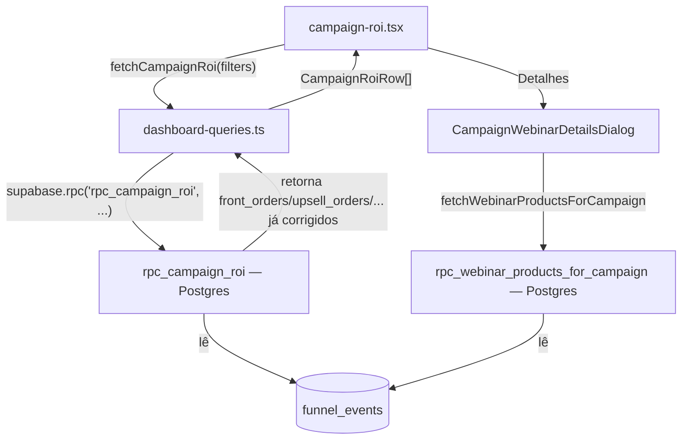

# Campaign ROI — Timezone Regression & Refund/Chargeback Order-Count Fix — Planning Output (v1)

> **Status:** PLANEJADO — Aguardando aprovação
> **Data:** 2026-09-19
> **Scope:** `rpc_campaign_roi`, `rpc_webinar_products_for_campaign` (Supabase RPCs consumidas por `src/pages/campaign-roi.tsx`)
> **Files:** 2 arquivos (1 novo — migração, 1 novo — script de verificação; 0 arquivos de frontend modificados)
> **Risk:** 🔴 HIGH

---

## 1. Contexto

O usuário forneceu um diff manual, dia a dia (15/09 a 19/09), cruzando por `payment_id` os totais do dashboard `melhor-versao-dashboard` contra o export bruto da Lastlink. O diff fecha exatamente ao aplicar duas hipóteses:

1. **Timezone:** o dashboard agrupa por `event_timestamp::date` (UTC), enquanto a Lastlink opera no calendário de Brasília. Toda venda entre 21:00–23:59:59 BRT aparece no dia seguinte no dashboard.
2. **Status da compra:** o dashboard segue contando o evento `purchase` original mesmo quando a venda depois vira `reembolso`/`chargeback`.

Investigação no repositório confirma as duas causas com precisão cirúrgica — e revela que a causa raiz não é um bug nunca corrigido: é uma **regressão**.

- Em `supabase/migrations/20260727200000_fix_america_sao_paulo_date_bucketing.sql` (Jul/27), `rpc_campaign_roi` já filtrava por `(e.event_timestamp at time zone 'America/Sao_Paulo')::date between p_date_from and p_date_to` — bucketing correto no calendário de Brasília.
- Em `supabase/migrations/20260915174949_extend_campaign_roi_upsell02_webinar.sql` (15/09 — a mesma janela de datas que o usuário auditou), a função foi **recriada do zero** (`drop function` + `create or replace`) para adicionar upsell02/webinário, e o filtro de data regrediu de volta para `e.event_timestamp::date between p_date_from and p_date_to` (linha 79) — UTC puro, sem `at time zone`. O mesmo aconteceu em `rpc_webinar_products_for_campaign` (linha 199 do mesmo arquivo).
- Os scripts `scripts/verify-timezone-bucketing.sql` e `scripts/verify-campaign-roi-refunds.sql`, já existentes no repo desde a correção de julho, confirmam que ambos os problemas (timezone e status de reembolso) já foram objeto de auditoria formal antes — só não foram re-verificados após a migração de 15/09, que os reintroduziu.
- O segundo problema do usuário ("dashboard conta a venda mesmo após reembolso/chargeback") também procede, mas parcialmente: `front_revenue_cents`/`upsell_revenue_cents`/etc. (receita) já descontam `purchase_refunded`/`purchase_chargeback` corretamente. Só as colunas de **contagem** (`front_orders`, `upsell_orders`, `upsell02_orders`, `webinar_orders`) não descontam — elas contam só `event_type = 'purchase...'`, sem subtrair as reversões correspondentes. Como a página `campaign-roi.tsx` ordena e destaca justamente essas colunas de contagem ("Vendas Front", "Vendas Upsell"...), é exatamente o número de "vendas" que o usuário está comparando contra a Lastlink.

Ambos os bugs vivem na mesma função SQL e no mesmo commit de origem — corrigir os dois é um único ajuste coeso.

---

## 2. Referência de Código Mapeada

### 2.1 Filtro de data correto (pré-regressão), em `funnel_events_scoped`

[20260727200000_fix_america_sao_paulo_date_bucketing.sql L77-L78](file:///Users/brunogovas/Projects/Pandora-Box/melhor-versao-dashboard/supabase/migrations/20260727200000_fix_america_sao_paulo_date_bucketing.sql#L77-L78)

```sql
and event_timestamp >= (p_date_from::timestamp at time zone 'America/Sao_Paulo')
and event_timestamp < ((p_date_to + 1)::timestamp at time zone 'America/Sao_Paulo')
and event_date >= p_date_from
and event_date <= p_date_to
```
↑ Padrão de referência para filtrar por intervalo de datas no calendário de Brasília, usado nas demais RPCs do dashboard.

### 2.2 Filtro de data correto (pré-regressão), em `rpc_campaign_roi` original de julho

[20260727200000_fix_america_sao_paulo_date_bucketing.sql L144](file:///Users/brunogovas/Projects/Pandora-Box/melhor-versao-dashboard/supabase/migrations/20260727200000_fix_america_sao_paulo_date_bucketing.sql#L144)

```sql
and (e.event_timestamp at time zone 'America/Sao_Paulo')::date between p_date_from and p_date_to
```
↑ Este é exatamente o predicado que a migração de 15/09 removeu. Será restaurado nas duas funções afetadas.

### 2.3 Função atualmente ativa em produção — com a regressão

[20260915174949_extend_campaign_roi_upsell02_webinar.sql L34-L144](file:///Users/brunogovas/Projects/Pandora-Box/melhor-versao-dashboard/supabase/migrations/20260915174949_extend_campaign_roi_upsell02_webinar.sql#L34-L144)

```sql
with scoped as (
  select
    ...
  from public.funnel_events e
  where e.event_type in (
      'purchase', 'purchase_upsell', 'purchase_refunded', 'purchase_chargeback',
      'purchase_upsell_02', 'purchase_upsell_02_refunded', 'purchase_upsell_02_chargeback',
      'purchase_webinario', 'purchase_webinario_refunded', 'purchase_webinario_chargeback'
    )
    and (e.metadata->>'is_test') is distinct from 'true'
    and (p_funnel_id is null or e.funnel_id = p_funnel_id)
    and (p_country is null or e.country = p_country)
    and (p_funnel_variant is null or e.funnel_variant = p_funnel_variant)
    and (
      p_traffic_source_id is null
      or coalesce(e.traffic_source_id, public.classify_traffic_source(...), 'unknown') = p_traffic_source_id
    )
    and e.event_timestamp::date between p_date_from and p_date_to   -- ← BUG 1: UTC, não Brasília
)
select
  ...
  count(*) filter (where event_type = 'purchase' and attribution_status is distinct from 'unmatched') as front_orders,       -- ← BUG 2: não desconta refund/chargeback
  count(*) filter (where event_type = 'purchase_upsell' and attribution_status is distinct from 'unmatched') as upsell_orders,        -- ← BUG 2
  count(*) filter (where event_type = 'purchase_upsell_02' and attribution_status is distinct from 'unmatched') as upsell02_orders,   -- ← BUG 2
  count(*) filter (where event_type = 'purchase_webinario' and attribution_status is distinct from 'unmatched') as webinar_orders,    -- ← BUG 2
  ...
from scoped
group by traffic_source_id, utm_source, utm_campaign, utm_medium
order by total_revenue_cents desc;
```
↑ Esta é a versão que será substituída (via novo `drop function` + `create or replace`, seguindo o próprio padrão do arquivo de 15/09).

### 2.4 Netting de receita correto (padrão a replicar nas colunas de contagem)

[20260915174949_extend_campaign_roi_upsell02_webinar.sql L86-L91](file:///Users/brunogovas/Projects/Pandora-Box/melhor-versao-dashboard/supabase/migrations/20260915174949_extend_campaign_roi_upsell02_webinar.sql#L86-L91)

```sql
coalesce(sum(price_cents) filter (
  where event_type = 'purchase' and attribution_status is distinct from 'unmatched'
), 0)
- coalesce(sum(price_cents) filter (
  where event_type in ('purchase_refunded', 'purchase_chargeback') and not is_upsell and attribution_status is distinct from 'unmatched'
), 0) as front_revenue_cents,
```
↑ A receita já faz `soma(purchase) - soma(refund/chargeback)`. A correção do Bug 2 replica esse mesmo padrão de subtração, mas em `count(*)` em vez de `sum(price_cents)`.

### 2.5 Página consumidora — onde os números de "Vendas" são lidos e comparados pelo usuário

[campaign-roi.tsx L109-L112](file:///Users/brunogovas/Projects/Pandora-Box/melhor-versao-dashboard/src/pages/campaign-roi.tsx#L109-L112)

```tsx
formatNumber(row.front_orders),
formatNumber(row.upsell_orders),
formatNumber(row.upsell02_orders),
formatNumber(row.webinar_orders),
```
↑ Confirma que `front_orders`/`upsell_orders`/`upsell02_orders`/`webinar_orders` (as colunas do Bug 2) são exatamente os números "Vendas Front/Upsell/Upsell 02/Webinário" exibidos na tela — os mesmos que o usuário comparou contra a Lastlink.

### 2.6 Segunda função com o mesmo bug de timezone, no mesmo arquivo

[20260915174949_extend_campaign_roi_upsell02_webinar.sql L173-L199](file:///Users/brunogovas/Projects/Pandora-Box/melhor-versao-dashboard/supabase/migrations/20260915174949_extend_campaign_roi_upsell02_webinar.sql#L173-L199)

```sql
create or replace function public.rpc_webinar_products_for_campaign(...)
...
  from public.funnel_events e
  where e.event_type like 'purchase_webinario%'
    ...
    and e.event_timestamp::date between p_date_from and p_date_to   -- ← mesmo BUG 1
  group by 1, 2
```
↑ Drilldown de produtos de webinário aberto a partir do botão "Detalhes" na mesma página; tem o mesmo filtro de data quebrado e será corrigido junto para manter os dois números (grid principal e drilldown) consistentes.

### 2.7 Scripts de verificação já existentes (não modificados, servem de gate de aceite)

[scripts/verify-timezone-bucketing.sql](file:///Users/brunogovas/Projects/Pandora-Box/melhor-versao-dashboard/scripts/verify-timezone-bucketing.sql) e [scripts/verify-campaign-roi-refunds.sql](file:///Users/brunogovas/Projects/Pandora-Box/melhor-versao-dashboard/scripts/verify-campaign-roi-refunds.sql)

↑ Já escritos para a correção de julho; serão reutilizados (mais um script novo para o Bug 2 — ver §3.2) para confirmar que a correção de 15/09 não voltou a quebrar.

---

## 3. Lógica de Implementação

### 3.1 Bug 1 — Restaurar bucketing por America/Sao_Paulo

**Origem:** `[REPO EXISTENTE]`

```sql
-- Em rpc_campaign_roi, dentro do CTE `scoped` (substitui a linha 79):
and (e.event_timestamp at time zone 'America/Sao_Paulo')::date between p_date_from and p_date_to

-- Em rpc_webinar_products_for_campaign (substitui a linha 199):
and (e.event_timestamp at time zone 'America/Sao_Paulo')::date between p_date_from and p_date_to
```
Fluxo: idêntico ao predicado que já existia na função pré-regressão (§2.2), apenas reaplicado sobre a versão de 15/09 que tem as colunas extras de upsell02/webinário. Validado contra a documentação do Postgres (Context7, `/websites/postgresql_current`, `AT TIME ZONE`): `timestamptz at time zone 'zone'` converte para `timestamp` no calendário daquele fuso antes do cast `::date`, que é exatamente o comportamento desejado — sem isso, `::date` trunca no fuso da sessão (UTC no Supabase).

### 3.2 Bug 2 — Descontar refund/chargeback das colunas de contagem

**Origem:** `[CRIADO]` (extensão direta do padrão em §2.4, aplicado a `count(*)` em vez de `sum(price_cents)`)

```sql
-- front_orders: soma("purchase") - soma("purchase_refunded"/"purchase_chargeback" não-upsell)
coalesce(count(*) filter (
  where event_type = 'purchase' and attribution_status is distinct from 'unmatched'
), 0)
- coalesce(count(*) filter (
  where event_type in ('purchase_refunded', 'purchase_chargeback') and not is_upsell and attribution_status is distinct from 'unmatched'
), 0) as front_orders,

-- upsell_orders
coalesce(count(*) filter (
  where event_type = 'purchase_upsell' and attribution_status is distinct from 'unmatched'
), 0)
- coalesce(count(*) filter (
  where event_type in ('purchase_refunded', 'purchase_chargeback') and is_upsell and attribution_status is distinct from 'unmatched'
), 0) as upsell_orders,

-- upsell02_orders
coalesce(count(*) filter (
  where event_type = 'purchase_upsell_02' and attribution_status is distinct from 'unmatched'
), 0)
- coalesce(count(*) filter (
  where event_type in ('purchase_upsell_02_refunded', 'purchase_upsell_02_chargeback') and attribution_status is distinct from 'unmatched'
), 0) as upsell02_orders,

-- webinar_orders
coalesce(count(*) filter (
  where event_type = 'purchase_webinario' and attribution_status is distinct from 'unmatched'
), 0)
- coalesce(count(*) filter (
  where event_type in ('purchase_webinario_refunded', 'purchase_webinario_chargeback') and attribution_status is distinct from 'unmatched'
), 0) as webinar_orders,
```
Fluxo: espelha exatamente o `sum(price_cents) - sum(refund/chargeback price_cents)` já usado para receita (§2.4), trocando `sum(price_cents)` por `count(*)`. Usa `is_upsell` para separar refund/chargeback de front vs. upsell (mesma flag já usada na receita), e `event_type` explícito para upsell02/webinário (mesmo padrão dessas duas seções de receita).

**Nota de correção de não-negatividade:** contagens nunca ficam negativas na prática (uma venda só pode ser estornada se existiu), mas por segurança contra dados inconsistentes (ex.: refund sem purchase matched no período, evento duplicado), a subtração usa `GREATEST(..., 0)` — ver bloco final da migração no §9.

### 3.3 Migração SQL completa (arquivo novo)

**Origem:** `[CRIADO]` + `[REPO EXISTENTE]` (segue o padrão exato de `drop function` + `create or replace` + `grant execute` do arquivo de 15/09)

```sql
-- supabase/migrations/20260919120000_fix_campaign_roi_timezone_and_order_counts.sql

drop function if exists public.rpc_campaign_roi(text, text, text, date, date, text);

create or replace function public.rpc_campaign_roi(
  p_funnel_id text,
  p_country text,
  p_funnel_variant text,
  p_date_from date,
  p_date_to date,
  p_traffic_source_id text default null
)
returns table (
  traffic_source_id text,
  utm_source text,
  utm_campaign text,
  utm_medium text,
  front_revenue_cents bigint,
  upsell_revenue_cents bigint,
  upsell02_revenue_cents bigint,
  webinar_revenue_cents bigint,
  total_revenue_cents bigint,
  reversed_revenue_cents bigint,
  front_orders bigint,
  upsell_orders bigint,
  upsell02_orders bigint,
  webinar_orders bigint,
  unmatched_revenue_cents bigint
)
language sql
security definer
stable
set search_path = public, pg_temp
as $$
  with scoped as (
    select
      coalesce(e.traffic_source_id, public.classify_traffic_source(
        e.metadata->>'utm_source',
        e.metadata->>'fbclid',
        e.metadata->>'ttclid',
        e.metadata->>'gclid',
        e.metadata->>'src',
        e.metadata->>'sck'
      ), 'unknown') as traffic_source_id,
      e.event_type,
      (e.metadata->>'is_upsell')::boolean as is_upsell,
      coalesce((e.metadata->>'price_cents')::bigint, 0) as price_cents,
      coalesce(e.metadata->>'utm_source', 'Sem UTM') as utm_source,
      coalesce(e.metadata->>'utm_campaign', 'Sem campanha') as utm_campaign,
      e.metadata->>'utm_medium' as utm_medium,
      e.metadata->>'attribution_status' as attribution_status
    from public.funnel_events e
    where e.event_type in (
        'purchase',
        'purchase_upsell',
        'purchase_refunded',
        'purchase_chargeback',
        'purchase_upsell_02',
        'purchase_upsell_02_refunded',
        'purchase_upsell_02_chargeback',
        'purchase_webinario',
        'purchase_webinario_refunded',
        'purchase_webinario_chargeback'
      )
      and (e.metadata->>'is_test') is distinct from 'true'
      and (p_funnel_id is null or e.funnel_id = p_funnel_id)
      and (p_country is null or e.country = p_country)
      and (p_funnel_variant is null or e.funnel_variant = p_funnel_variant)
      and (
        p_traffic_source_id is null
        or coalesce(e.traffic_source_id, public.classify_traffic_source(
          e.metadata->>'utm_source',
          e.metadata->>'fbclid',
          e.metadata->>'ttclid',
          e.metadata->>'gclid',
          e.metadata->>'src',
          e.metadata->>'sck'
        ), 'unknown') = p_traffic_source_id
      )
      -- FIX Bug 1: bucketiza no calendário de Brasília, não em UTC (regressão da migração 20260915174949)
      and (e.event_timestamp at time zone 'America/Sao_Paulo')::date between p_date_from and p_date_to
  )
  select
    traffic_source_id,
    utm_source,
    utm_campaign,
    utm_medium,
    coalesce(sum(price_cents) filter (
      where event_type = 'purchase' and attribution_status is distinct from 'unmatched'
    ), 0)
    - coalesce(sum(price_cents) filter (
      where event_type in ('purchase_refunded', 'purchase_chargeback') and not is_upsell and attribution_status is distinct from 'unmatched'
    ), 0) as front_revenue_cents,
    coalesce(sum(price_cents) filter (
      where event_type = 'purchase_upsell' and attribution_status is distinct from 'unmatched'
    ), 0)
    - coalesce(sum(price_cents) filter (
      where event_type in ('purchase_refunded', 'purchase_chargeback') and is_upsell and attribution_status is distinct from 'unmatched'
    ), 0) as upsell_revenue_cents,
    coalesce(sum(price_cents) filter (
      where event_type = 'purchase_upsell_02' and attribution_status is distinct from 'unmatched'
    ), 0)
    - coalesce(sum(price_cents) filter (
      where event_type in ('purchase_upsell_02_refunded', 'purchase_upsell_02_chargeback') and attribution_status is distinct from 'unmatched'
    ), 0) as upsell02_revenue_cents,
    coalesce(sum(price_cents) filter (
      where event_type = 'purchase_webinario' and attribution_status is distinct from 'unmatched'
    ), 0)
    - coalesce(sum(price_cents) filter (
      where event_type in ('purchase_webinario_refunded', 'purchase_webinario_chargeback') and attribution_status is distinct from 'unmatched'
    ), 0) as webinar_revenue_cents,
    coalesce(sum(price_cents) filter (
      where event_type in ('purchase', 'purchase_upsell', 'purchase_upsell_02', 'purchase_webinario')
        and attribution_status is distinct from 'unmatched'
    ), 0)
    - coalesce(sum(price_cents) filter (
      where event_type in (
        'purchase_refunded', 'purchase_chargeback',
        'purchase_upsell_02_refunded', 'purchase_upsell_02_chargeback',
        'purchase_webinario_refunded', 'purchase_webinario_chargeback'
      )
      and attribution_status is distinct from 'unmatched'
    ), 0) as total_revenue_cents,
    coalesce(sum(price_cents) filter (
      where event_type in (
        'purchase_refunded', 'purchase_chargeback',
        'purchase_upsell_02_refunded', 'purchase_upsell_02_chargeback',
        'purchase_webinario_refunded', 'purchase_webinario_chargeback'
      )
      and attribution_status is distinct from 'unmatched'
    ), 0) as reversed_revenue_cents,
    -- FIX Bug 2: descontar refund/chargeback das contagens, igual já é feito na receita
    greatest(0,
      coalesce(count(*) filter (where event_type = 'purchase' and attribution_status is distinct from 'unmatched'), 0)
      - coalesce(count(*) filter (where event_type in ('purchase_refunded', 'purchase_chargeback') and not is_upsell and attribution_status is distinct from 'unmatched'), 0)
    ) as front_orders,
    greatest(0,
      coalesce(count(*) filter (where event_type = 'purchase_upsell' and attribution_status is distinct from 'unmatched'), 0)
      - coalesce(count(*) filter (where event_type in ('purchase_refunded', 'purchase_chargeback') and is_upsell and attribution_status is distinct from 'unmatched'), 0)
    ) as upsell_orders,
    greatest(0,
      coalesce(count(*) filter (where event_type = 'purchase_upsell_02' and attribution_status is distinct from 'unmatched'), 0)
      - coalesce(count(*) filter (where event_type in ('purchase_upsell_02_refunded', 'purchase_upsell_02_chargeback') and attribution_status is distinct from 'unmatched'), 0)
    ) as upsell02_orders,
    greatest(0,
      coalesce(count(*) filter (where event_type = 'purchase_webinario' and attribution_status is distinct from 'unmatched'), 0)
      - coalesce(count(*) filter (where event_type in ('purchase_webinario_refunded', 'purchase_webinario_chargeback') and attribution_status is distinct from 'unmatched'), 0)
    ) as webinar_orders,
    coalesce(sum(price_cents) filter (where attribution_status = 'unmatched'), 0) as unmatched_revenue_cents
  from scoped
  group by traffic_source_id, utm_source, utm_campaign, utm_medium
  order by total_revenue_cents desc;
$$;

grant execute on function public.rpc_campaign_roi(text, text, text, date, date, text) to anon, authenticated;

drop function if exists public.rpc_webinar_products_for_campaign(text, text, text, text, text, text, date, date, text);

create or replace function public.rpc_webinar_products_for_campaign(
  p_funnel_id text,
  p_country text,
  p_funnel_variant text,
  p_utm_source text,
  p_utm_campaign text,
  p_utm_medium text,
  p_date_from date,
  p_date_to date,
  p_traffic_source_id text default null
)
returns table (
  product_code text,
  product_name text,
  purchase_count bigint,
  gross_revenue_cents bigint
)
language sql
security definer
stable
set search_path = public, pg_temp
as $$
  select
    coalesce(nullif(e.metadata->>'product_code', ''), 'desconhecido') as product_code,
    coalesce(nullif(e.metadata->>'product_name', ''), 'Produto sem nome') as product_name,
    count(*) filter (where e.event_type = 'purchase_webinario') as purchase_count,
    coalesce(sum((e.metadata->>'price_cents')::bigint) filter (where e.event_type = 'purchase_webinario'), 0) as gross_revenue_cents
  from public.funnel_events e
  where e.event_type like 'purchase_webinario%'
    and (e.metadata->>'is_test') is distinct from 'true'
    and (e.metadata->>'attribution_status') is distinct from 'unmatched'
    and (p_funnel_id is null or e.funnel_id = p_funnel_id)
    and (p_country is null or e.country = p_country)
    and (p_funnel_variant is null or e.funnel_variant = p_funnel_variant)
    and coalesce(e.metadata->>'utm_source', 'Sem UTM') = p_utm_source
    and coalesce(e.metadata->>'utm_campaign', 'Sem campanha') = p_utm_campaign
    and coalesce(e.metadata->>'utm_medium', '') = coalesce(p_utm_medium, '')
    and (
      p_traffic_source_id is null
      or coalesce(e.traffic_source_id, public.classify_traffic_source(
        e.metadata->>'utm_source',
        e.metadata->>'fbclid',
        e.metadata->>'ttclid',
        e.metadata->>'gclid',
        e.metadata->>'src',
        e.metadata->>'sck'
      ), 'unknown') = p_traffic_source_id
    )
    -- FIX Bug 1: mesmo bucketing por America/Sao_Paulo
    and (e.event_timestamp at time zone 'America/Sao_Paulo')::date between p_date_from and p_date_to
  group by 1, 2
  having count(*) filter (where e.event_type = 'purchase_webinario') > 0
  order by gross_revenue_cents desc, purchase_count desc, product_name asc;
$$;

grant execute on function public.rpc_webinar_products_for_campaign(text, text, text, text, text, text, date, date, text) to anon, authenticated;
```

### 3.4 Script de verificação novo para o Bug 2

**Origem:** `[CRIADO]` (segue o padrão de `scripts/verify-campaign-roi-refunds.sql`)

```sql
-- scripts/verify-campaign-roi-order-counts.sql
-- Critério de aceite: front_orders (e demais colunas de contagem) da RPC devem bater com uma
-- contagem independente de purchase - refund/chargeback, feita direto sobre funnel_events.

with raw_counts as (
  select
    coalesce(e.traffic_source_id, public.classify_traffic_source(
      e.metadata->>'utm_source', e.metadata->>'fbclid', e.metadata->>'ttclid',
      e.metadata->>'gclid', e.metadata->>'src', e.metadata->>'sck'
    ), 'unknown') as traffic_source_id,
    coalesce(e.metadata->>'utm_source', 'Sem UTM') as utm_source,
    coalesce(e.metadata->>'utm_campaign', 'Sem campanha') as utm_campaign,
    e.metadata->>'utm_medium' as utm_medium,
    count(*) filter (where e.event_type = 'purchase' and (e.metadata->>'attribution_status') is distinct from 'unmatched')
      - count(*) filter (where e.event_type in ('purchase_refunded', 'purchase_chargeback') and (e.metadata->>'is_upsell')::boolean is not true and (e.metadata->>'attribution_status') is distinct from 'unmatched')
      as front_orders_raw
  from public.funnel_events e
  where e.event_type in ('purchase', 'purchase_refunded', 'purchase_chargeback')
    and (e.metadata->>'is_test') is distinct from 'true'
    and (e.event_timestamp at time zone 'America/Sao_Paulo')::date between '2026-09-15' and '2026-09-19'
  group by 1, 2, 3, 4
),
via_rpc as (
  select traffic_source_id, utm_source, utm_campaign, utm_medium, front_orders
  from public.rpc_campaign_roi(null, null, null, '2026-09-15', '2026-09-19', null)
)
select
  coalesce(r.traffic_source_id, v.traffic_source_id) as traffic_source_id,
  coalesce(r.utm_campaign, v.utm_campaign) as utm_campaign,
  r.front_orders_raw as via_raw_aggregate,
  v.front_orders as via_rpc,
  (coalesce(r.front_orders_raw, 0) = coalesce(v.front_orders, 0)) as matches
from raw_counts r
full outer join via_rpc v
  on v.traffic_source_id = r.traffic_source_id
  and v.utm_source = r.utm_source
  and v.utm_campaign = r.utm_campaign
  and v.utm_medium is not distinct from r.utm_medium
order by via_raw_aggregate desc nulls last;
```

---

## 4. Arquitetura de Componentes



Não há mudança de fluxo — apenas a correção do predicado de data e das colunas de contagem dentro das duas RPCs (nós C e F). Frontend (`campaign-roi.tsx`, `dashboard-queries.ts`, `dashboard-types.ts`) não muda: o shape de retorno das funções é idêntico ao atual.

---

## 5. CSS/SCSS Reference

N/A — este ajuste é 100% backend (SQL/RPC). Nenhum estilo é alterado.

---

## 6. Novos Componentes

N/A — nenhum componente novo. O único artefato "novo" é a migração SQL (§3.3) e o script de verificação (§3.4).

---

## 7. Componentes Modificados

Nenhum arquivo de frontend é modificado. As duas funções SQL são recriadas via `create or replace function` dentro de uma nova migração (não se edita o arquivo de migração de 15/09 — migrações aplicadas nunca são editadas retroativamente).

---

## 8. i18n Keys

N/A.

---

## 9. Files Summary

| Action | File | Risk |
|--------|------|------|
| **NEW** | `supabase/migrations/20260919120000_fix_campaign_roi_timezone_and_order_counts.sql` | 🔴 HIGH |
| **NEW** | `scripts/verify-campaign-roi-order-counts.sql` | 🟢 LOW |

Nenhum arquivo de frontend (`src/**`) é tocado.

---

## 10. Implementation Order

1. **Phase A:** Aplicar a migração `20260919120000_fix_campaign_roi_timezone_and_order_counts.sql` no ambiente de staging (via `@devops`/Supabase MCP — nunca em `main`/produção sem aprovação explícita, conforme `.claude/rules/standard-software-architecture.md` e `mcp-usage.md`).
2. **Phase B:** Rodar `scripts/verify-timezone-bucketing.sql`, `scripts/verify-campaign-roi-refunds.sql` (já existentes) e `scripts/verify-campaign-roi-order-counts.sql` (novo) em staging, comparando `via_rpc` vs. `via_raw_aggregate` — critério de aceite: 100% de `matches = true`.
3. **Phase C:** Re-rodar manualmente o cruzamento de 15–19/09 (mesmos e-mails/`payment_id` do relatório do usuário) contra `rpc_campaign_roi(null, null, null, '2026-09-15', '2026-09-19', null)` em staging — critério de aceite: `front_orders` por dia bate 1:1 com os totais aprovados da Lastlink por dia.
4. **Phase D:** Apresentar o diff antes/depois (staging) ao stakeholder para aprovação — obrigatório por ser 🔴 HIGH.
5. **Phase E:** Promover a migração para produção **somente** mediante aprovação explícita do usuário.

---

## 11. Rollback Plan

```
Migração 20260919120000_fix_campaign_roi_timezone_and_order_counts.sql
├── Git Ref: ca5167668b4b72bf9a81eddf625a82f401438427 (HEAD antes da implementação)
├── Arquivos a reverter: supabase/migrations/20260919120000_fix_campaign_roi_timezone_and_order_counts.sql,
│                        scripts/verify-campaign-roi-order-counts.sql
├── Revert Command: git checkout ca5167668b4b72bf9a81eddf625a82f401438427 -- supabase/migrations/20260919120000_fix_campaign_roi_timezone_and_order_counts.sql scripts/verify-campaign-roi-order-counts.sql
└── Validação pós-revert: reaplicar em staging o `create or replace function` de
    20260915174949_extend_campaign_roi_upsell02_webinar.sql (a função volta ao estado
    com a regressão) e confirmar que scripts/verify-*.sql voltam a acusar `matches = false`
    nos mesmos pontos — comportamento esperado do estado revertido.
```

Nota: como `rpc_campaign_roi`/`rpc_webinar_products_for_campaign` são recriadas via `create or replace function` (não há `DROP` destrutivo de dados), o rollback é sempre seguro e não há perda de dados em `funnel_events` — apenas a lógica de leitura muda.

---

## 12. Verification Plan

| # | Test Case | Route/RPC | Expected |
|---|-----------|-----------|----------|
| 1 | `scripts/verify-timezone-bucketing.sql`, query 2 (boundary 21h-23h59 BRT) | Supabase SQL editor (staging) | `todos_no_dia_brt_correto = true` |
| 2 | `scripts/verify-campaign-roi-refunds.sql` | Supabase SQL editor (staging) | 100% `matches = true` |
| 3 | `scripts/verify-campaign-roi-order-counts.sql` (novo) | Supabase SQL editor (staging) | 100% `matches = true` |
| 4 | `rpc_campaign_roi(null,null,null,'2026-09-15','2026-09-15',null)` | RPC direta (staging) | `sum(front_orders) = 31` (Lastlink 15/09 aprovadas), não 35 |
| 5 | `rpc_campaign_roi(null,null,null,'2026-09-16','2026-09-16',null)` | RPC direta (staging) | `sum(front_orders) = 41` (Lastlink 16/09), não 37 |
| 6 | `rpc_campaign_roi(null,null,null,'2026-09-17','2026-09-17',null)` | RPC direta (staging) | `sum(front_orders) = 69` (Lastlink 17/09), não 74 |
| 7 | `rpc_campaign_roi(null,null,null,'2026-09-18','2026-09-18',null)` | RPC direta (staging) | `sum(front_orders) = 55` (Lastlink 18/09), não 46 |
| 8 | `/campaign-roi` (UI, staging) | `src/pages/campaign-roi.tsx` | Página carrega sem erro no console, colunas "Vendas Front/Upsell/Upsell 02/Webinário" e "Receita Total/Estornos" renderizam sem regressão visual |
| 9 | `/campaign-roi` com filtro de `traffic_source_id = 'google'` | UI (staging) | Números batem 1:1 com a fonte "google" da Lastlink no mesmo período |

---

## 13. Handoff

### 13.1 Promoção para produção

- **O que é necessário:** aprovação explícita do usuário para promover `20260919120000_fix_campaign_roi_timezone_and_order_counts.sql` de staging para `main`/produção — regra crítica do preset `sync-async-supabase` (nunca promover deploy de produção sem aprovação explícita), reforçada em `.claude/rules/standard-software-architecture.md`.
- **Quem aplica:** `@devops` via `mcp__Supabase_MCP__apply_migration` (não SQL manual), após aprovação.
- **Nota de acesso:** a tentativa de introspecção via `mcp__Supabase_MCP__execute_sql`/`list_tables` durante este planejamento retornou `permission denied` — o MCP Supabase configurado nesta sessão não tem credenciais de leitura para o projeto `zcaypxqrteoedzbdmagm` (ref do `.env`). A migração acima foi derivada 100% de análise estática do código-fonte das migrações já commitadas (não foi possível rodar os scripts de verificação ao vivo nesta sessão de planejamento) — a Phase B do Implementation Order (§10) deve ser o primeiro passo executado com acesso de leitura funcional antes de aplicar em staging.

### 13.2 Achado fora de escopo — não corrigido neste ajuste

- `rpc_campaign_roi` (versão de 15/09) também **removeu** a lógica de isolamento por `dashboard_role` (`caller_role`/`effective_filter`, presente nas migrações `20260725000000_tiktok_user_rls.sql` e `20260725190000_generalize_source_only_role_isolation.sql`) que restringia usuários com role `..._only` a enxergar apenas sua própria fonte de tráfego. A versão atual aceita `p_traffic_source_id` livremente via parâmetro, sem revalidar contra o JWT do caller. Isso é uma possível regressão de segurança/isolamento de dados entre fontes de tráfego, mas é **ortogonal** ao problema de contagem de vendas relatado pelo usuário — sinalizado aqui para uma sessão de ajuste separada, não incluído nesta migração para não ampliar o raio de risco de um fix já 🔴 HIGH.
