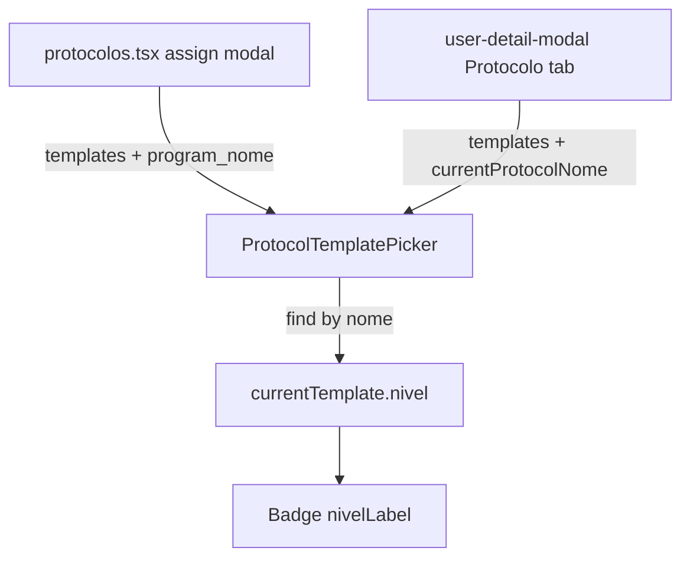

# Nível no "Protocolo atual" — Planning Output (v1)

> **Status:** PLANEJADO — Aguardando aprovação
> **Data:** 2026-09-24
> **Scope:** modal "Editar protocolo" (aba Protocolos > alunos, e aba "Protocolo" do modal de usuário)
> **Files:** 1 arquivo (0 novos, 1 modificado)
> **Risk:** 🟢 LOW

---

## Technical Specification (Phase 4)

- **Issue:** Na linha "Protocolo atual: <nome>", só aparecem os badges de categoria ("Protocolo A") e sexo. O nível (Iniciante/Avançado) não aparece, embora as linhas da lista abaixo já o mostrem.
- **Suspected Root Cause:** `ProtocolTemplatePicker` renderiza apenas `categoriaLabel` e `sexoLabel` para `currentTemplate`; falta o badge `nivelLabel(currentTemplate.nivel)`. O dado já está disponível (`ProtocolEditorTemplateOption.nivel`).
- **Target Outcome:** "Protocolo atual: X  [Avançado] [Protocolo A] [Feminino]", com o mesmo badge/ordem (nível primeiro) usado na lista.
- **Risks & Mitigation:** (1) `currentTemplate` é achado por `nome`; se o template atual estiver inativo/renomeado, não é achado → nível não aparece (mesmo comportamento que sexo hoje) — badge condicional. (2) Nomes duplicados entre templates podem casar com o errado — pré-existente, fora de escopo.
- **Audit points:** sem hooks/estado novos (valor derivado no render); sem SCSS (Tailwind + `Badge`); sem `funnelTracker` neste componente; sem scroll/efeitos.

### Risk classification
```
Point #1: Mostrar nível no protocolo atual
├── Risk Level: 🟢 LOW
├── Blast Radius: ProtocolTemplatePicker (usado em protocolos.tsx:1755 e user-detail-modal.tsx:672)
├── Regression Surface: layout da linha de badges (flex-wrap já absorve)
└── Confidence: HIGH
```

---

## 1. Contexto

`ProtocolTemplatePicker` é compartilhado pelos dois fluxos de troca de protocolo. Corrigindo nele, ambos os lugares passam a exibir o nível. Nenhum outro local exibe a "versão do protocolo" do aluno (`program_nome` em `protocolos.tsx:1256` mostra só o nome do programa, sem badges).

## 2. Referência de Código Mapeada

### 2.1 Badges do protocolo atual (a alterar)
[protocol-editor.tsx L141-L151](file:///Users/brunogovas/Projects/Pandora-Box/melhor-versao-dashboard/src/components/composites/protocol-editor.tsx#L141-L151)

```tsx
{currentTemplateNome && (
  <div className="flex flex-wrap items-center gap-2 text-sm text-muted-foreground">
    <span>
      Protocolo atual: <span className="font-medium text-foreground">{currentTemplateNome}</span>
    </span>
    <Badge variant="outline">{categoriaLabel(currentTemplate?.categoria)}</Badge>
    {currentTemplate?.sexo && (
      <Badge variant="outline">{sexoLabel(currentTemplate.sexo)}</Badge>
    )}
  </div>
)}
```
↑ Será estendido com o badge de nível.

### 2.2 Helper e badge de nível já existentes
[protocol-editor.tsx L97-L99](file:///Users/brunogovas/Projects/Pandora-Box/melhor-versao-dashboard/src/components/composites/protocol-editor.tsx#L97-L99) e [L178](file:///Users/brunogovas/Projects/Pandora-Box/melhor-versao-dashboard/src/components/composites/protocol-editor.tsx#L178)

```tsx
function nivelLabel(value: string) {
  return value === "avancado" ? "Avançado" : value === "iniciante" ? "Iniciante" : value
}
// ...
<Badge variant="outline">{nivelLabel(template.nivel)}</Badge>
```
↑ Reutilizados sem mudança.

## 3. Lógica de Implementação

### 3.1 Badge de nível condicional
**Origem:** `[REPO EXISTENTE]` + `[CRIADO]`; derivação no render conforme React docs `[CONTEXT7]` (/websites/react_dev — "calculate during rendering", sem estado redundante).

```tsx
<Badge variant="outline">{categoriaLabel(currentTemplate?.categoria)}</Badge>
{currentTemplate?.nivel && (
  <Badge variant="outline">{nivelLabel(currentTemplate.nivel)}</Badge>
)}
{currentTemplate?.sexo && (
  <Badge variant="outline">{sexoLabel(currentTemplate.sexo)}</Badge>
)}
```
Ordem: categoria → nível → sexo (nível ao lado da categoria, agrupando o "tipo" antes do sexo). Se preferir a ordem da lista (nível primeiro), é troca de linha.

## 4. Arquitetura de Componentes



## 5. CSS/SCSS Reference
Sem alterações; reutiliza `Badge variant="outline"` e o container `flex flex-wrap`.

## 6. Novos Componentes
Nenhum.

## 7. Componentes Modificados

### 7.1 protocol-editor.tsx
Apenas o trecho da seção 3.1. Sem novos states/props.

## 8. i18n Keys
N/A (strings PT hardcoded, padrão do projeto).

## 9. Files Summary

| Action | File | Risk |
|--------|------|------|
| **MODIFY** | `/Users/brunogovas/Projects/Pandora-Box/melhor-versao-dashboard/src/components/composites/protocol-editor.tsx` | 🟢 LOW |

## 10. Implementation Order
1. **Phase A:** inserir o badge (3 linhas).
2. **Phase B:** `npm run typecheck` e `npm run lint`.
3. **Phase C:** verificação visual nos dois fluxos.

## 11. Rollback Plan
Diretório não é repositório git; antes de editar, copiar o arquivo para `protocol-editor.tsx.bak` (fora do commit) ou reverter removendo as 3 linhas adicionadas.

## 12. Verification Plan

| # | Test Case | Route | Expected |
|---|-----------|-------|----------|
| 1 | Abrir "Editar protocolo" de aluno com programa | Protocolos > alunos | Linha mostra nível + categoria + sexo |
| 2 | Mesmo aluno via modal de usuário, aba Protocolo | Usuários > detalhe | Mesmos badges |
| 3 | Aluno cujo template atual não está na lista ativa | idem | Só categoria "Sem categoria", sem erro |
| 4 | Largura estreita | idem | Badges quebram linha sem overflow |

## 13. Handoff
N/A.
