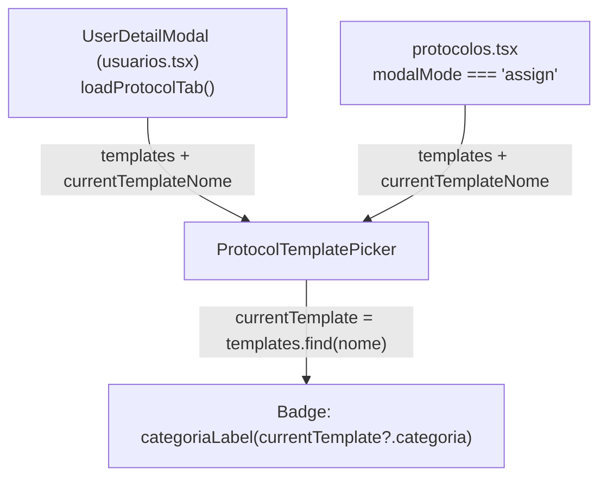

# Categoria visível ao editar Protocolo do usuário — Planning Output (v1)

> **Status:** PLANEJADO — Aguardando aprovação
> **Data:** 2026-09-16
> **Scope:** CRM (`melhor-versao-dashboard`) — aba "Protocolo" no `UserDetailModal` (`src/pages/usuarios.tsx`) e modal "Editar protocolo" em `src/pages/protocolos.tsx`
> **Files:** 1 modificado
> **Risk:** 🟢 LOW

---

## 1. Contexto

Hoje, ao abrir a aba **Protocolo** de um aluno (tanto pelo modal de detalhe do usuário em `usuarios.tsx` quanto pelo fluxo "Editar protocolo" em `protocolos.tsx`), o componente `ProtocolTemplatePicker` mostra apenas o **nome** do protocolo atual:

```
Protocolo atual: <nome>
```

Cada item da lista de opções já mostra a categoria do *template* (`Protocolo A`, `Protocolo B`, "Sem categoria"), mas o protocolo **atualmente atribuído ao aluno** não mostra sua própria categoria — o admin precisa adivinhar ou ir até a listagem de protocolos (`protocolos.tsx`) e localizar o nome manualmente para descobrir se é A, B, C etc.

Pedido do usuário: ao editar o protocolo do usuário, deve ser possível ver de imediato em qual categoria (A, B, C...) o protocolo atual dele está.

**Causa raiz:** a categoria só existe no objeto `template` (carregado em `templates`), nunca foi associada de volta ao "protocolo atual" (que só é identificado pelo `nome`, vindo de `program_nome`/`currentProtocolNome`).

**Confirmado no RPC:** `admin_user_program_detail` (Supabase remoto do CRM, fora deste repo) não retorna `categoria` — só `program_nome`. Não há alteração de backend necessária: a lista completa de templates (`admin_protocol_templates_tree`, com `categoria`) já é carregada nos dois pontos de uso antes do picker renderizar, então dá pra resolver o match localmente por nome.

---

## 2. Referência de Código Mapeada

### 2.1 `ProtocolTemplatePicker` — onde "Protocolo atual" é exibido hoje

[protocol-editor.tsx L109-135](file:///Users/brunogovas/Projects/Pandora-Box/melhor-versao-dashboard/src/components/composites/protocol-editor.tsx#L109-L135)

```tsx
export function ProtocolTemplatePicker({
  templates,
  currentTemplateNome,
  saving,
  error,
  onSelect,
}: ProtocolTemplatePickerProps) {
  const [query, setQuery] = useState("")

  const normalizedQuery = query.trim().toLowerCase()
  const filtered = normalizedQuery
    ? templates.filter((template) => template.nome.toLowerCase().includes(normalizedQuery))
    : templates

  return (
    <div className="space-y-3">
      {currentTemplateNome && (
        <p className="text-sm text-muted-foreground">
          Protocolo atual: <span className="font-medium text-foreground">{currentTemplateNome}</span>
        </p>
      )}
```
↑ Ponto exato onde o nome do protocolo atual é exibido — é aqui que a categoria precisa aparecer junto.

### 2.2 Label de categoria por template na própria lista (padrão já usado)

[protocol-editor.tsx L151-154](file:///Users/brunogovas/Projects/Pandora-Box/melhor-versao-dashboard/src/components/composites/protocol-editor.tsx#L151-L154)

```tsx
<div className="min-w-0">
  <p className="truncate text-sm font-medium text-foreground">{template.nome}</p>
  <p className="text-xs text-muted-foreground">{template.categoria ? `Protocolo ${template.categoria}` : "Sem categoria"}</p>
</div>
```
↑ Mesmo formato de label ("Protocolo A" / "Sem categoria") já usado por item — deve ser reaproveitado para o protocolo atual, não reinventado.

### 2.3 Helper equivalente já existente em `protocolos.tsx` (não compartilhado hoje)

[protocolos.tsx L268-270](file:///Users/brunogovas/Projects/Pandora-Box/melhor-versao-dashboard/src/pages/protocolos.tsx#L268-L270)

```tsx
function categoriaLabel(value: string | null) {
  return value ? `Protocolo ${value}` : "Sem categoria"
}
```
↑ Confirma que o padrão de texto já é convenção no projeto — a nova lógica dentro de `protocol-editor.tsx` vai seguir o mesmo texto (evitando duplicar um terceiro helper, extraindo um único local dentro do próprio arquivo do componente compartilhado).

### 2.4 Os dois call-sites já carregam a lista completa de templates antes do picker

[user-detail-modal.tsx L252-276](file:///Users/brunogovas/Projects/Pandora-Box/melhor-versao-dashboard/src/components/composites/user-detail-modal.tsx#L252-L276)

```tsx
async function loadProtocolTab() {
  if (protocolTemplates !== null || !canEdit) return
  setProtocolLoadError(null)
  try {
    const [templateRows, detailRows] = await Promise.all([
      adminRpc<{ template_id: string; nome: string; nivel: string; objetivo: string; categoria: string | null; status: string }[]>(
        "admin_protocol_templates_tree",
        { p_status: "ativo", p_nivel: null, p_objetivo: null }
      ),
      adminRpc<{ program_nome: string | null }[]>("admin_user_program_detail", { p_user_id: user.id }),
    ])
    setProtocolTemplates(
      templateRows.map((row) => ({
        id: row.template_id,
        nome: row.nome,
        nivel: row.nivel,
        objetivo: row.objetivo,
        categoria: row.categoria,
      }))
    )
    setCurrentProtocolNome(detailRows[0]?.program_nome ?? null)
  } catch (loadError) {
    setProtocolLoadError(errorMessage(loadError))
  }
}
```
↑ `protocolTemplates` (com `categoria`) e `currentProtocolNome` já coexistem no state antes de `ProtocolTemplatePicker` renderizar — nenhuma nova chamada de rede é necessária.

[protocolos.tsx L1755-1767](file:///Users/brunogovas/Projects/Pandora-Box/melhor-versao-dashboard/src/pages/protocolos.tsx#L1755-L1767)

```tsx
<ProtocolTemplatePicker
  templates={templates.map((template) => ({
    id: template.template_id,
    nome: template.nome,
    nivel: template.nivel,
    objetivo: template.objetivo,
    categoria: template.categoria,
  }))}
  currentTemplateNome={choiceStudent.program_nome}
  saving={assignSaveState !== "idle"}
  error={assignError}
  onSelect={(templateId) => void handleAssignTemplate(templateId)}
/>
```
↑ Segundo call-site com o mesmo formato de props — a correção dentro de `ProtocolTemplatePicker` cobre os dois fluxos automaticamente, sem tocar em `protocolos.tsx` nem em `user-detail-modal.tsx`.

---

## 3. Lógica de Implementação

### 3.1 Derivar a categoria do protocolo atual durante o render (sem novo state/efeito)

**Origem:** `[REPO EXISTENTE]` (padrão de label da seção 2.2/2.3) + `[CONTEXT7]` (padrão de derived state do React)

Consulta ao Context7 (`/reactjs/react.dev` — "you-might-not-need-an-effect" / "choosing-the-state-structure") confirma o padrão correto para este caso: calcular o valor derivado durante a renderização com `.find()`, sem `useState`/`useEffect` extra:

```tsx
// ✅ Padrão confirmado via Context7 (react.dev):
const selection = items.find(item => item.id === selectedId) ?? null;
```

Aplicando o mesmo padrão em `ProtocolTemplatePicker`:

```tsx
function categoriaLabel(categoria: string | null | undefined) {
  return categoria ? `Protocolo ${categoria}` : "Sem categoria"
}

export function ProtocolTemplatePicker({
  templates,
  currentTemplateNome,
  saving,
  error,
  onSelect,
}: ProtocolTemplatePickerProps) {
  const [query, setQuery] = useState("")

  // NEW: nenhum state novo — derivado durante o render, igual ao padrão do React.dev
  const currentTemplate = currentTemplateNome
    ? templates.find((template) => template.nome === currentTemplateNome)
    : undefined

  const normalizedQuery = query.trim().toLowerCase()
  const filtered = normalizedQuery
    ? templates.filter((template) => template.nome.toLowerCase().includes(normalizedQuery))
    : templates

  return (
    <div className="space-y-3">
      {currentTemplateNome && (
        <p className="text-sm text-muted-foreground">
          Protocolo atual: <span className="font-medium text-foreground">{currentTemplateNome}</span>
          {/* NEW */}
          <Badge variant="outline" className="ml-2 align-middle">
            {categoriaLabel(currentTemplate?.categoria)}
          </Badge>
        </p>
      )}
      {/* ...resto inalterado... */}
```

**Fluxo:**
1. `currentTemplateNome` (nome do protocolo atualmente atribuído) já chega como prop.
2. `templates` (lista completa, com `categoria`) também já chega como prop.
3. `currentTemplate` é resolvido por `.find()` a cada render — sem custo perceptível (lista de templates ativos é pequena) e sem duplicar estado.
4. Se não houver match (ex.: protocolo atual veio de um template arquivado/inativo, já que a query usa `p_status: "ativo"`), `currentTemplate` é `undefined` e o badge cai no fallback "Sem categoria" — comportamento seguro, sem crash.
5. Reaproveita literalmente o mesmo texto (`Protocolo ${categoria}` / `Sem categoria`) já usado na linha 153 do próprio componente e no helper equivalente de `protocolos.tsx`.

---

## 4. Arquitetura de Componentes



Nenhuma prop nova entra ou sai do componente — o dado que falta (categoria do atual) já está disponível dentro do próprio `templates` recebido.

---

## 5. CSS/SCSS Reference

Não aplicável — reaproveita o componente `Badge` (`@/components/atoms/badge`) já importado em `protocol-editor.tsx` (linha 3) e usado nas variantes `outline`/`secondary` mais abaixo no mesmo arquivo (linhas 156-157). Nenhum CSS novo.

---

## 6. Novos Componentes

Não aplicável — nenhum componente novo é criado.

---

## 7. Componentes Modificados

### 7.1 `src/components/composites/protocol-editor.tsx`

**Nova função interna:**
```tsx
function categoriaLabel(categoria: string | null | undefined) {
  return categoria ? `Protocolo ${categoria}` : "Sem categoria"
}
```

**Modificação no `ProtocolTemplatePicker`:**
```tsx
const currentTemplate = currentTemplateNome
  ? templates.find((template) => template.nome === currentTemplateNome)
  : undefined
```

**JSX modificado (linhas 125-129 atuais):**
```tsx
{currentTemplateNome && (
  <p className="text-sm text-muted-foreground">
    Protocolo atual: <span className="font-medium text-foreground">{currentTemplateNome}</span>
    <Badge variant="outline" className="ml-2 align-middle">
      {categoriaLabel(currentTemplate?.categoria)}
    </Badge>
  </p>
)}
```

Opcional (menor risco ainda, cosmético): a linha 153 (`{template.categoria ? ... : "Sem categoria"}`) pode ser trocada por `{categoriaLabel(template.categoria)}` para eliminar a duplicação de string — mesmo texto, zero mudança de comportamento visível.

**Nenhuma prop nova** em `ProtocolTemplatePickerProps` — a mudança é 100% interna ao componente.

---

## 8. i18n Keys

Não aplicável — projeto não usa i18n nesses componentes (strings em PT-BR hardcoded, como já é o padrão do arquivo).

---

## 9. Files Summary

| Action | File | Risk |
|--------|------|------|
| **MODIFY** | `src/components/composites/protocol-editor.tsx` | 🟢 LOW |

---

## 10. Implementation Order

1. **Phase A:** Adicionar `categoriaLabel()` e o `.find()` derivado dentro de `ProtocolTemplatePicker`.
2. **Phase B:** Renderizar o `Badge` com a categoria ao lado de "Protocolo atual".
3. **Phase C (opcional):** Substituir a string inline da linha 153 por `categoriaLabel(template.categoria)` para consistência.

---

## 11. Rollback Plan

```
Componentes modificados:
├── Git Ref: HEAD antes da implementação
├── Revert: git checkout <ref> -- src/components/composites/protocol-editor.tsx
└── Validação: reabrir a aba "Protocolo" em usuarios.tsx e o modal "Editar protocolo"
  em protocolos.tsx e confirmar que "Protocolo atual: <nome>" volta a aparecer sem o badge,
  sem erros no console.
```

---

## 12. Verification Plan

| # | Test Case | Route | Expected |
|---|-----------|-------|----------|
| 1 | Abrir `UserDetailModal` de um aluno com protocolo atual cujo template está na lista ativa | CRM → Usuários → detalhe do aluno → aba "Protocolo" | Badge mostra "Protocolo A/B/C" correto ao lado do nome |
| 2 | Abrir o mesmo fluxo para aluno sem protocolo atual (`program_nome` null) | CRM → Usuários → aba "Protocolo" | Linha "Protocolo atual" não aparece (comportamento já existente, inalterado) |
| 3 | Abrir para aluno cujo protocolo atual foi desativado (não está mais em `admin_protocol_templates_tree` com `p_status: "ativo"`) | CRM → Usuários → aba "Protocolo" | Badge cai no fallback "Sem categoria" — sem crash |
| 4 | Repetir os casos 1-3 no modal "Editar protocolo" de `protocolos.tsx` | CRM → Protocolos → aluno → "Editar protocolo" | Mesmo comportamento, já que é o mesmo componente compartilhado |
| 5 | Console do navegador durante os 4 casos acima | — | Nenhum erro/warning novo |

---

## 13. Handoff

Não aplicável — mudança 100% client-side, sem integração externa.
