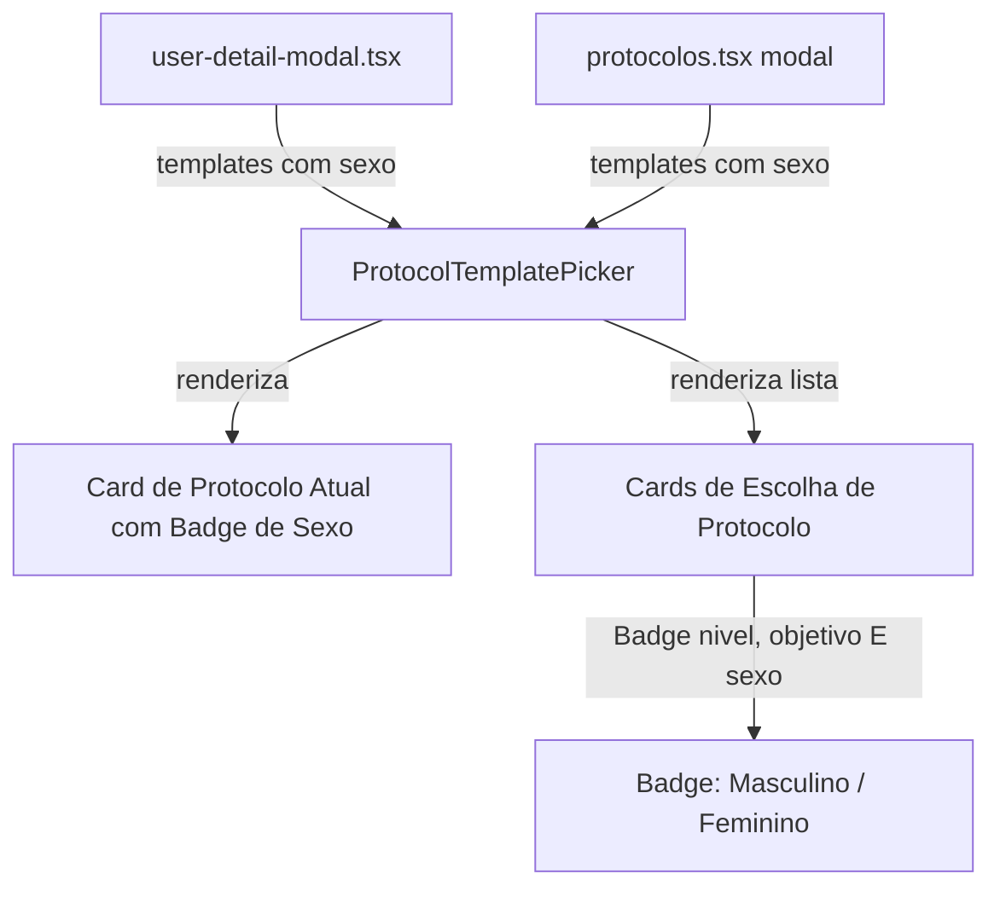

# Badge de Sexo nos Cards de Edição de Protocolo — Planning Output (v1)

> **Status:** PLANEJADO — Aguardando aprovação  
> **Data:** 2026-09-22  
> **Scope:** CRM (`melhor-versao-dashboard`) — Cards de seleção de protocolo em `ProtocolTemplatePicker` (`src/components/composites/protocol-editor.tsx`), consumido em `src/components/composites/user-detail-modal.tsx` (aba Protocolo do aluno) e `src/pages/protocolos.tsx` (modal Editar protocolo)  
> **Files:** 3 arquivos modificados (0 novos, 3 modificados)  
> **Risk:** 🟢 LOW

---

## 1. Contexto

Ao editar o protocolo de um aluno no dashboard CRM — seja através da aba **Protocolo** no modal de detalhes do usuário (`user-detail-modal.tsx` / `usuarios.tsx`) ou pelo fluxo **Editar protocolo** na listagem de treinos individuais (`protocolos.tsx`) —, é apresentado o componente `ProtocolTemplatePicker`.

Atualmente, cada card de opção de template exibe:
- Nome do protocolo e categoria (ex: "Protocolo A", "Sem categoria")
- Badge com o nível do protocolo (ex: "Iniciante", "Avançado") com variante `outline`
- Badge com o objetivo do protocolo (ex: "Crescer", "Secar", "Crescer e Secar") com variante `secondary`

No entanto, o **sexo do protocolo** (Masculino / Feminino) não é exibido nos cards de seleção nem na indicação de "Protocolo atual", embora o banco de dados e a RPC `admin_protocol_templates_tree` já possuam o campo `sexo` (`"masculino" | "feminino"`). Na página principal de protocolos (`src/pages/protocolos.tsx`), os cards já usam o helper `sexoLabel()` renderizando um `Badge variant="outline"`.

**Objetivo:** Adicionar uma badge contendo o sexo do protocolo em todos os cards da lista de templates do modal de edição de protocolo, bem como no cabeçalho informativo "Protocolo atual", mantendo a consistência visual com os demais badges e telas do sistema.

---

## 2. Referência de Código Mapeada

### 2.1 `sexoLabel` e formato de Badge no `protocolos.tsx`
[src/pages/protocolos.tsx L264-L266](file:///Users/brunogovas/Projects/Pandora-Box/melhor-versao-dashboard/src/pages/protocolos.tsx#L264-L266)
[src/pages/protocolos.tsx L1144-L1149](file:///Users/brunogovas/Projects/Pandora-Box/melhor-versao-dashboard/src/pages/protocolos.tsx#L1144-L1149)

```tsx
const SEXO_OPTIONS: { value: SexoApi; label: string }[] = [
  { value: "masculino", label: "Masculino" },
  { value: "feminino", label: "Feminino" },
]

function sexoLabel(value: string) {
  return SEXO_OPTIONS.find((option) => option.value === value)?.label ?? value
}

// Renderização existente dos badges de template em protocolos.tsx:
badges={[
  { label: nivelLabel(template.nivel), variant: "outline" },
  { label: objetivoLabel(template.objetivo), variant: "secondary" },
  { label: sexoLabel(template.sexo), variant: "outline" },
  { label: template.status, variant: template.status === "ativo" ? "default" : "outline" },
]}
```
↑ Este é o padrão consolidado no repositório para formatar e rotular o sexo de um protocolo ("Masculino" / "Feminino").

### 2.2 `ProtocolEditorTemplateOption` e renderização dos cards no `protocol-editor.tsx`
[src/components/composites/protocol-editor.tsx L9-L15](file:///Users/brunogovas/Projects/Pandora-Box/melhor-versao-dashboard/src/components/composites/protocol-editor.tsx#L9-L15)
[src/components/composites/protocol-editor.tsx L166-L170](file:///Users/brunogovas/Projects/Pandora-Box/melhor-versao-dashboard/src/components/composites/protocol-editor.tsx#L166-L170)

```tsx
export interface ProtocolEditorTemplateOption {
  id: string
  nome: string
  nivel: string
  objetivo: string
  categoria: string | null
}

// Trecho atual da renderização dos cards no picker:
<div className="flex shrink-0 gap-1.5">
  <Badge variant="outline">{nivelLabel(template.nivel)}</Badge>
  <Badge variant="secondary">{objetivoLabel(template.objetivo)}</Badge>
</div>
```
↑ Hoje a interface omite `sexo`, e o conjunto de badges na direita exibe apenas `nivel` e `objetivo`.

### 2.3 Mapeamento de templates em `user-detail-modal.tsx`
[src/components/composites/user-detail-modal.tsx L256-L271](file:///Users/brunogovas/Projects/Pandora-Box/melhor-versao-dashboard/src/components/composites/user-detail-modal.tsx#L256-L271)

```tsx
const [templateRows, detailRows] = await Promise.all([
  adminRpc<{ template_id: string; nome: string; nivel: string; objetivo: string; categoria: string | null; status: string }[]>(
    "admin_protocol_templates_tree",
    { p_status: "ativo", p_nivel: null, p_objetivo: null }
  ),
  adminRpc<{ program_nome: string | null }[]>("admin_user_program_detail", { p_user_id: user.id }),
])
setProtocolTemplates(
  templateRows.map((row) => ({
    id: row.template_id,
    nome: row.nome,
    nivel: row.nivel,
    objetivo: row.objetivo,
    categoria: row.categoria,
  }))
)
```
↑ A chamada RPC já retorna as linhas completas do template, mas o mapping descarta o campo `sexo`.

### 2.4 Mapeamento de templates em `protocolos.tsx`
[src/pages/protocolos.tsx L1756-L1762](file:///Users/brunogovas/Projects/Pandora-Box/melhor-versao-dashboard/src/pages/protocolos.tsx#L1756-L1762)

```tsx
<ProtocolTemplatePicker
  templates={templates.map((template) => ({
    id: template.template_id,
    nome: template.nome,
    nivel: template.nivel,
    objetivo: template.objetivo,
    categoria: template.categoria,
  }))}
  currentTemplateNome={choiceStudent.program_nome}
  saving={assignSaveState !== "idle"}
  error={assignError}
  onSelect={(templateId) => void handleAssignTemplate(templateId)}
/>
```
↑ `templates` já é do tipo `TemplateRow[]`, que possui o campo `sexo: SexoApi`. O `.map` precisa incluir `sexo`.

---

## 3. Lógica de Implementação

### 3.1 Helper `sexoLabel` e extensão da interface de template
**Origem:** `[REPO EXISTENTE]` + `[CRIADO]`

```tsx
export interface ProtocolEditorTemplateOption {
  id: string
  nome: string
  nivel: string
  objetivo: string
  categoria: string | null
  sexo?: string | null
}

function sexoLabel(value: string | null | undefined) {
  if (!value) return null
  if (value === "masculino") return "Masculino"
  if (value === "feminino") return "Feminino"
  return value
}
```

### 3.2 Renderização da Badge de Sexo nos cards e no protocolo atual
**Origem:** `[CRIADO]` + `[REPO EXISTENTE]`

```tsx
// 1. No cabeçalho de Protocolo Atual:
{currentTemplateNome && (
  <div className="flex flex-wrap items-center gap-2 text-sm text-muted-foreground">
    <span>
      Protocolo atual: <span className="font-medium text-foreground">{currentTemplateNome}</span>
    </span>
    <Badge variant="outline">{categoriaLabel(currentTemplate?.categoria)}</Badge>
    {currentTemplate?.sexo && (
      <Badge variant="outline">{sexoLabel(currentTemplate.sexo)}</Badge>
    )}
  </div>
)}

// 2. Na lista de templates (cards de escolha):
<div className="flex shrink-0 flex-wrap items-center gap-1.5">
  <Badge variant="outline">{nivelLabel(template.nivel)}</Badge>
  <Badge variant="secondary">{objetivoLabel(template.objetivo)}</Badge>
  {template.sexo && (
    <Badge variant="outline">{sexoLabel(template.sexo)}</Badge>
  )}
</div>
```

---

## 4. Arquitetura de Componentes



---

## 5. CSS/SCSS Reference

Utiliza o componente de design system existente `Badge` (`@/components/atoms/badge.tsx` baseado em Radix / Tailwind / shadcn) com `variant="outline"`.

Nenhum arquivo CSS ou SCSS novo precisa ser criado ou alterado; as variáveis globais e classes de utilitário do Tailwind já existentes no projeto são respeitadas integralmente.

---

## 6. Novos Componentes

Nenhum componente novo. A alteração reutiliza os componentes existentes.

---

## 7. Componentes Modificados

### 7.1 `src/components/composites/protocol-editor.tsx`
- Adiciona o campo opcional `sexo?: string | null` em `ProtocolEditorTemplateOption`.
- Adiciona a função utilitária `sexoLabel(value: string | null | undefined)`.
- Adiciona `<Badge variant="outline">{sexoLabel(template.sexo)}</Badge>` nos cards de cada template (quando `template.sexo` existir).
- Adiciona `<Badge variant="outline">{sexoLabel(currentTemplate.sexo)}</Badge>` na linha de "Protocolo atual" (quando `currentTemplate?.sexo` existir).

### 7.2 `src/components/composites/user-detail-modal.tsx`
- No método `loadProtocolTab()`, inclui a propriedade `sexo: string | null` no tipo da RPC `admin_protocol_templates_tree` e passa `sexo: row.sexo` para o objeto `protocolTemplates`.

### 7.3 `src/pages/protocolos.tsx`
- No bloco onde `<ProtocolTemplatePicker>` é montado no modal `modalMode === "assign"`, inclui `sexo: template.sexo` no mapeamento dos templates.

### 7.4 Testes (`tests/admin-users-integration.spec.ts`)
- Atualizar os testes da aba de protocolo para validar que a badge de sexo é renderizada nos cards de edição e no protocolo atual.

---

## 8. i18n Keys

Não aplicável — o projeto não utiliza arquivo de tradução para esses componentes (mensagens e rótulos já estão em PT-BR hardcoded no padrão do dashboard).

---

## 9. Files Summary

| Action | File | Risk |
|--------|------|------|
| **MODIFY** | `src/components/composites/protocol-editor.tsx` | 🟢 LOW |
| **MODIFY** | `src/components/composites/user-detail-modal.tsx` | 🟢 LOW |
| **MODIFY** | `src/pages/protocolos.tsx` | 🟢 LOW |
| **MODIFY** | `tests/admin-users-integration.spec.ts` | 🟢 LOW |

---

## 10. Implementation Order

1. **Phase A:** Atualizar a interface `ProtocolEditorTemplateOption` e adicionar o helper `sexoLabel` e a exibição da badge em `src/components/composites/protocol-editor.tsx`.
2. **Phase B:** Atualizar os pontos de chamada em `src/components/composites/user-detail-modal.tsx` e `src/pages/protocolos.tsx` para passar a propriedade `sexo` aos templates.
3. **Phase C:** Adicionar asserções nos testes automatizados em `tests/admin-users-integration.spec.ts` para garantir cobertura e prevenir regressões.
4. **Phase D:** Executar `npx tsc --noEmit` e `npx playwright test tests/admin-users-integration.spec.ts` para validação de tipo e comportamento.

---

## 11. Rollback Plan

```
Componentes modificados:
├── Git Ref: HEAD antes da implementação
├── Revert: git checkout HEAD -- src/components/composites/protocol-editor.tsx src/components/composites/user-detail-modal.tsx src/pages/protocolos.tsx tests/admin-users-integration.spec.ts
└── Validação: Reexecutar npx tsc --noEmit e npx playwright test tests/admin-users-integration.spec.ts
```

---

## 12. Verification Plan

| # | Test Case | Route | Expected |
|---|-----------|-------|----------|
| 1 | Abrir modal de edição de protocolo pelo CRM de usuários | CRM → Usuários → Detalhes do Usuário → Aba "Protocolo" | Cada card de protocolo na lista exibe a badge com seu sexo correspondente ("Masculino" / "Feminino") |
| 2 | Protocolo atual com sexo definido | CRM → Usuários → Detalhes do Usuário → Aba "Protocolo" | A linha "Protocolo atual: [Nome]" exibe a badge com o sexo correspondente ao lado de Categoria |
| 3 | Abrir modal "Editar protocolo" na tela de protocolos | CRM → Protocolos → Aba "Treinos individuais" → "Editar protocolo / treino" → "Editar protocolo" | Cards de opção de protocolo exibem a badge de sexo |
| 4 | Template sem campo de sexo (retrocompatibilidade) | Ambas as rotas | Se o campo `sexo` for null/undefined, a badge de sexo é omitida sem erro ou quebra de layout |
| 5 | Testes Playwright automatizados | Linha de comando | Testes da aba protocolo passam com 100% de sucesso |

---

## 13. Handoff

Não aplicável — alteração exclusivamente de interface no frontend sem alterações em tabelas, RPCs ou webhooks externos.
