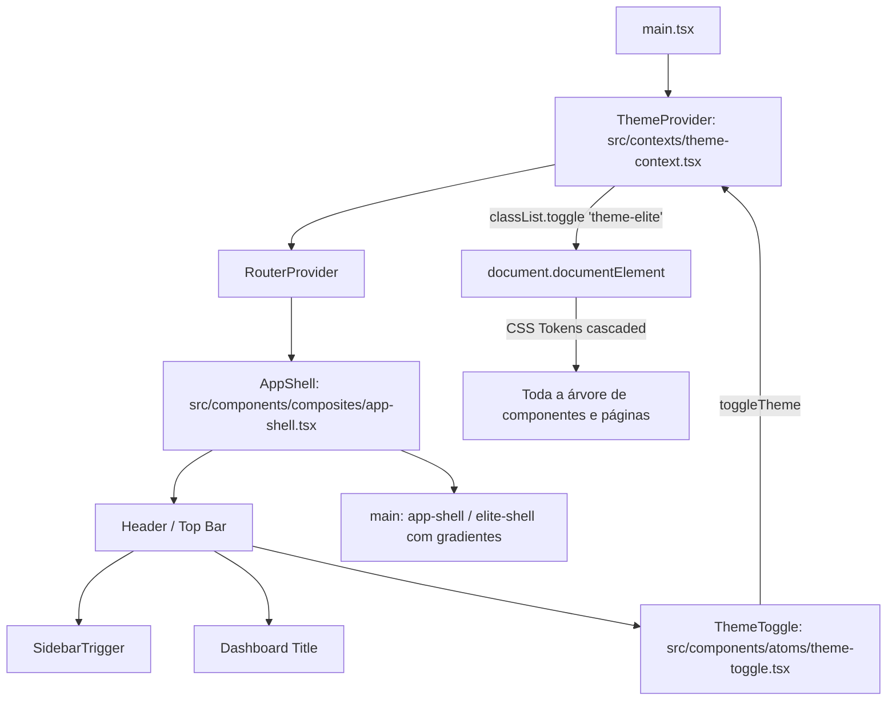

# Modo de Tema Elite no melhor-versao-dashboard — Planning Output (v1)

> **Status:** PLANEJADO — Aguardando aprovação  
> **Data:** 2026-09-15  
> **Scope:** `src/index.css`, `src/contexts/theme-context.tsx`, `src/components/composites/app-shell.tsx`, `src/components/atoms/theme-toggle.tsx`, `src/main.tsx`  
> **Files:** 5 arquivos (2 novos, 3 modificados)  
> **Risk:** 🟢 LOW

---

## 1. Contexto

O dashboard `melhor-versao-dashboard` possui atualmente um tema visual padrão em tons claros/beges (`:root` com `--background: #d8d7ce`). O bloco `.dark` existente em `src/index.css` duplica os mesmos tokens claros, não oferecendo uma experiência dark contrastada.

O usuário solicitou adicionar um modo de tema baseado no `theme-elite` de `treino-trinca-app/app-treino`, que traz uma estética premium dark navy/blue, com tokens refinados de background (`#040710`), cards translúcidos (`rgba(18, 28, 52, 0.92)`), bordas sutis com brilho azul (`rgba(106, 160, 255, 0.34)`), tipografia de alto contraste e efeitos de iluminação ambiental (`radial-gradient` no shell).

Conforme alinhamento na etapa de elicitação, o modo será configurável via alternador no Header da aplicação com persistência em `localStorage`, permitindo transitar entre o tema "Padrão" e o tema "Elite".

---

## 2. Referência de Código Mapeada

> **REGRA MANDATÓRIA:** Toda referência de código existente que será utilizada, estendida ou servir de base para a implementação DEVE ser mapeada aqui com link para arquivo + linhas exatas e snippet real do repositório.

### 2.1 Tokens `.theme-elite` e Ambient Glow do treino-trinca-app

[treino-trinca-app/app-treino/src/global.css L118-L163](file:///Users/brunogovas/Projects/Pandora-Box/treino-trinca-app/app-treino/src/global.css#L118-L163)

```css
.theme-elite {
  /* Full Elite token set. `--card` / `--border` / `--primary` keep the
     "premium" rgba values — those are what 100% of the Elite account's
     rendered cards/links use (Playwright capture 2026-09-01, and the
     pre-pivot 1:1 clone of the Elite account passed pixel-really-perfect
     with exactly these). The remaining tokens are the Elite account's
     resolved values (getComputedStyle on the real shell, same capture):
     app-treino/docs/sessions/2026-09/elite-audit/original-elite-tokens.md */
  --background: #040710;
  --foreground: #fcfcfc;
  --card: rgba(18, 28, 52, 0.92);
  --card-foreground: #fcfcfc;
  --popover: #090e1b;
  --popover-foreground: #fcfcfc;
  --primary: #9fbeff;
  --primary-foreground: #ffffff;
  --secondary: #131c35;
  --secondary-foreground: #ebebeb;
  --muted: #12192b;
  --muted-foreground: #a6b3c9;
  --accent: #2a6af4;
  --accent-foreground: #ffffff;
  --destructive: #dc2828;
  --destructive-foreground: #fafafa;
  --success: #21c45d;
  --success-foreground: #ffffff;
  --border: rgba(106, 160, 255, 0.34);
  --input: #12192b;
  --ring: #0f4bf0;
  --chart-1: #0f4bf0;
  --chart-2: #3c83f6;
  --chart-3: #4560f7;
  --chart-4: #6467f2;
  --chart-5: #61a6fa;
}

/* Elite ambient glow — the "hot" values the original Elite shell renders
   (radial 1 = 0.14/34%, radial 2 = 88% 10% / 0.08/30%). `.app-shell` base
   was re-tuned to the cooler non-elite values in the 2026-07-31 pivot, so
   the Elite look is restored here without touching the non-elite base. */
.elite-shell.app-shell {
  background-image:
    radial-gradient(circle at 18% -10%, rgba(59, 130, 246, 0.14), rgba(0, 0, 0, 0) 34%),
    radial-gradient(circle at 88% 10%, rgba(14, 165, 233, 0.08), rgba(0, 0, 0, 0) 30%),
    linear-gradient(var(--background), var(--background));
}
```
↑ Esta definição de tokens e ambient glow será incorporada no `index.css` do `melhor-versao-dashboard`.

### 2.2 Estrutura do AppShell do melhor-versao-dashboard

[melhor-versao-dashboard/src/components/composites/app-shell.tsx L12-L31](file:///Users/brunogovas/Projects/Pandora-Box/melhor-versao-dashboard/src/components/composites/app-shell.tsx#L12-L31)

```tsx
export function AppShell({ children, title = "Dashboard", className, ...props }: AppShellProps) {
  return (
    <SidebarProvider>
      <AppSidebar />
      <div className={cn("h-svh bg-background flex flex-col flex-1 overflow-hidden", className)} {...props}>
        {/* Header — item de altura fixa fora da área de scroll, não usa mais "sticky".
            (overflow-x-hidden num ancestral de um elemento sticky força overflow-y a virar
            "auto" nesse ancestral, quebrando o sticky relativo à viewport — daí o bug de scroll.) */}
        <div className="shrink-0 z-30 flex items-center gap-2 border-b border-white/10 bg-background/40 backdrop-blur-xl px-4 h-14 shadow-sm">
          <SidebarTrigger />
          <div className="font-heading font-bold text-lg text-primary">{title}</div>
        </div>
        {/* Main Content Area — única região com scroll */}
        <main className="flex-1 w-full mx-auto overflow-y-auto overflow-x-hidden">
          {children || <Outlet />}
        </main>
      </div>
    </SidebarProvider>
  )
}
```
↑ O Header receberá o botão `ThemeToggle` alinhado à direita (`ml-auto`), e a casca do app receberá a classe condicional `.app-shell` e `.elite-shell` para renderizar os gradientes.

### 2.3 Padrão de Contexto e Provedores do App

[melhor-versao-dashboard/src/main.tsx L145-L153](file:///Users/brunogovas/Projects/Pandora-Box/melhor-versao-dashboard/src/main.tsx#L145-L153)

```tsx
createRoot(document.getElementById('root')!).render(
  <StrictMode>
    <AuthProvider>
      <TooltipProvider>
        <RouterProvider router={router} />
      </TooltipProvider>
    </AuthProvider>
  </StrictMode>,
)
```
↑ O `ThemeProvider` envolverá a árvore de componentes no `main.tsx`, disponibilizando o estado do tema para toda a aplicação.

---

## 3. Lógica de Implementação

> **REGRA MANDATÓRIA:** A lógica de implementação DEVE ser escrita e codificada neste documento ANTES de qualquer execução com origem: `[CRIADO]`, `[CONTEXT7]`, ou `[REPO EXISTENTE]`.

### 3.1 Theme Context & Persistence Hook
**Origem:** `[CONTEXT7]` + `[CRIADO]`

```tsx
import * as React from "react"

export type Theme = "default" | "elite"

interface ThemeContextType {
  theme: Theme
  setTheme: (theme: Theme) => void
  toggleTheme: () => void
  isElite: boolean
}

const STORAGE_KEY = "mv-dashboard-theme"

const ThemeContext = React.createContext<ThemeContextType | undefined>(undefined)

export function ThemeProvider({ children }: { children: React.ReactNode }) {
  const [theme, setThemeState] = React.useState<Theme>(() => {
    try {
      const saved = localStorage.getItem(STORAGE_KEY)
      if (saved === "elite" || saved === "default") {
        return saved
      }
    } catch {
      // Ignore localStorage errors (e.g. incognito sandbox)
    }
    return "default"
  })

  const setTheme = React.useCallback((newTheme: Theme) => {
    setThemeState(newTheme)
    try {
      localStorage.setItem(STORAGE_KEY, newTheme)
    } catch {
      // Ignore localStorage errors
    }
  }, [])

  const toggleTheme = React.useCallback(() => {
    setTheme(theme === "elite" ? "default" : "elite")
  }, [theme, setTheme])

  React.useEffect(() => {
    const root = document.documentElement
    if (theme === "elite") {
      root.classList.add("theme-elite")
    } else {
      root.classList.remove("theme-elite")
    }
  }, [theme])

  const isElite = theme === "elite"

  const value = React.useMemo(
    () => ({
      theme,
      setTheme,
      toggleTheme,
      isElite,
    }),
    [theme, setTheme, toggleTheme, isElite]
  )

  return <ThemeContext.Provider value={value}>{children}</ThemeContext.Provider>
}

export function useTheme() {
  const context = React.useContext(ThemeContext)
  if (!context) {
    throw new Error("useTheme must be used within a ThemeProvider")
  }
  return context
}
```

### 3.2 CSS Tokens & Ambient Glow (Tailwind v4 `@theme inline` compatible)
**Origem:** `[REPO EXISTENTE]` (`treino-trinca-app/app-treino/src/global.css`)

```css
/* ==========================================================================
   Tema Elite (Clonado do treino-trinca-app/treino-app)
   ========================================================================== */

.theme-elite {
  --background: #040710;
  --foreground: #fcfcfc;
  --card: rgba(18, 28, 52, 0.92);
  --card-foreground: #fcfcfc;
  --popover: #090e1b;
  --popover-foreground: #fcfcfc;
  --primary: #9fbeff;
  --primary-foreground: #040710;
  --secondary: #131c35;
  --secondary-foreground: #ebebeb;
  --muted: #12192b;
  --muted-foreground: #a6b3c9;
  --accent: #2a6af4;
  --accent-foreground: #ffffff;
  --destructive: #dc2828;
  --destructive-foreground: #fafafa;
  --success: #21c45d;
  --success-foreground: #ffffff;
  --border: rgba(106, 160, 255, 0.34);
  --input: #12192b;
  --ring: #0f4bf0;
  --chart-1: #0f4bf0;
  --chart-2: #3c83f6;
  --chart-3: #4560f7;
  --chart-4: #6467f2;
  --chart-5: #61a6fa;

  /* Sidebar adaptado ao ambiente Elite */
  --sidebar: #060a14;
  --sidebar-foreground: #fcfcfc;
  --sidebar-primary: #9fbeff;
  --sidebar-primary-foreground: #040710;
  --sidebar-accent: #131c35;
  --sidebar-accent-foreground: #9fbeff;
  --sidebar-border: rgba(106, 160, 255, 0.2);
  --sidebar-ring: #0f4bf0;

  /* Efeitos Elite */
  --border-elite: rgba(106, 160, 255, 0.34);
  --shadow-elite-glow: rgba(106, 160, 255, 0.28) 0px 0px 34px 0px, rgba(0, 0, 0, 0.38) 0px 22px 70px 0px;
  --gradient-elite-button: linear-gradient(135deg, rgb(122, 174, 255), rgb(99, 157, 255) 48%, rgb(75, 134, 255));
}

/* Ambient glow para o shell da aplicação quando no tema elite */
.theme-elite .app-shell,
.theme-elite.app-shell,
.theme-elite .elite-shell {
  background-image:
    radial-gradient(circle at 18% -10%, rgba(59, 130, 246, 0.14), rgba(0, 0, 0, 0) 34%),
    radial-gradient(circle at 88% 10%, rgba(14, 165, 233, 0.08), rgba(0, 0, 0, 0) 30%),
    linear-gradient(var(--background), var(--background));
}
```

### 3.3 Theme Toggle Button Component
**Origem:** `[CRIADO]`

```tsx
import { Sparkles, Sun } from "lucide-react"
import { useTheme } from "@/contexts/theme-context"
import { Button } from "@/components/atoms/button"
import {
  Tooltip,
  TooltipContent,
  TooltipTrigger,
} from "@/components/atoms/tooltip"

export function ThemeToggle() {
  const { theme, toggleTheme } = useTheme()
  const isElite = theme === "elite"

  return (
    <Tooltip>
      <TooltipTrigger asChild>
        <Button
          variant="outline"
          size="sm"
          onClick={toggleTheme}
          className="gap-1.5 transition-all text-xs font-sans h-8 px-2.5 rounded-lg border-border/80 hover:border-primary/50"
          aria-label={isElite ? "Mudar para tema Padrão" : "Mudar para tema Elite"}
        >
          {isElite ? (
            <>
              <Sparkles className="size-3.5 text-primary animate-pulse" />
              <span className="font-semibold text-foreground">Tema Elite</span>
            </>
          ) : (
            <>
              <Sun className="size-3.5 text-muted-foreground" />
              <span className="text-foreground">Tema Padrão</span>
            </>
          )}
        </Button>
      </TooltipTrigger>
      <TooltipContent side="bottom" align="end">
        {isElite ? "Ativar tema Padrão (Claro)" : "Ativar tema Elite (Dark Navy)"}
      </TooltipContent>
    </Tooltip>
  )
}
```

---

## 4. Arquitetura de Componentes



---

## 5. CSS/SCSS Reference

### 5.1 Tokens Existentes vs Tema Elite

[melhor-versao-dashboard/src/index.css L40-L72](file:///Users/brunogovas/Projects/Pandora-Box/melhor-versao-dashboard/src/index.css#L40-L72)

**Adaptações necessárias:**

| Propriedade | Valor Original (`:root`) | Valor no `.theme-elite` | Efeito Visual |
|-------------|-------------------------|--------------------------|---------------|
| `--background` | `#d8d7ce` (bege claro) | `#040710` (navy quase preto) | Fundo escuro imersivo |
| `--foreground` | `oklch(0.2749 ...)` (escuro) | `#fcfcfc` (branco suave) | Texto de alto contraste |
| `--card` | `oklch(1 0 0)` (branco puro) | `rgba(18, 28, 52, 0.92)` | Cards translúcidos navy |
| `--card-foreground`| `#222831` | `#fcfcfc` | Texto legível nos cards |
| `--border` | `oklch(0.2749 ...)` | `rgba(106, 160, 255, 0.34)` | Bordas azuis sutis brilhantes |
| `--primary` | `oklch(0.6668 ...)` | `#9fbeff` (azul claro vibrante) | Destaques primários nítidos |
| `--secondary` | `oklch(0.3418 ...)` | `#131c35` | Elementos de apoio escuros |
| `--muted` | `oklch(0.9268 ...)` | `#12192b` | Backgrounds sutis |
| `--muted-foreground`| `oklch(0.2749 ...)` | `#a6b3c9` | Textos secundários suaves |
| `--sidebar` | `oklch(0.2749 ...)` | `#060a14` | Sidebar navy escuro integrado |
| `--sidebar-border` | `oklch(0.3418 ...)` | `rgba(106, 160, 255, 0.20)` | Divisória suave de sidebar |

---

## 6. Novos Componentes

### 6.1 `src/contexts/theme-context.tsx`
- **Path:** `src/contexts/theme-context.tsx`
- **Props:** `{ children: React.ReactNode }`
- **Comportamento:** Gerencia o tema ativo (`default` ou `elite`), sincroniza com `localStorage` (`mv-dashboard-theme`), adiciona/remove a classe `.theme-elite` no `<html>`, exporta hook `useTheme()`.

### 6.2 `src/components/atoms/theme-toggle.tsx`
- **Path:** `src/components/atoms/theme-toggle.tsx`
- **Props:** Nenhuma (consome `useTheme()`).
- **Comportamento:** Botão de alternância com ícone `Sparkles` quando Elite e `Sun` quando Padrão, envolto em `Tooltip` para acessibilidade e clareza visual.

---

## 7. Componentes Modificados

### 7.1 `src/index.css`
- Adicionar o bloco de tokens de cores `.theme-elite` e o seletor de ambient glow `.theme-elite .app-shell, .theme-elite .elite-shell`.

### 7.2 `src/components/composites/app-shell.tsx`
- Importar `ThemeToggle`.
- Inserir `<ThemeToggle />` no Header com `ml-auto`.
- Adicionar classe `app-shell elite-shell` na div principal de layout para ativar o ambient glow quando `.theme-elite` estiver presente no root.

### 7.3 `src/main.tsx`
- Importar `ThemeProvider` de `@/contexts/theme-context`.
- Envolver `<AuthProvider>` com `<ThemeProvider>`.

---

## 8. i18n Keys

*N/A — O dashboard não utiliza biblioteca de i18n externa no momento; textos inseridos diretamente em português nos componentes.*

---

## 9. Files Summary

| Action | File | Risk |
|--------|------|------|
| **NEW** | `src/contexts/theme-context.tsx` | 🟢 LOW |
| **NEW** | `src/components/atoms/theme-toggle.tsx` | 🟢 LOW |
| **MODIFY** | `src/index.css` | 🟢 LOW |
| **MODIFY** | `src/components/composites/app-shell.tsx` | 🟢 LOW |
| **MODIFY** | `src/main.tsx` | 🟢 LOW |

---

## 10. Implementation Order

1. **Phase A (CSS & Token Setup):**
   - Adicionar o escopo `.theme-elite` e os gradientes ambientais no `src/index.css`.
2. **Phase B (Theme Context & State):**
   - Criar `src/contexts/theme-context.tsx` com persistência em `localStorage` e sincronização no elemento raiz (`document.documentElement`).
   - Conectar o `ThemeProvider` no `src/main.tsx`.
3. **Phase C (UI & AppShell Integration):**
   - Criar `src/components/atoms/theme-toggle.tsx`.
   - Adicionar o botão no Header do `src/components/composites/app-shell.tsx` e as classes `app-shell elite-shell`.
4. **Phase D (Build & Quality Gates):**
   - Executar `npm run build` (typecheck + vite build) para garantir zero erros de build ou typescript.
   - Validar visualmente o chaveamento nos dois temas.

---

## 11. Rollback Plan

```
Componentes modificados:
├── Git Ref: HEAD antes da implementação
├── Revert: git checkout HEAD -- src/index.css src/components/composites/app-shell.tsx src/main.tsx && rm src/contexts/theme-context.tsx src/components/atoms/theme-toggle.tsx
└── Validação: npm run build; verificar que o dashboard retorna ao tema padrão único
```

---

## 12. Verification Plan

| # | Test Case | Route | Expected |
|---|-----------|-------|----------|
| 1 | Carregamento inicial (Padrão) | `/roi-campanhas` | Aplicação carrega com tema padrão bege `#d8d7ce`, sem classe `theme-elite` no `html`. |
| 2 | Alternância para Elite | `/roi-campanhas` | Clicar no botão `Tema Padrão` -> Transiciona para `Tema Elite`: `html` recebe `.theme-elite`, background escurece para `#040710`, cards ganham fundo navy e bordas azuladas, gradiente ambiental visível no shell. |
| 3 | Persistência em refresh | `/roi-campanhas` | Recarregar a página (F5) -> Tema Elite permanece ativo a partir do `localStorage`. |
| 4 | Alternância de volta para Padrão | `/roi-campanhas` | Clicar em `Tema Elite` -> Transiciona imediatamente de volta para o tema Padrão. |
| 5 | Navegação entre rotas | `/crm/usuarios`, `/performance` | Ao navegar entre rotas com o tema Elite ativo, o tema permanece consistente em todas as telas e na sidebar. |
| 6 | Validação de Build | CLI | `npm run build` executa e passa com código de saída 0 sem warnings de tipagem. |

---

## 13. Handoff

*N/A — Ajuste estritamente frontend no design token system e layout shell; nenhuma dependência externa ou alteração de banco/N8N.*
